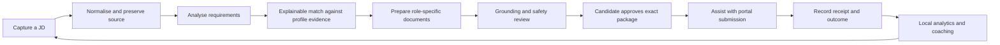

# 01 — Product scope

> **Status:** Product direction accepted at M0; capability details remain proposed
> **Audience:** the product owner and future implementers
> **Related:** [system architecture](02-system-architecture.md), [domain and artifact contracts](03-domain-model-and-artifact-contracts.md), [Vietnam IT localisation](18-vietnam-it-market-localization.md), [roadmap](19-roadmap-and-milestones.md)

## 1. Product statement

The [M0 record](27-m0-baseline-and-delivery-inventory.md) defines the first-release subset and current implementation inventory. This document describes the target product, not a claim that every capability below is implemented or required in that release.

Career Copilot is a **single-user, local-first AI job-search workstation** for software and adjacent IT professionals seeking work in Ho Chi Minh City and Vietnam. A developer clones the repository, runs it on their own computer, and uses a localhost dashboard plus explicit AI-agent workflows to organise job search work.

The product turns a scattered job search into traceable local work: collect a job description (JD), preserve its source, analyse it, compare it with evidence from the candidate's profile, prepare an application package, obtain the candidate's approval, assist with submission, and learn from outcomes.

It is intentionally not a recruiter CRM, a hosted SaaS, an employer ATS, or an autonomous mass-application bot.

## 2. Target user and jobs-to-be-done

The initial user is an individual technical professional in Vietnam who is comfortable cloning and running a developer tool. The supported role family includes, but is not limited to:

- software engineers: frontend, backend, full-stack, mobile, platform, and embedded;
- infrastructure roles: DevOps, SRE, cloud, security, and data platform;
- data and AI roles: data analyst, data engineer, ML engineer, AI engineer, and MLOps;
- quality roles: manual QA, automation QA, SDET, and performance testing;
- IT-adjacent product roles: business analyst, systems analyst, product analyst, and technical project roles.

The user needs to answer six practical questions without losing control of their information:

1. Which open roles are relevant, and which copies of the same role should be treated as one opportunity?
2. What does the JD actually require, and what is fact, inference, or still unknown?
3. Which requirements are evidenced by my profile, which are gaps, and which are hard constraints?
4. Which version of my CV, cover letter, and application answers was prepared for this exact opportunity?
5. What will the system submit, where, and only after I approve it?
6. Which sources, CV approaches, and role targets actually lead to responses and interviews?

## 3. Product principles

### 3.1 The candidate owns the workspace

There are no Career Copilot accounts, organisations, shared workspaces, cloud databases, or background synchronisation. Career data belongs in a directory on the candidate's computer. A copied workspace is the candidate's backup and portable record.

### 3.2 A dashboard is a local view, not a remote service

The dashboard is served only on loopback (`127.0.0.1` or `localhost`) and reads the same local artifacts used by CLI commands and agents. It must remain useful when disconnected from the internet for tasks that use already-stored files.

### 3.3 Agents advise within narrow, reviewable roles

Agents are specialised collaborators, not free-running operators. They may extract, compare, draft, review, coach, and prepare actions only through defined inputs and outputs. Each result records its sources, confidence, omissions, and limitations. See [the agent boundaries](02-system-architecture.md#5-constrained-agent-model).

### 3.4 Source facts outrank generated text

Raw JD content, candidate-supplied profile material, and records of external outcomes are source records. AI-generated analysis, match rationale, drafts, and recommendations are derived artifacts. A derived artifact must never silently replace a source record or invent a candidate claim.

### 3.5 Approval is a first-class safety control

No submission may start until the candidate explicitly approves the exact target, job revision, document package, application answers, and submission channel. Approval is bound to content hashes, expires when a bound artifact changes, and is recorded locally. The detailed contract is in [Approval records](03-domain-model-and-artifact-contracts.md#8-approval-contract).

### 3.6 Explainability before scoring

The product does not reduce suitability to a persuasive percentage. It may prioritise jobs, but every recommendation must expose supporting evidence, hard constraints, gaps, unknowns, confidence, and the data used to reach it.

### 3.7 Local storage does not mean invisible network use

The product itself must not upload or synchronise career data. Reading a public job site, using a portal in the candidate's own browser session, or explicitly invoking a user-configured AI runtime may involve the network. These actions must be opt-in, visible, and recorded; the product must never imply that an external provider is local.

## 4. In-scope capabilities

The target product scope is divided into capability groups so that each can be implemented and evaluated independently. The order and delivery boundaries are in the [roadmap](19-roadmap-and-milestones.md).

| Capability | User value | Local system responsibility |
| --- | --- | --- |
| Workspace and dashboard | One place to see active opportunities and work to do | Serve localhost UI; safely read and write workspace artifacts |
| Profile and evidence | Keep a trustworthy base profile for technical roles | Preserve source material, structured profile, evidence links, and version history |
| Job intake | Capture roles from pasted content, files, supported sources, or browser handoff | Preserve source, retrieval context, normalised JD, and duplicate relationships |
| Explainable matching | Decide whether a role is worth pursuing | Compare explicit job requirements with profile evidence, gaps, blockers, and uncertainty |
| Document studio | Prepare role-specific application material | Create versioned CV drafts, letters, and form answers without changing the base profile |
| Grounding review | Prevent unsupported claims and unsafe instructions | Verify every material claim against candidate evidence and flag unresolved items |
| Candidate approval | Let the candidate control outbound actions | Bind consent to immutable revisions and invalidate it on change |
| Submission assistance | Reduce repetitive portal work without bypassing protections | Open/pre-fill supported flows, stop for human handoff, record receipts and failure state |
| Application record | Track each opportunity from discovery to outcome | Maintain a local state machine, notes, tasks, and event history |
| Career analytics and coaching | Improve the next search cycle using actual outcomes | Aggregate local, privacy-preserving event data and surface evidence-led recommendations |
| Vietnam IT localisation | Make the workflow useful for the intended market | Support Vietnamese/English material, local job sources, HCMC location and VND compensation semantics |

## 5. Explicit non-goals and boundaries

The following are deliberately outside the product contract unless a future specification changes this document:

- no hosted product, account, sign-in, tenant model, billing, collaborative adviser workspace, or cloud backup;
- no automatic submission without a valid candidate approval for that individual application;
- no CAPTCHA bypass, login bypass, evasion of portal rate limits, or behaviour that circumvents a source's terms or technical controls;
- no guarantee of a job, interview, salary result, or employer response;
- no fabrication of experience, education, credentials, GitHub work, salary history, visa/eligibility status, dates, or any other candidate fact;
- no legal, tax, immigration, or employment-law advice;
- no blanket web scraping. Source integrations require an individual connector specification and a policy review first;
- no requirement that an AI model run locally. The only required property is that Career Copilot does not operate a hosted agent service or silently transmit workspace data;
- no general-purpose career product for every profession in the first product line. The shared data model remains extensible, but UX and agents optimise for IT roles.

## 6. What "local-only" means in practice

| Concern | Required behaviour |
| --- | --- |
| Identity | No Career Copilot account, password, user database, or authentication server. |
| Storage | The workspace, including documents, evidence, approvals, and analytics, is stored in user-controlled local paths. |
| Dashboard | Bind to loopback by default; do not listen on a LAN interface unless a separately approved design adds that capability. |
| Credentials | Portal credentials remain in the user's browser or operating-system credential store. The workspace must not persist raw passwords or session cookies. |
| AI runtime | The user chooses and explicitly invokes the runtime. Before a runtime receives private source material, the UI/CLI must identify the runtime and its network implications. |
| Network | No telemetry, remote analytics, cloud sync, or unsolicited background fetch. A user-initiated source lookup or portal submission is an external action and gets an audit event. Explicitly enabled scheduled intake is deferred and conditional on the separate automation decision. |
| Backup/export | Provide local export/import and documented backup guidance; no managed remote backup. |

## 7. Primary user journey

The candidate can leave the workflow at any point. No state transition is inferred from an AI recommendation alone, and no external action follows merely because documents were generated.

## 8. Definition of product quality

The product is successful when a technical candidate can confidently answer, for every application, "what did I apply to, with which facts and documents, through which channel, and what happened?" Success is measured locally by:

- a low rate of duplicate or lost opportunities;
- zero known submissions without a matching valid approval;
- zero known generated claims that survive the grounding review without source evidence;
- readable evidence for every match recommendation and blocker;
- correct handling of Vietnamese/English, HCMC location, and salary semantics for supported sources;
- a useful local dashboard even when agents and external sources are unavailable.

## 9. Open product decisions

The foundation freezes the local-only and candidate-approval decisions. The following need a dedicated small specification before implementation:

1. Which source connector begins first, and whether it is import-only or browser-assisted.
2. Which user-configured AI runtimes are supported and how consent is presented before their use.
3. Which document output formats are required beyond Markdown, and whether PDF generation is local-only.
4. How the tool packages a workspace for backup while preventing accidental inclusion in Git.
5. Which analytics are useful enough to collect locally in the first release.

These decisions are decomposed in the [roadmap](19-roadmap-and-milestones.md#4-small-specification-sequence).
