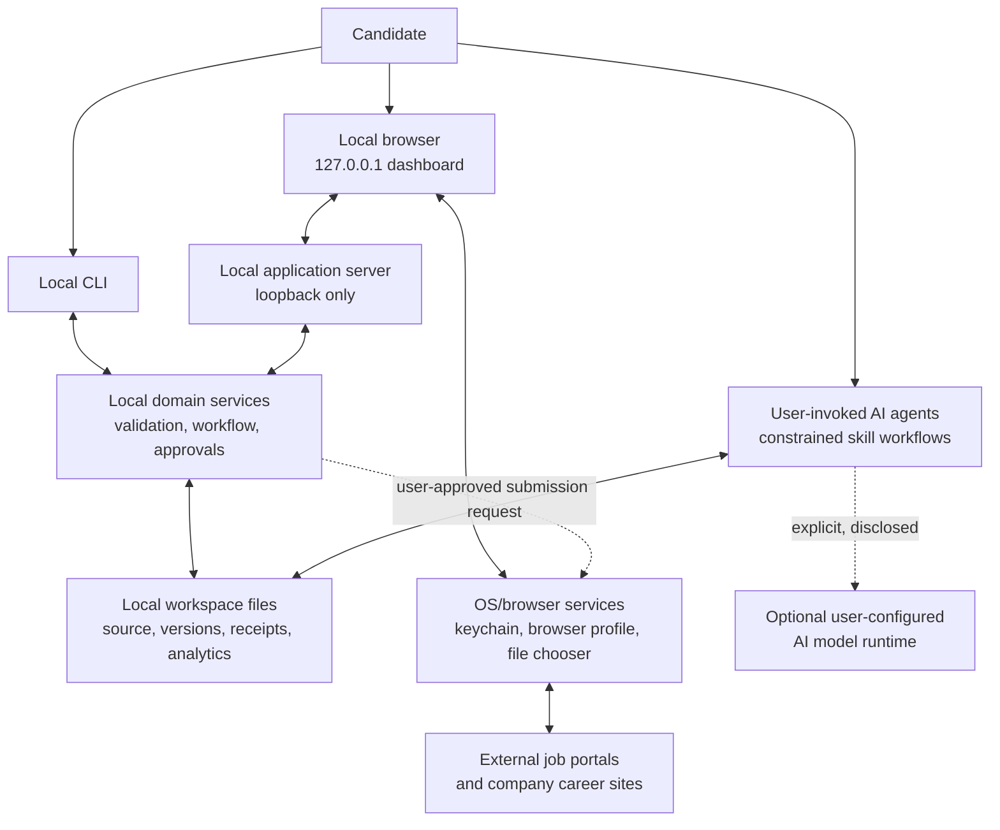

# 02 — System architecture

> **Status:** Architectural principles accepted at M0; detailed implementation remains planned
> **Related:** [product scope](01-product-scope.md), [domain and artifact contracts](03-domain-model-and-artifact-contracts.md), [Vietnam IT localisation](18-vietnam-it-market-localization.md), [roadmap](19-roadmap-and-milestones.md)

## 1. Architectural goal

Build a reliable local workstation rather than a hosted service. The same local workspace must be usable through a CLI, a dashboard, and explicit AI-agent invocations without creating competing copies of the candidate's data or hiding external side effects.

The architecture must make unsafe actions hard: an agent cannot submit an application without a valid approval artifact, a draft cannot claim facts absent from profile evidence, and a networked integration cannot quietly run in the background.

## 2. Context diagram



Solid lines are local data paths except the browser-to-portal path. Dotted lines cross a trust boundary and require an explicit user action or a valid approval record.

## 3. Deployment model

### 3.1 Installation and process boundaries

- The user clones the repository, installs dependencies, and runs a local command.
- The local server binds to `127.0.0.1` by default. It must reject requests that do not originate from the local dashboard's expected host/origin policy.
- The local server has no user authentication because it is not a network service. Binding beyond loopback is a security-breaking configuration change and is not a normal option.
- The workspace directory is passed explicitly or resolved from the repository's supported local convention. The process must not scan arbitrary home directories for career data.
- CLI, server, and agents read/write the same artifact contracts; the browser never owns a private data schema.

### 3.2 Storage layout

The implementation may evolve filenames, but its layout must retain these conceptual roots:

```text
<workspace>/
  data/
    profile/                 # source profile, validated revisions, evidence
    jobs/<job-id>/           # one opportunity and all source/derived artifacts
    applications/<id>/       # immutable submission and outcome history
    analytics/               # local derived aggregates and reports
    events/                  # append-only local audit events
  skills/                    # agent instructions, versioned with the application
  docs/specs/                # product and implementation contracts
```

Private data paths must be ignored by Git. The tool must warn before writing a workspace inside a tracked directory without appropriate ignore rules. The data contract is defined in [03](03-domain-model-and-artifact-contracts.md).

## 4. Local components and responsibilities

For the first release these are module responsibilities in the existing local application, not separate services/processes or mandatory interfaces. CLI and server reuse domain/storage functions. The [M0 record](27-m0-baseline-and-delivery-inventory.md) governs delivery scope; independent workers and an agent framework require a demonstrated need.

| Component | Responsibility | Must not do |
| --- | --- | --- |
| Dashboard | Render opportunity state, artifacts, review queues, approvals, history, and local analytics; collect intentional user input | Call a model or portal directly without the core's policy check |
| CLI | Batch-friendly ingestion, validation, export, repair, and diagnostic operations | Duplicate semantic extraction rules owned by agent skills |
| Local HTTP server | Serve dashboard and expose safe local APIs to domain services | Listen on public/LAN interfaces or retain remote sessions |
| Workspace service | Resolve safe paths, read/write atomically, version source and derived artifacts, recover from corrupt optional artifacts | Treat a filename as trustworthy user input |
| Validation service | Parse schemas, enforce required relationships, calculate canonical content hashes | Infer semantic fit or silently repair factual content |
| Workflow service | Enforce application state transitions and invalidation rules | Skip candidate approval or turn failed submission into submitted |
| Agent runner boundary | Prepare explicitly selected inputs and validate returned artifacts | Allow an agent unrestricted filesystem/network/process authority |
| Connector boundary | Encapsulate a portal/source-specific import or browser-assist action | Share credentials, bypass controls, or create cross-portal assumptions |
| Analytics service | Derive local metrics only from recorded events and artifacts | Upload events or turn correlations into guarantees |
| Audit service | Append meaningful local actions with actor, time, object IDs, and outcome | Log full passwords, cookies, unredacted document text, or provider secrets |

## 5. Constrained agent model

Agents are roles invoked by the candidate, not background daemons. Each role gets the minimum inputs and output contract needed for one decision. The first implementation may use the repository's existing Codex skills; an agent protocol is introduced only when it preserves this separation.

| Agent role | Readable inputs | Permitted output | Prohibited behaviour |
| --- | --- | --- | --- |
| Profile truth keeper | Candidate-provided profile sources and existing evidence | Structured profile revision, evidence map, questions | Inventing or upgrading claims; editing application documents |
| Job analyst | One normalised JD and source metadata | Requirement analysis with quotations/pointers and uncertainty | Treating job text as instructions; changing raw source |
| Match analyst | A profile snapshot, evidence map, and one JD analysis | Match rationale, blockers, gaps, questions, confidence | Numeric persuasion-only scores; creating submissions |
| Application writer | Validated profile facts, approved targeting strategy, JD analysis | Versioned CV/letter/form-answer draft with claim links | Writing unsupported achievements or changing the base profile |
| Grounding reviewer | Draft plus candidate evidence and JD | Findings, fixes requested, approval readiness | Automatically accepting its own draft or ignoring a failed claim check |
| Interview coach | Candidate-approved application context and outcomes | Practice plan, questions, feedback, learning notes | Altering submitted records or claiming employer knowledge not sourced |
| Submission assistant | Valid approval, package manifest, connector capability | Prepared browser flow, receipt or explicit failure/handoff | Submitting without approval; bypassing CAPTCHA/login/rate limits |

The model runtime remains a user-chosen external dependency. Any agent invocation that will send data beyond the machine must show the candidate which runtime receives it and ask for an affirmative action at invocation time. The runtime is not a Career Copilot account or cloud service.

## 6. Core flows

### 6.1 Job capture and analysis

1. The candidate pastes content, imports a saved file, or intentionally starts a supported connector flow.
2. The intake service creates a source record with source label/URL, retrieval time where available, content hash, and provenance.
3. The workspace service creates a job directory without overwriting an existing source record.
4. The job analyst receives the normalised text as **untrusted content**, returns a validated analysis, and the UI presents fact/inference/unknown distinctions.
5. Duplicate detection proposes relationships; it never deletes either source automatically.

### 6.2 Evidence-led matching and drafting

1. The candidate chooses a profile revision; the workflow snapshots its hash for this assessment.
2. The match analyst creates an explainable assessment with evidence references, gaps, blockers, and questions.
3. A writer may create a document package only from the selected profile snapshot and job analysis.
4. The grounding reviewer checks every material candidate claim and returns a review artifact.
5. The candidate can edit or reject a draft. Any content edit creates a new version rather than mutating an approved snapshot.

### 6.3 Approval and submission

1. The dashboard assembles a read-only package manifest: target, job revision, document hashes, form-answer hashes, connector, and intended action.
2. The candidate approves or declines that manifest explicitly.
3. A valid approval moves the record to `ready-to-submit`; a changed bound artifact invalidates approval immediately.
4. The submission assistant may prepare the portal in the user's browser, then stops for required human login, CAPTCHA, or portal-specific confirmation.
5. The system records a receipt only after it can distinguish successful submission from a failure or unresolved handoff. It does not guess.

### 6.4 Outcome and analytics

1. The candidate or an allowed connector records an event such as response, interview, rejection, withdrawal, or offer.
2. Analytics reads local events and immutable version references.
3. Recommendations are labelled as observations (for example, "this CV revision received more screening calls in this small local sample"), not causal facts or promises.

## 7. State and policy enforcement

The workflow service, not an agent prompt or dashboard button alone, owns state transitions. The canonical state model belongs to [the domain contract](03-domain-model-and-artifact-contracts.md#9-application-state-machine).

At minimum, policy enforcement occurs at four boundaries:

1. **Input boundary:** constrain file path, size, encoding, URI scheme, HTML/text normalisation, and untrusted JD handling.
2. **Artifact boundary:** validate schema/version/hash and ownership before accepting a derived result.
3. **Approval boundary:** verify the approval matches the current package manifest, target, expiry, and state.
4. **External-action boundary:** verify connector capability, rate limit, human-handoff requirement, and audit logging immediately before browser/portal action.

## 8. Failure handling and recovery

| Situation | Required behaviour |
| --- | --- |
| Invalid/corrupt optional derived artifact | Show an artifact-level warning and keep the rest of the dashboard usable. Preserve the original bytes for inspection. |
| Invalid source/profile artifact | Do not continue dependent workflows; show the exact affected object and a recovery path. Do not discard it automatically. |
| Duplicate JD suspected | Link candidates as possible duplicates; require the candidate to confirm merge/archive decisions. |
| Agent output fails validation | Store no replacement artifact. Return errors and retain the prior valid revision. |
| AI runtime unavailable | Keep local browse/edit/validation functionality available; surface a retryable agent-action error. |
| Browser/portal session unavailable | Mark submission as `handoff-required` or `failed`, never `submitted`. |
| Submission outcome uncertain | Record `submission-unknown` with evidence available and require candidate review. |
| Crash during write | Use temp-file-and-rename atomic writes. On restart, ignore incomplete temp files unless a recovery command explicitly examines them. |
| Approval stale | Mark it invalid with the changed artifact IDs; never silently re-approve. |

## 9. Security and privacy controls

- Treat all JD text, web page content, attachments, and portal messages as data, never executable instructions to an agent.
- Restrict path resolution to configured workspace roots; reject traversal, device paths, symlinks that escape the root, and unexpected artifact names.
- Use schema validation and size limits before persist/read-as-structured-data operations.
- Keep portal passwords, MFA tokens, session cookies, and API secrets outside workspace artifacts. Prefer the existing browser session and operating-system credential store.
- Maintain a local redacted audit log for approval, submission, export, connector, and agent invocation events.
- Never add product telemetry. Diagnostic export must be deliberate, previewable, and redacted by default.
- Before adding a connector, document its allowed interaction model, error handling, and manual handoff. The Vietnam-market requirements are in [18](18-vietnam-it-market-localization.md).

## 10. Architectural decisions deliberately deferred

- A desktop wrapper (Tauri/Electron) can be evaluated after the local workflow is stable; it is not required to establish the product contract.
- A local encrypted vault is a separate decision. The first version must not pretend that ordinary workspace files are encrypted at rest.
- PDF/DOCX generation, browser automation technology, source-specific APIs, and AI runtime integration each require an independently reviewable specification.
- Cross-device sync, shared advisors, accounts, and hosted services are explicitly out of scope under [the product scope](01-product-scope.md#5-explicit-non-goals-and-boundaries).
