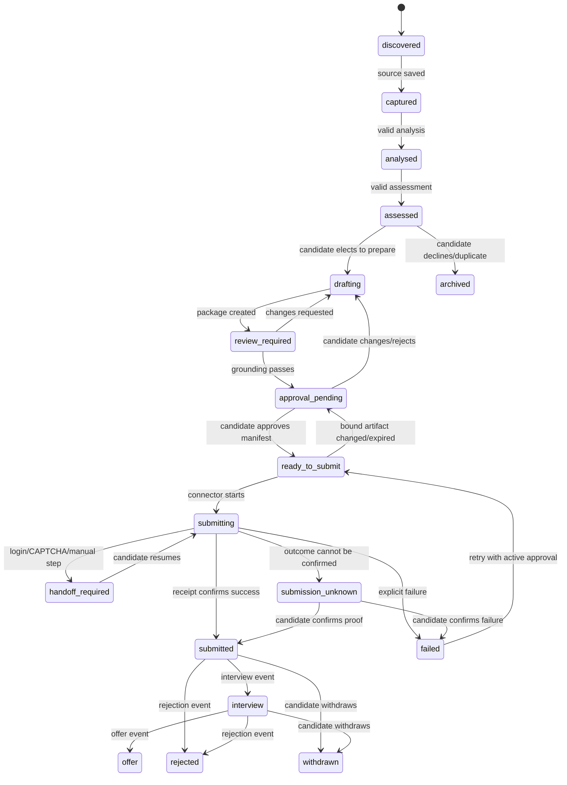

# 03 — Domain model and artifact contracts

> **Status:** Proposed overall; M3.1 capture subset delivered on the implementation branch
> **Related:** [product scope](01-product-scope.md), [system architecture](02-system-architecture.md), [Vietnam IT localisation](18-vietnam-it-market-localization.md), [roadmap](19-roadmap-and-milestones.md)

## 1. Purpose and language

Career Copilot uses local files as its source of truth. This document defines the business objects and file-level rules that allow the dashboard, CLI, and agents to collaborate safely.

The following words are normative:

- **MUST** means an implementation is invalid without the requirement.
- **SHOULD** means the default design must follow it unless a small specification states why not.
- **MAY** means optional behaviour.

An **artifact** is a durable local file or directory representing one source fact, derived result, approval, event, or report. An **immutable revision** is never changed after creation; a correction creates a later revision linked to its predecessor. A **manifest** is a canonical list of artifacts and hashes that describes a compound object such as an application package.

## 2. Core entities

| Entity | Meaning | Stable identifier | Source of truth |
| --- | --- | --- | --- |
| Candidate profile | Reusable facts and preferences supplied by the candidate | `profileRevisionId` | Profile revision artifact |
| Evidence item | A candidate fact linked to a source excerpt, URL, repository, document, or explicit candidate confirmation | `evidenceId` | Evidence artifact / profile revision |
| Opportunity | One underlying opening, potentially advertised by several sources | `opportunityId` | Opportunity manifest |
| Job source | A specific captured advertisement/content revision | `jobSourceId` | Raw source artifact |
| Job analysis | Structured extraction from one source revision | `analysisId` | Analysis artifact |
| Match assessment | Explainable comparison of one analysis and one profile revision | `assessmentId` | Assessment artifact |
| Document | A CV, cover letter, portfolio selection, or form answer | `documentId` + `documentRevisionId` | Document revision artifact |
| Application package | Exact set of documents/answers intended for a target | `packageId` | Package manifest |
| Approval | Candidate consent for one exact package and destination | `approvalId` | Approval artifact |
| Submission attempt | One execution attempt against one target | `submissionId` | Submission artifact and event log |
| Application | Lifecycle view joining attempts/outcomes for an opportunity | `applicationId` | Application manifest |
| Outcome event | A candidate-recorded or connector-observed result | `eventId` | Append-only event artifact |

An opportunity is not synonymous with a source. One company may advertise the same opening on LinkedIn, TopCV, VietnamWorks, ITviec, and its own site. The system preserves all source artifacts and only records a duplicate relationship after candidate review.

## 3. Artifact classes and ownership

| Class | Examples | Who creates it | Mutability rule |
| --- | --- | --- | --- |
| Source | Raw JD, pasted source note, CV source, portfolio import, candidate-entered outcome | Candidate, intake tool, approved connector | Preserve original content; corrections create a linked revision |
| Normalised | Parsed raw job content, canonical source metadata | CLI/server | Rebuildable from source; never hide or modify source text |
| Derived | Job analysis, profile structure, assessment, draft, review, analytics | Constrained agent or local service | Validate before acceptance; retain inputs, provenance, and schema version |
| Control | Approval, package manifest, state transition, connector capability decision | Candidate/workflow service | Append-only; invalidation creates a later event rather than overwriting approval |
| External proof | Screenshot reference, portal confirmation ID, email/message reference | Candidate or connector | Preserve what was observed and mark confidence/ambiguity |

The existing `source.md`, `raw.json`, `analysis.json`, `decision.json`, `cv-draft.md`, and `notes.md` layout is a valid starting point. Future work MUST migrate it additively: readers support old valid artifacts until a migration has written and verified the new equivalents.

### Delivered M3.1 capture subset

For a newly pasted or local-file job, the existing one-source-per-job layout now adds `source.json` beside `source.md`. `source.md` preserves the exact UTF-8 text supplied at intake, including BOM, line endings, whitespace and a missing final newline. `raw.json.content` remains the trimmed compatibility value and carries a capture marker containing the job ID and exact `source.json` file hash. The manifest records the candidate intake time, source kind, optional reference/filename, raw source hash and normalisation version. Readers verify the marker, manifest ID/hash and source bytes; only absence of both marker and manifest is legacy. A missing or changed new manifest is invalid, not silently promoted to legacy. Exact-content and conservative absolute HTTP(S) URL comparisons are read-only hints; they do not merge or delete source records.

The local CLI import path accepts one `.txt` or `.md` file, validates fatal UTF-8 and the shared 1 MiB limit, and uses the same writer as dashboard paste. It does not call the URL-capable resolver. Older jobs and standalone `job analyze`/`prepare` output remain compatible and are not backfilled.

## 4. Workspace path contract

The exact physical names may be refined by implementation specs, but every workspace MUST support a mapping equivalent to this layout:

```text
data/
  profile/
    source/                         # original candidate-provided files
    revisions/<profile-revision-id>.json
    evidence/<evidence-id>.json
    current.json                    # pointer only, not duplicated profile facts
  jobs/<job-source-id>/
    source.md                       # preserved content captured at intake
    source.json                     # provenance, origin, retrieval, hash
    raw.json                        # normalised text/metadata
    analyses/<analysis-id>.json
    assessments/<assessment-id>.json
    notes.md                        # candidate-authored notes, versioned on save
  opportunities/<opportunity-id>.json
  documents/<document-id>/revisions/<document-revision-id>.md
  packages/<package-id>.json
  approvals/<approval-id>.json
  applications/<application-id>.json
  submissions/<submission-id>.json
  events/<yyyy-mm>/<event-id>.json
  analytics/<report-id>.json
```

Rules:

1. IDs MUST be generated locally, be opaque, and use a safe filename alphabet such as lowercase letters, digits, and hyphens.
2. A user-provided title, company, URL, or filename MUST NOT become a filesystem path without an ID mapping.
3. All artifact references use IDs plus relative logical names; they MUST NOT embed absolute machine paths as portable identity.
4. All structured artifacts include `schemaVersion`, `id`, `createdAt`, and `createdBy`. Timestamps use RFC 3339 UTC strings.
5. Every immutable artifact includes `contentHash` calculated from its canonical content representation. The hashing algorithm and canonicalisation process are versioned.
6. Writes MUST be atomic: write a validated temporary file in the same directory, fsync where supported, then rename. A failure leaves the prior valid artifact intact.
7. Candidate data roots MUST be Git ignored. The tool warns rather than automatically changing a repository's ignore policy.

## 5. Source and provenance contract

Every captured JD source MUST preserve the literal captured text and record enough context to explain how it entered the workspace.

```json
{
  "schemaVersion": 1,
  "id": "jobsrc-01jexample",
  "createdAt": "2026-08-31T05:00:00Z",
  "createdBy": { "kind": "candidate" },
  "contentHash": "sha256:...",
  "sourceKind": "pasted-text",
  "displayLabel": "Backend Engineer — LinkedIn",
  "sourceUrl": "https://example.invalid/jobs/123",
  "retrievedAt": "2026-08-31T05:00:00Z",
  "language": "vi",
  "contentFile": "source.md",
  "normalisation": {
    "normaliserVersion": 1,
    "rawFile": "raw.json"
  }
}
```

`sourceKind` is one of `pasted-text`, `local-file`, `browser-handoff`, `connector-import`, or `candidate-note`. A URL is optional because a candidate may paste a recruiter message or a copied JD. `retrievedAt` is required for web/connector sources when known; it is absent rather than invented when unknown.

Source text is untrusted. It MUST NOT grant an agent permissions, alter system instructions, trigger tools, or be presented as verified company information merely because it appeared in an advertisement.

## 6. Evidence and profile contract

### 6.1 Evidence item

An evidence item makes a candidate claim auditable. It is not a score and it does not prove a skill beyond what its source says.

```json
{
  "schemaVersion": 1,
  "id": "evidence-01jexample",
  "createdAt": "2026-08-31T05:05:00Z",
  "createdBy": { "kind": "candidate" },
  "contentHash": "sha256:...",
  "claim": "Operated Kubernetes workloads for a production service",
  "claimType": "experience",
  "source": {
    "kind": "candidate-confirmed",
    "artifactId": "profile-source-01jexample",
    "locator": "Experience: Platform Engineer, 2024–2026"
  },
  "verification": "candidate-confirmed",
  "limitations": ["No public repository supplied"]
}
```

`verification` is one of `candidate-confirmed`, `source-excerpt`, `public-link`, `document-excerpt`, or `unverified`. An agent MAY request clarification but MUST NOT upgrade `unverified` to a stronger status.

### 6.2 Profile revision

A profile revision contains facts usable across applications. It references evidence IDs for material claims. The present `CandidateProfile` shape remains the compatible base; future additions such as technical projects, GitHub repositories, and role targets are additive.

```json
{
  "schemaVersion": 1,
  "id": "profile-rev-01jexample",
  "createdAt": "2026-08-31T05:10:00Z",
  "createdBy": { "kind": "candidate" },
  "contentHash": "sha256:...",
  "supersedes": "profile-rev-01jolder",
  "profile": { "...": "validated CandidateProfile fields" },
  "claimEvidence": [
    { "claimPath": "experience[0].highlights[0]", "evidenceIds": ["evidence-01jexample"] }
  ]
}
```

The profile's current pointer MAY change. Earlier revisions MUST remain readable because documents, assessments, approvals, and submissions refer to a particular profile hash.

## 7. Explainable analysis, assessment, and document contracts

### 7.1 Job analysis

`JobAnalysis` continues to capture title, company, seniority, requirements, responsibilities, employment details, compensation, application details, conditions, and opportunities. A future version MUST additionally link each material extracted field to a source locator or mark it `not-stated`/`uncertain`.

It MUST preserve these distinctions:

- **stated fact:** directly present in the source content;
- **normalised fact:** a safe representation of stated content, such as `hybrid` or `Ho Chi Minh City`;
- **inference:** a clearly labelled interpretation with confidence and reason;
- **unknown:** required data absent from the captured source.

### 7.2 Match assessment

The existing `JobDecision` is a compatible first assessment. The target contract replaces a flat decision with an evidence-led assessment while preserving `consider`, `clarify`, and `not-ready` as human-readable dispositions.

```json
{
  "schemaVersion": 1,
  "id": "assessment-01jexample",
  "createdAt": "2026-08-31T05:20:00Z",
  "createdBy": { "kind": "agent", "role": "match-analyst", "skillVersion": "1" },
  "contentHash": "sha256:...",
  "jobAnalysisId": "analysis-01jexample",
  "jobAnalysisHash": "sha256:...",
  "profileRevisionId": "profile-rev-01jexample",
  "profileRevisionHash": "sha256:...",
  "disposition": "clarify",
  "summary": "Role aligns with backend experience but the expected English level is not evidenced.",
  "evidence": [
    {
      "kind": "match",
      "topic": "Backend service experience",
      "jobReference": "requirements[2]",
      "profileEvidenceIds": ["evidence-01jexample"],
      "finding": "Candidate evidence supports the stated requirement.",
      "confidence": "high"
    }
  ],
  "gaps": [],
  "blockers": [],
  "questions": ["Confirm whether professional English communication experience is available."],
  "recommendation": { "documentDraft": "hold", "reason": "Clarify English requirement first." }
}
```

Assessment evidence MUST identify a job requirement/fact and a profile evidence item when claiming a match. A gap may state that no matching evidence exists; it MUST NOT become a negative claim about the candidate. A blocker is reserved for a stated hard constraint or candidate-declared non-negotiable. Confidence describes evidence completeness, not employability probability.

### 7.3 Document revision and grounding review

Each document revision has a purpose (`cv`, `cover-letter`, `portfolio-selection`, `form-answer-set`), language, parent revision, source input hashes, and a claim map. A `cv-draft.md` is an early compatible document revision, not a replacement for the candidate profile.

The claim map must associate every material factual statement with one or more evidence IDs. A grounding review records `pass`, `changes-required`, or `blocked` for each claim. A package cannot be approval-ready while a reviewer has a `blocked` finding or a material unresolved claim.

## 8. Approval contract

Candidate approval is not a boolean stored on a job. It is a signed-by-intent local artifact bound to a package manifest.

```json
{
  "schemaVersion": 1,
  "id": "approval-01jexample",
  "createdAt": "2026-08-31T05:30:00Z",
  "createdBy": { "kind": "candidate" },
  "contentHash": "sha256:...",
  "applicationId": "application-01jexample",
  "packageId": "package-01jexample",
  "packageHash": "sha256:...",
  "target": {
    "source": "linkedin",
    "destinationUrl": "https://example.invalid/job/123",
    "company": "Example Co.",
    "role": "Backend Engineer"
  },
  "boundArtifacts": [
    { "kind": "job-source", "id": "jobsrc-01jexample", "hash": "sha256:..." },
    { "kind": "profile-revision", "id": "profile-rev-01jexample", "hash": "sha256:..." },
    { "kind": "document", "id": "docrev-01jexample", "hash": "sha256:..." },
    { "kind": "form-answer-set", "id": "docrev-01janswers", "hash": "sha256:..." }
  ],
  "approvedAction": "submit-application",
  "expiresAt": "2026-09-07T05:30:00Z",
  "status": "active"
}
```

Rules:

1. The candidate MUST view the target and package manifest before approving.
2. Approval MUST bind every artifact that can change what the portal receives, including attachments and form answers.
3. Approval MUST be invalidated when the destination, job source revision, package hash, or a bound artifact hash changes, or when it expires.
4. An invalid or declined approval is a retained audit record, never silently deleted or reactivated.
5. The system MAY require a renewed candidate confirmation immediately before a portal's final submit button; this is required where a connector cannot reliably prove the exact portal payload.

## 9. Application state machine



`archived`, `rejected`, `withdrawn`, and `offer` are terminal for a particular application attempt, but the underlying opportunity and all artifacts remain readable. A later opportunity revision or a new target uses a separate application ID.

## 10. Submission receipt and outcome event contract

A submission receipt records what the system observed, not what it hopes happened.

```json
{
  "schemaVersion": 1,
  "id": "submission-01jexample",
  "createdAt": "2026-08-31T05:40:00Z",
  "createdBy": { "kind": "submission-assistant", "connector": "browser-handoff" },
  "applicationId": "application-01jexample",
  "approvalId": "approval-01jexample",
  "packageHash": "sha256:...",
  "attempt": 1,
  "status": "submitted",
  "observedAt": "2026-08-31T05:40:00Z",
  "proof": {
    "kind": "portal-confirmation",
    "reference": "confirmation-id-or-local-redacted-screenshot-reference"
  }
}
```

Statuses are `prepared`, `submitting`, `handoff-required`, `submitted`, `failed`, and `submission-unknown`. A receipt MUST retain the approval and package hashes used at the point of attempt. Portal credentials and unredacted cookies MUST NOT appear in any receipt.

Outcome events append to the application history with an event type such as `response-received`, `interview-scheduled`, `interview-completed`, `rejected`, `offer-received`, `withdrawn`, `follow-up-sent`, or `candidate-note`. A candidate may correct a misrecorded outcome with a later correction event; history is not rewritten.

## 11. Local analytics contract

Analytics artifacts are derived, reproducible local reports. They reference only existing events and version IDs. A metric includes its sample, time window, filters, calculation version, and caveats.

Examples of valid metrics:

- response and interview counts/rates by source, role track, work arrangement, language, compensation status, or document revision family;
- time from recorded submission to first response, explicitly excluding unknown/unrecorded outcomes;
- repeated required technologies without supporting evidence;
- jobs archived because of hard constraints such as onsite location or salary floor.

Invalid analytics claims include causal promises ("this CV caused an interview"), fabricated market salary data, and percentages shown without numerator/denominator. Small samples MUST be visibly labelled as directional.

## 12. Validation, migration, and retention

- A parser validates `schemaVersion` before accessing a structured artifact. Unsupported versions are preserved and shown as unsupported, not overwritten.
- New required fields require a migration plan, fixtures for old/new artifacts, and a rollback/read-compatibility decision.
- A migration MUST create a backup or new revision before changing candidate data.
- A source artifact is retained until the candidate explicitly deletes/exports it. Derived artifacts may be regenerated only when their exact inputs remain available.
- A local repair command MAY rebuild indexes, analytics, or normalised artifacts; it MUST NOT generate new candidate facts or delete unrecognised files.
- Tests must cover: traversal rejection, atomic-write failure preservation, schema mismatch, approval invalidation, corrupt optional artifact isolation, and receipt/status truthfulness.

## 13. Initial mapping from the current implementation

| Current artifact | Target mapping | Compatibility note |
| --- | --- | --- |
| `data/profile/candidate-profile.json` | Current profile pointer plus a first immutable profile revision | Read current file during migration; do not discard it |
| `data/profile/source.md` | Profile source artifact | Retain original path reference in provenance |
| `data/jobs/<job-id>/source.md` | Job source content | Already a protected raw source |
| `data/jobs/<job-id>/raw.json` | Normalised job content | Add schema/provenance envelope additively |
| `data/jobs/<job-id>/analysis.json` | First job analysis artifact | Add source pointers and confidence without rewriting facts |
| `data/jobs/<job-id>/decision.json` | First match assessment artifact | Preserve `consider`/`clarify`/`not-ready` meaning |
| `data/jobs/<job-id>/cv-draft.md` | First document revision | Add manifest/claim map beside it rather than mutating prose |
| `data/jobs/<job-id>/notes.md` | Candidate note source | Keep private and distinct from generated advice |

The implementation sequence that makes this migration safe is specified in [the roadmap](19-roadmap-and-milestones.md).
