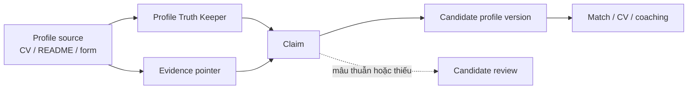

# 04 — Hồ sơ kỹ thuật và Evidence Graph

**Trạng thái:** Proposed — chưa là yêu cầu của mã nguồn hiện tại
**Nền tảng:** [01 — Product scope](01-product-scope.md), [02 — Kiến trúc](02-system-architecture.md), [03 — Mô hình dữ liệu](03-domain-model-and-artifact-contracts.md)
**Quyết định chung:** [00 — Decision log](00-decision-log.md) · **Agent:** [11 — Agent orchestration](11-agent-orchestration.md)
**Đầu ra cho:** [06 — Explainable matching](06-explainable-matching.md), [07 — Document Studio](07-document-studio-and-versioning.md), [10 — Career coaching](10-interview-and-career-coaching.md)

## 1. Mục tiêu

Biến dữ liệu nghề nghiệp thô của một lập trình viên thành một hồ sơ có thể dùng lại, trong đó **mọi claim có thể dùng để match, viết CV, trả lời form hoặc luyện phỏng vấn đều truy ngược được về evidence local**. Đây là nguồn chân lý của ứng viên, không phải bản CV được tối ưu cho một JD cụ thể.

V1 phục vụ các vai trò liên quan IT tại TP.HCM/Vietnam: frontend/backend/full-stack/mobile, QA/tester, DevOps/SRE/cloud, data/AI/ML engineer, BA/product-facing technical roles và technical support. Danh sách này xác định các màn hình/language pack ban đầu, không được biến thành taxonomy đóng hay loại trừ hồ sơ nghề IT khác.

## 2. Phạm vi và ranh giới

| Bao gồm | Không bao gồm |
| --- | --- |
| Nhập CV, LinkedIn export, portfolio README, GitHub URL/export, chứng chỉ và câu trả lời do người dùng cung cấp | Tự động suy luận năng lực từ tên công nghệ hoặc số năm không được nêu |
| Chuẩn hóa facts, lưu evidence, phát hiện mâu thuẫn và thiếu dữ kiện | Công khai profile, account, cloud sync, recruiter access |
| Quản lý preference làm việc tại Việt Nam/HCM | Chấm điểm con người hoặc tự quyết định công việc phù hợp |
| Duy trì version bất biến và audit local | Ghi đè CV nguồn hoặc tự sửa thông tin ứng viên |

Tất cả dữ liệu nằm dưới thư mục workspace local và phải được Git ignore theo [03](03-domain-model-and-artifact-contracts.md). Không upload source profile, repo private hoặc token GitHub. Khi người dùng đưa URL, hệ thống chỉ lưu URL và thời điểm người dùng xác nhận; việc fetch một URL là external access, cần opt-in rõ ràng.

## 3. Các đối tượng dữ liệu



### 3.1 Source document

Source document là bản nguyên gốc do ứng viên nhập hoặc chọn file. Nó không bị agent sửa. Mỗi source có:

- `sourceId`, loại (`cv`, `portfolio`, `github-export`, `certificate`, `manual-answer`, `other`), tên hiển thị, đường dẫn local tương đối và checksum;
- thời điểm nhập; provenance (`user-imported`, `user-pasted`, `user-confirmed-url`);
- sensitivity (`private`, `shareable-with-portal`); và trạng thái đọc (`available`, `missing`, `unreadable`).

Không mặc định coi bất cứ website/profile công khai nào là đúng hoặc hiện tại. Nếu một source bị xóa ngoài hệ thống, claim vẫn hiển thị nhưng mất trạng thái `verified-local` và không được dùng cho submission cho đến khi người dùng xác nhận lại.

### 3.2 Evidence pointer

Evidence là con trỏ tối thiểu tới nơi nói lên fact, không phải bản diễn giải của agent. Dạng chuẩn đề xuất:

```json
{
  "evidenceId": "ev_01J...",
  "sourceId": "src_cv_2026_08",
  "locator": { "kind": "line-range", "start": 18, "end": 23 },
  "quote": "Built and operated ...",
  "capturedAt": "2026-08-31T12:00:00.000Z",
  "userConfirmed": true
}
```

`quote` phải ngắn, đủ để người dùng nhận ra ngữ cảnh. Với PDF/ảnh không có line, `locator.kind` là `page` hoặc `manual-note`. Không lưu toàn bộ tài liệu nhiều lần trong mỗi claim. Evidence không được chứa credential, access token, số CCCD, địa chỉ nhà hoặc thông tin nhạy cảm không cần cho tìm việc.

### 3.3 Claim

Claim là một mệnh đề cụ thể mà các agent được phép sử dụng. Ví dụ: “đã triển khai CI pipeline GitHub Actions cho service X”, “có thể làm hybrid tại TP.HCM”, “English: B2 do người dùng tự khai”. Một claim luôn có:

- `claimId`, `kind`, `value` và `status`;
- ít nhất một `evidenceId`, trừ khi là preference được người dùng nhập trực tiếp;
- `confidence` chỉ mô tả độ chắc chắn của việc **trích xuất**, không phải độ giỏi (`high`, `medium`, `low`);
- `createdBy` (`user` hoặc agent name), timestamps, và claim version.

Status được giới hạn: `supported`, `user-asserted`, `needs-confirmation`, `contradicted`, `retired`. Agent chỉ được dùng `supported` và `user-asserted` trong CV/submission; `needs-confirmation` là câu hỏi; `contradicted` và `retired` không được dùng.

Các kind ban đầu:

| Nhóm | Ví dụ | Quy tắc |
| --- | --- | --- |
| Identity/contact | tên, email, portfolio URL | Chỉ hiển thị/nộp khi người dùng chọn field |
| Experience | title, employer, date, achievement | Không biến task thành impact nếu source không nêu |
| Technical capability | TypeScript, Kubernetes, test automation | Gắn mức evidence, không suy từ keyword đơn lẻ |
| Project | repo, system, role, scope, outcome | Repo URL không tự chứng minh production ownership |
| Education/certification | degree, AWS certificate | Chứng chỉ hết hạn giữ fact nhưng có expiry nếu biết |
| Language | English level, Japanese level | Nêu nguồn: self-asserted hoặc chứng chỉ |
| Preference/constraint | HCM, hybrid, notice period, salary, work authorization | Do người dùng nhập/xác nhận, không suy từ lịch sử |

### 3.4 Technical evidence graph

Graph không cần graph database ở V1; nó là các ID tham chiếu trong JSON files. UI hiển thị theo "skill → claims → evidence".

Một skill technical có thể có evidence từ project, work experience, certificate hoặc manual assertion. UI phải phân biệt:

- **Mentioned**: chỉ xuất hiện trong source/skill list.
- **Applied**: có work/project evidence nêu việc đã làm.
- **Outcome-backed**: có outcome cụ thể được source nêu.
- **Currentness unknown**: không có thời gian gần đây; không được giả định vẫn dùng thường xuyên.

Ví dụ, `Kubernetes` với một source chỉ liệt kê ở skills là `mentioned`; không được writer nâng thành “Kubernetes production expert”.

## 4. Workflow nhập và xác nhận

1. Người dùng chọn **Add profile source**, nhìn thấy nơi file sẽ được copy/lưu local và loại dữ liệu sẽ được đọc.
2. UI ghi immutable source, tạo source checksum và hiển thị preview; không gọi agent/network tự động.
3. User bấm **Extract proposed facts**. Profile Truth Keeper đọc source trong sandbox, trả về facts/evidence/questions, không sửa profile active.
4. UI hiện diff theo ba nhóm: facts mới, facts cập nhật, mâu thuẫn/cần làm rõ.
5. User chấp nhận/từ chối/chỉnh sửa từng fact hoặc theo nhóm. Edit thủ công tạo `user-asserted` và audit event.
6. User bấm **Publish profile version**. Hệ thống tạo một immutable profile version; version active chỉ đổi sau thao tác này.

Không có bước nào tự ghi đè `candidate-profile.json` hiện có. Trong giai đoạn migration, file legacy có thể được import thành một source và profile version đầu tiên; việc import phải ghi rõ lossless/field mapping.

## 5. Mâu thuẫn, thiếu facts và privacy

Agent phải hỏi hoặc gắn `needs-confirmation` khi hai source mâu thuẫn về title, employer, dates, role ownership, degree, language level, availability hoặc salary. Không chọn source “có vẻ mới hơn” nếu source không có thời điểm đáng tin.

Privacy controls tối thiểu:

- contact fields có disclosure state `private`, `document-default`, hoặc `portal-default`;
- evidence/raw source không được tự đi vào CV, cover letter, form answer hay analytics export;
- dashboard không log nội dung document qua browser console/telemetry;
- "Delete source" hiển thị chính xác claims/version chịu ảnh hưởng, cho phép archive hay purge theo [03](03-domain-model-and-artifact-contracts.md).

## 6. Acceptance criteria

- Người dùng có thể import nhiều source và xem facts traceable theo source/quote.
- Một claim không có evidence không thể được agent dùng làm accomplishment hoặc qualification trong document/submission.
- Thay đổi profile tạo version mới, không sửa version đã dùng để tạo document hoặc approval.
- UI phân biệt rõ fact được hỗ trợ, tự khai, cần xác nhận và mâu thuẫn.
- Hồ sơ IT có thể thể hiện work/project evidence mà không áp một taxonomy cứng cho mọi role.
- Không có network fetch, analytics upload hay account requirement trong workflow này.

## 7. Câu hỏi mở trước khi triển khai

1. V1 có import PDF trực tiếp hay chỉ hỗ trợ Markdown/text trước để giữ extraction deterministic?
2. GitHub evidence sẽ là URL do user xác nhận, local clone, hay cả hai?
3. Salary preference có cần cấu trúc `gross/net`, VND range và period ngay V1 không? Đề xuất: có, vì nó ảnh hưởng matching tại HCM.

## Liên kết tiếp theo

- [05 — Job discovery and ingestion](05-job-discovery-and-ingestion.md) định nghĩa nguồn JD và provenance.
- [06 — Explainable matching](06-explainable-matching.md) chỉ được dùng claim/evidence hợp lệ của tài liệu này.
- [07 — Document Studio and versioning](07-document-studio-and-versioning.md) định nghĩa cách document khóa profile version.
