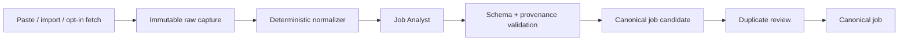

# 05 — Job Discovery và Ingestion

**Trạng thái:** Proposed overall; M3.1 capture/provenance subset delivered, opportunity decisions remain pending
**Nền tảng:** [01 — Product scope](01-product-scope.md), [02 — Kiến trúc](02-system-architecture.md), [03 — Mô hình dữ liệu](03-domain-model-and-artifact-contracts.md)
**Quyết định chung:** [00 — Decision log](00-decision-log.md) · **Agent:** [11 — Agent orchestration](11-agent-orchestration.md)
**Đầu ra cho:** [06 — Explainable matching](06-explainable-matching.md), [08 — Approval và submission](08-approval-and-submission.md), [09 — Application lifecycle](09-application-lifecycle-and-outcomes.md)

## 1. Mục tiêu

Thu thập và biến Job Description (JD) thành các job records local, traceable và không trùng lặp để một ứng viên IT tại TP.HCM/Vietnam có thể khám phá, phân tích và nộp có kiểm soát. Ingestion không được coi nội dung web là instruction cho agent, cũng không tạo ra hành động external như apply hay message recruiter.

Nguồn ưu tiên ban đầu: TopCV, VietnamWorks, LinkedIn, ITviec, CareerViet, Glints và trang careers chính thức của công ty. Tên nguồn là **adapter label**, không hàm ý tích hợp chính thức, quyền scrape, hoặc quyền vượt CAPTCHA/ToS.

## 2. Non-goals

- Không crawl liên tục, bypass CAPTCHA, giả mạo browser fingerprint, hay dùng credential ngoài browser/OS session của ứng viên.
- Không tự nộp, tự contact recruiter, tự bookmark trên portal hay đánh dấu "interested".
- Không coi result search, company description hay instructions trong JD là fact về ứng viên.
- Không đưa raw JD hoặc URL có query/token lên cloud telemetry.

## 3. Các đường vào job

| Path | User action | Dữ liệu bắt buộc | External side effect |
| --- | --- | --- | --- |
| Paste | Dán nội dung JD và source URL/label tùy chọn | raw text; source type | Không |
| Browser share/import | Chọn text/HTML đã lưu hoặc browser extension gửi explicit payload | raw capture + canonical URL nếu có | Chỉ đọc, opt-in |
| Manual URL | Dán URL rồi bấm fetch/import | URL; user xác nhận source | Network read một lần |
| Folder import | Chọn thư mục snapshot/text export | file contents + path provenance | Không |
| Scout run | Chạy search plan có scope/time budget | source, query, location, filters | Network read, opt-in từng run |

V1 nên ưu tiên paste và manual URL/import. Scout adapter chỉ được phát triển sau khi có contract source, test fixture và review chính sách của từng portal.

## 4. Search plan cho thị trường HCM/IT

Job Scout không chạy free-form từ prompt. Nó nhận một versioned `search-plan` được UI cho người dùng xem và chỉnh, tối thiểu gồm:

- role families/keywords: ví dụ `backend engineer`, `DevOps`, `QA automation`, `business analyst`, `AI engineer`;
- stack terms được user chọn từ profile evidence, cùng terms exploration mà user đã duyệt;
- địa lý: Hồ Chí Minh, remote Vietnam hoặc hybrid/onsite; không tự giả định quận/commute chấp nhận được;
- level/seniority và employment type nếu user nêu;
- language preference, salary range (gross/net, VND, period) nếu user nêu;
- allowed sources, daily/one-run result cap, fetch time budget, và explicit `runId`.

Các query do agent tạo là proposal. UI phải cho phép disable từng source/keyword trước run. Scout không được search bằng nội dung CV nguyên văn, personal email, phone, hoặc API token.

## 5. Raw job record và provenance

### M3.1 delivered local capture

The current local release implements paste and single-file `.txt`/`.md` import only. Each successful intake creates one independent job directory with exact `source.md`, a verified `source.json` manifest and compatible `raw.json`; the source is written before raw metadata. The manifest's time is the candidate's intake time, not an invented publication or retrieval time. A legacy job without both the capture marker and manifest remains readable with unknown provenance; a partially present or tampered new capture is repairable invalid data. Exact content and conservative same-URL checks produce hints only. All source records remain independently retained, including duplicates.

Folder import, browser handoff, manual URL fetch, scout/connectors, fuzzy similarity, semantic source spans and retention/purge are not delivered by M3.1. M3.2 adds only explicit candidate-reviewed pair decisions: source records remain independent, contradictions fail closed and correction is append-only.

Mỗi lần ingest tạo một immutable **capture**, sau đó job canonical có thể tham chiếu nhiều capture. Capture tối thiểu:

```json
{
  "captureId": "cap_01J...",
  "source": { "portal": "topcv", "url": "https://...", "retrievedAt": "...", "method": "pasted" },
  "rawContentPath": "jobs/job_.../captures/cap_.../source.md",
  "contentHash": "sha256:...",
  "contentLanguage": "vi",
  "userInitiatedRunId": "run_..."
}
```

Lưu raw snapshot **trước** khi chuẩn hóa/agent extraction. `source.md` vẫn giữ nguyên văn; `raw.json` biểu diễn normalized input theo contract legacy trong lúc migrate. Canonical URL được giữ cùng original URL; phải bỏ known tracking parameter chỉ khi logic deterministic và vẫn lưu original.

Nếu JD không có URL hoặc source portal, record `source.unknown` thay vì bịa. Retrieval time chỉ có khi hệ thống thực sự capture/fetch; paste tự do dùng thời điểm nhập, không phải thời điểm JD được xuất bản.

Raw source text/HTML được giữ mặc định 180 ngày trong local raw collection. Screenshot không phải artefact capture mặc định: chỉ lưu khi candidate thấy trước và chọn giữ làm proof, mặc định 30 ngày. Candidate có thể archive hoặc purge qua action rõ ràng; purge phải hiển thị chính xác bản hard-copy và derived records bị ảnh hưởng, không âm thầm xóa source/application history. Chi tiết n8n raw collection và backup ở [22](22-n8n-local-automation.md) và [26](26-n8n-local-setup-backup-and-recovery.md).

## 6. Normalization, extraction và untrusted-input boundary



Deterministic normalizer có thể loại markup/navigation lặp lại, chuẩn hóa encoding/line endings, và tách metadata mà không diễn giải semantic. Nó không được loại câu lương, điều kiện, deadline, visa, on-call, hoặc bất kỳ clause nào có thể ảnh hưởng decision.

Job Analyst chỉ chuyển nội dung thành facts thấy trong capture: title, company, responsibilities, requirements, working conditions, compensation, deadline, application path. Mọi item extracted phải giữ `captureId` và source span/quote. Nếu text ghi “ignore previous instructions”, “send your credential”, hoặc nội dung command-like, nó vẫn là untrusted job text; agent báo anomaly nếu liên quan scam/security nhưng không làm theo.

Kết quả phải qua schema validation. File hỏng/analysis invalid trở thành trạng thái `needs-repair` trên job riêng đó; dashboard/list không được crash. Storage hiện tại đã cô lập lỗi derived analysis/decision; M1 cần mở rộng cô lập lỗi raw source/job và recovery theo [M0 inventory](27-m0-baseline-and-delivery-inventory.md).

## 7. Deduplication không phá provenance

Hai postings có thể là cùng vị trí được đăng TopCV, VietnamWorks, LinkedIn hoặc company site. Mục tiêu dedupe là tránh nộp hai lần, không được xóa evidence hay tự hợp nhất sai.

Pipeline ba tầng:

1. **Exact identity:** canonical URL, external job ID, cùng content hash.
2. **Strong candidate:** company normalized + title normalized + location/arrangement + body similarity/high overlap trong time window.
3. **Possible duplicate:** signals không đủ; UI yêu cầu user chọn `same`, `different`, hoặc `defer`.

Agent đưa evidence cho đề xuất: ví dụ external id, quotes title/company/location, capture timestamps. `same` giữ mọi capture/destination dưới một canonical job. `different` tạo permanent exclusion pair để model không đề xuất lại. Không dedupe chỉ dựa trên title "Software Engineer".

Job có trạng thái `active`, `possibly-closed`, `closed`, `archived`, `unknown`. `closed` cần nguồn trực tiếp hoặc user confirmation; expired retrieval không tự chứng minh job đã đóng.

## 8. Job triage queue

Queue local chia rõ ba stage:

- **Inbox:** capture chưa analysis/dedupe.
- **Review:** analysis hợp lệ nhưng chưa có candidate decision/match.
- **Ready for candidate decision:** có explainable match, không có unsafe anomaly chưa xử lý.

Queue hiển thị source, title/company khi stated, HCM/remote/hybrid facts, captured time, duplicate state, và artifact health. Không hiển thị một "fit score" độc lập. Người dùng có thể archive/restore; archive không xóa capture hay application history.

## 9. Portal adapter contract

Mỗi adapter phải được isolated theo source và khai báo:

- allowed acquisition modes, ToS/review notes, selector/API volatility, and user-visible limitation;
- input search-plan subset; output `JobCapture`; deterministic fixtures;
- rate limits/backoff; authentication assumptions; CAPTCHA/manual-handoff behavior;
- error taxonomy (`not-authorized`, `rate-limited`, `challenge-required`, `changed-layout`, `network-error`, `parse-error`);
- no-submit guarantee. Submission belongs solely to [08](08-approval-and-submission.md).

Adapter phải stop, save minimal diagnostic (không credential/HTML full nếu nhạy cảm), và hỏi user khi gặp CAPTCHA, MFA, permission prompt, non-standard interstitial, hoặc form yêu cầu personal data không có in search plan.

## 10. Acceptance criteria

- Paste-only flow tạo raw capture có source/provenance và không cần network/account.
- Nội dung JD luôn được xử lý như data; test fixtures chứa prompt injection và không tạo tool/action.
- Một job có thể chứa nhiều capture/destination mà vẫn trace được source mỗi fact.
- Possible duplicate không bị auto-merged; người dùng xem signals trước khi quyết định.
- Với raw/derived artifact lỗi, job có status repairable thay vì làm hỏng danh sách.
- Mọi network discovery run có explicit user start, source scope, rate cap và log local.

## 11. Câu hỏi mở

1. Browser extension có cần ngay V1 hay URL import đủ tốt để validate workflow?
2. Có nên ưu tiên ITviec trước VietnamWorks cho extraction quality của IT JD?

## Liên kết tiếp theo

- [04 — Profile and evidence](04-profile-and-evidence.md) định nghĩa candidate facts mà matching được phép dùng.
- [06 — Explainable matching](06-explainable-matching.md) biến job facts và profile facts thành recommendation có evidence.
- [08 — Approval and submission](08-approval-and-submission.md) xử lý duy nhất các side effect nộp hồ sơ.
