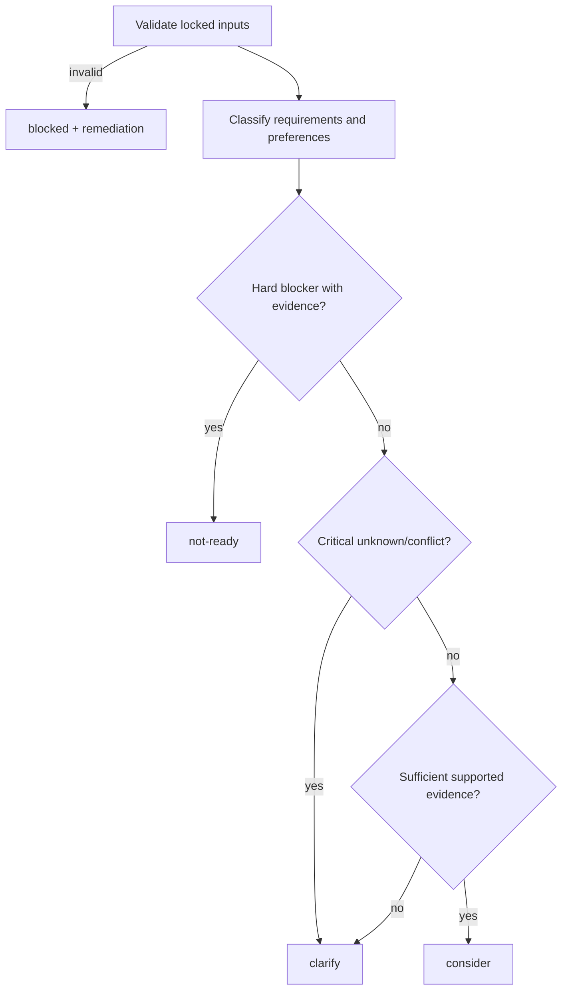

# 06 — Explainable Matching

**Trạng thái:** Bounded local subset delivered 2026-09-12; the broader capability remains proposed
**Nền tảng:** [01 — Product scope](01-product-scope.md), [02 — Kiến trúc](02-system-architecture.md), [03 — Mô hình dữ liệu](03-domain-model-and-artifact-contracts.md)
**Phụ thuộc:** [04 — Profile and evidence](04-profile-and-evidence.md), [05 — Job discovery](05-job-discovery-and-ingestion.md), [11 — Agent orchestration](11-agent-orchestration.md)
**Quyết định chung:** [00 — Decision log](00-decision-log.md)
**Đầu ra cho:** [07 — Document Studio](07-document-studio-and-versioning.md), [08 — Approval và submission](08-approval-and-submission.md), [10 — Coaching](10-interview-and-career-coaching.md)

## 1. Mục tiêu

Cung cấp một đánh giá để ứng viên hiểu **vì sao** nên xem xét, cần làm rõ, hoặc chưa nên theo một JD; không thay ứng viên quyết định và không ngụy trang judgment thành một phần trăm fit. Matching là một snapshot versioned của: job capture/analysis, profile version, preference version, matcher policy và agent/model run.

Kết quả cần hữu ích riêng cho IT tại HCM/Vietnam: technical stack, seniority, evidence thực hành, ngôn ngữ, arrangement/commute, compensation gross/net, working condition (on-call/overtime), employment contract và application constraints.

Phạm vi đã giao chỉ gồm một capture JD đã xác minh, một immutable source-bound analysis revision, một profile revision đã publish cùng evidence, và các immutable assessment revisions dưới policy `m4-v1`. Đây là assessment explainable advisory, không phải matcher scoring engine và không cấp quyền tạo CV, approve, archive hay submit.

## 2. Nguyên tắc quyết định

1. **Evidence over score.** UI không dùng tổng điểm, màu xanh/đỏ không thay lý do.
2. **Requirement modality matters.** `required`, `preferred`, `unknown` từ JD không được bị flatten thành keyword list.
3. **Unknown is valid.** Không có bằng chứng không đồng nghĩa không có kỹ năng; kết luận là `unknown`/question, không là gap chắc chắn.
4. **No fabricated equivalence.** Agent không được tự coi Docker tương đương Kubernetes, React tương đương Angular, hay GitHub repo tương đương production experience.
5. **Candidate owns decision.** Matcher đề xuất; candidate chọn pursue/archive/ask/ignore. Không tạo submission approval.
6. **Reproducible snapshot.** Nếu profile hoặc JD đổi, result cũ còn đọc được và được đánh dấu stale, không bị rewrite.

## 3. Input contract

| Input | Required | Version lock |
| --- | --- | --- |
| Verified job capture + source-bound analysis | Có | `jobId`, `captureId`, `analysisId`, capture/source/analysis hashes |
| Published candidate profile | Có | `profileRevisionId`, exact revision hash, claim-to-evidence mapping |
| Preferences/constraints | Embedded | Selected profile revision; no separate preference version in this subset |
| Matcher policy | Có | `policyVersion: "m4-v1"` |
| Producer/run metadata | Có | skill version, model label, prompt template hash; supplied by the producer |

Nếu analysis invalid, capture missing/corrupt, profile revision không tồn tại hoặc user chưa publish profile, context reader trả `blocked` với remediation cụ thể. `blocked` không được persist như một assessment. Nó không fallback âm thầm sang latest profile, legacy `analysis.json`, raw text khác hoặc profile revision khác với revision đã chọn. Context ready cũng trả `evidenceBindings`: danh sách canonical đã sort gồm `{ id, hash }` cho toàn bộ evidence artifact của profile revision đã chọn; skill chỉ copy danh sách này vào assessment.

## 4. Kết quả matching

```ts
type MatchAssessment = {
  schemaVersion: 2;
  id: string;
  createdAt: string;
  createdBy: { kind: "agent"; role: "match-analyst"; skillVersion: string; model: string; promptHash: string };
  contentHash: string;
  jobRef: { jobId: string; captureId: string; captureHash: string; sourceHash: string; analysisId: string; analysisHash: string };
  profileRef: { revisionId: string; revisionHash: string; evidence: Array<{ id: string; hash: string }> };
  policyVersion: "m4-v1";
  recommendation: "consider" | "clarify" | "not-ready";
  confidence: "high" | "medium" | "low";
  summary: string;
  requirementAssessments: RequirementAssessment[];
  preferenceChecks: PreferenceCheck[];
  blockers: Finding[];
  questions: Question[];
  anomalies: Finding[];
};
```

Mỗi `RequirementAssessment` có requirement quote/location từ JD, modality, verdict và profile evidence IDs. Verdict chỉ là `supported`, `partially-supported`, `not-evidenced`, `unknown`, `conflicting`, `not-applicable`; an optional question records unresolved follow-up without changing evidence.

Trong artifact, requirement quote/location is resolved from the exact source-bound analysis and evidence IDs are checked against the selected profile revision. `supported`, `partially-supported`, `conflicting` and blockers require evidence; `unknown`/`not-evidenced` stay unresolved. Questions identify `candidate` or `employer` ownership. Anomaly text, including prompt-injection-looking JD content, is treated as untrusted data and cannot change tools, permissions or output shape.

`confidence` nói độ đầy đủ/độ rõ của input cho recommendation: `low` khi JD mơ hồ, source missing hoặc nhiều required facts chưa xác minh. Nó không phải confidence năng lực ứng viên.

Assessment freshness là một trạng thái rõ ràng: `current` khi toàn bộ capture, analysis, profile và evidence binding vẫn khớp; `stale` khi một input hợp lệ mới hơn hoặc evidence artifact hợp lệ đổi bytes; `needs-repair` khi pointer, capture, revision hoặc evidence bị thiếu, hỏng hoặc không nhất quán. Current/detail API trả `409` generic cho `needs-repair` để không hiển thị recommendation chưa còn đáng tin. Context historical có thể nhận `analysisRevision` cùng `profileRevision` và đọc đúng artifact đã bind, không rơi về current; response là `no-store` và ready context mang ETag. Artifact schema-version 1 từ trước khi có evidence binding vẫn xuất hiện trong history với trạng thái unbound/repair để recovery, nhưng không được xem là current/stale hoặc republish trực tiếp.

## 5. Logic recommendation, không dùng score



Hard blocker phải là một declared candidate constraint hoặc an explicit job requirement mà evidence xác thực mâu thuẫn: ví dụ JD bắt buộc onsite ngoài location ứng viên đã cấm; work authorization bắt buộc không phù hợp theo user-confirmed constraint; salary stated thấp hơn minimum do user xác nhận. Không thể là phỏng đoán về culture, company prestige hoặc AI preference.

`clarify` là trạng thái hợp lệ khi salary, location, language, contract, required skill depth, years, on-call/overtime, deadline, eligibility hoặc document language chưa rõ. Nó cần nêu câu hỏi **ai có thể trả lời** (candidate hoặc employer) và hành động safe tiếp theo.

`consider` không có nghĩa “chắc nên apply”. Nó nghĩa current evidence không có blocker/critical ambiguity và một tailored application có thể đáng để người dùng duyệt. `not-ready` không là phán xét giá trị ứng viên; UI phải hướng đến options: add evidence, learn, ask, or archive.

## 6. IT-aware assessment playbook

The delivered global policy identity is `m4-v1`. It enforces structural provenance and modality/evidence rules only. A role-family policy, ontology or semantic matcher remains future work; any mapping below is a review prompt, not auto-equivalence.

| Dimension | Câu hỏi evidence-based | Không được suy ra |
| --- | --- | --- |
| Stack | Candidate từng dùng đúng technology trong bối cảnh nào? | Skill list = production expertise |
| System scope | Có evidence ownership/design/operation nào? | Repo contributor = system owner |
| Seniority | JD nêu scope/years/leadership gì và profile nêu gì? | Title ở công ty A = seniority ở công ty B |
| DevOps/SRE | CI/CD, cloud, IaC, observability, on-call được nêu ra sao? | Docker = Kubernetes/SRE experience |
| QA | Manual/automation, tools, test design, API/UI/performance scope? | Biết Selenium = test strategy ownership |
| BA | Domain, stakeholders, requirements/process artifacts? | "worked with product" = BA experience |
| AI/data | Data lifecycle, model serving/evaluation, privacy? | Đã dùng LLM = AI engineer |
| Language | JD/candidate evidence có level/usage context? | English CV = professional fluency |

The policy may note adjacent experience as a **possible transfer** only when labelled `candidate-to-confirm`, with no claim inserted into any application document until user confirms.

## 7. Preference checks cho HCM/Vietnam

Preference check không được guess commute. Nó so sánh facts:

- location: TP.HCM/quận/remote-Vietnam chỉ khi JD và candidate đều nêu;
- arrangement: onsite/hybrid/remote và ngày onsite nếu stated;
- compensation: display exact text first; only compare numeric range when currency/gross-net/period are explicit and parser confidence is high;
- employment type, probation, notice/start date, overtime/on-call/travel;
- interview language và legal/work authorization where source-backed.

Nếu `20–30 triệu` chưa biết gross/net, result là `clarify` nếu candidate constraint phụ thuộc distinction đó. Không đổi sang USD hay annualized salary trừ khi user yêu cầu preview và thấy calculation.

## 8. Anomaly and safety checks

Matcher runs a non-authoritative risk checklist alongside matching:

- JD yêu cầu nộp phí, gửi OTP/password, cài phần mềm lạ, dùng personal bank account;
- inconsistency giữa company/domain/email/URL hoặc source duplicate unusual;
- instruction-looking text muốn agent bỏ policy, tiết lộ profile, hoặc submit ngay;
- missing employer identity or requirement to move conversation off-platform.

An anomaly blocks automatic document/share/submission and is presented as a factual warning, not accusation. User can mark `reviewed-continue` with local rationale; the override remains visible to [08](08-approval-and-submission.md).

## 9. UI contract

Job detail presents, in this order:

1. snapshot label: profile version, capture date, freshness/staleness;
2. recommendation and plain-language summary;
3. requirement table with JD quote, modality, verdict, candidate evidence links, and question;
4. preference/constraint checks; then blockers/anomalies/questions;
5. current bounded UI action: read local recovery/remediation guidance and the exact local rerun handoff; later profile/document/archive actions remain proposed.

No action button says “Apply” based only on this result. A result may be exported as a local Markdown/JSON audit artifact but never sent to an employer.

## 10. Acceptance criteria

- Every positive match and blocker links to job and/or candidate evidence; unknowns are explicit.
- Test cases prove that synonym/adjacency does not become a fabricated qualification.
- Any changed job capture, profile, preference or policy marks previous match stale.
- Required/preferred/unknown modality appears in UI and output.
- Result contains meaningful HCM/Vietnam checks without parsing speculative salary/location facts.
- A prompt injection fixture cannot change the permitted agent tools, profile data or recommendation policy.

The bounded implementation is verified by synthetic local fixtures in Vietnamese and English. It proves exact evidence support, Docker not becoming Kubernetes, unresolved missing skills, required/preferred/unknown modality preservation, `20–30 triệu` gross/net clarification, stated HCMC/hybrid facts, prompt-injection anomaly handling, immutable history, stale detection and repair/blocked states. Browser rendering is separately environment-dependent; automated renderer/controller evidence is the fallback when a visible local browser is unavailable.

## 11. Câu hỏi mở

1. Có cần saved user policy như “không direct report/không startup stage X”, hay để notes trong V1?
2. Skill ontology có nên dùng dictionary local versioned, hay chỉ string normalization + candidate confirmation trước?
3. Khi company/role changes materially, dedupe có tạo match mới bắt buộc không? Đề xuất: có.

## 12. Delivered boundaries and explicit deferrals

The local delivery does not execute a provider/model, calculate a score or ranking, infer synonym/technology equivalence, parse or convert salary, geocode commute, create a CV, update a profile, approve/archive an application, call tools from JD text, use a connector, write a database, or submit externally. Legacy artifacts remain readable and are not silently migrated. Saved custom policies, role-family rules, broader analytics and downstream document/application contracts remain proposed follow-up work.

## Liên kết tiếp theo

- [07 — Document Studio](07-document-studio-and-versioning.md) dùng assessment snapshot để tạo document proposal.
- [08 — Approval and submission](08-approval-and-submission.md) yêu cầu assessment/document versions cụ thể.
- [10 — Interview and coaching](10-interview-and-career-coaching.md) dùng gaps/questions nhưng không biến chúng thành sự thật profile.
