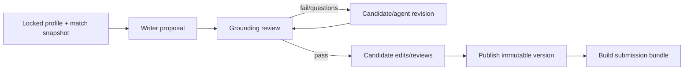

# 07 — Document Studio và Versioning

**Trạng thái:** Proposed
**Nền tảng:** [01 — Product scope](01-product-scope.md), [02 — Kiến trúc](02-system-architecture.md), [03 — Mô hình dữ liệu](03-domain-model-and-artifact-contracts.md)
**Phụ thuộc:** [04 — Profile and evidence](04-profile-and-evidence.md), [06 — Explainable matching](06-explainable-matching.md)
**Quyết định chung:** [00 — Decision log](00-decision-log.md)
**Đầu ra cho:** [08 — Approval và submission](08-approval-and-submission.md), [09 — Application lifecycle](09-application-lifecycle-and-outcomes.md)

## 1. Mục tiêu

Tạo và quản lý bộ hồ sơ theo từng JD — CV, cover letter, portfolio selection, email draft và form-answer set — mà không làm thay đổi base profile, không bịa facts, và luôn biết chính xác phiên bản nào đã được candidate duyệt/nộp.

Document Studio là local editor/preview/workflow; không phải cloud word processor, không phải ATS upload service, và không được tự gửi document đến portal/email.

## 2. Các khái niệm chính

| Đối tượng | Ý nghĩa | Bất biến |
| --- | --- | --- |
| Document family | "CV Backend", "Cover letter job X" | Có history, không là file duy nhất bị sửa đè |
| Document version | Một content snapshot + metadata/hash | Có, sau publish không đổi |
| Draft working copy | Bản đang agent/user chỉnh | Có thể thay đổi; không được dùng để submit |
| Template | Layout/rules, versioned local | Bản đã dùng được giữ reference |
| Document bundle | Tập documents + form answers cho một destination | Khóa bằng immutable IDs khi approval |
| Render | PDF/DOCX/HTML output của một version | Artifact dẫn xuất, gắn source hash |

Document ID không mang PII. Content file nằm dưới `data/` ignored. Metadata/audit phải lưu local và không nhét raw PDF/text nhiều lần nếu có pointer/checksum.

## 3. Version contract

Mỗi published version có tối thiểu:

```json
{
  "documentVersionId": "docv_01J...",
  "documentFamilyId": "docf_01J...",
  "kind": "cv",
  "jobRef": { "jobId": "job_...", "captureId": "cap_..." },
  "profileVersionId": "profilev_...",
  "matchAssessmentId": "match_...",
  "templateVersionId": "tpl_cv_it_...",
  "contentHash": "sha256:...",
  "sourceClaimIds": ["claim_..."],
  "createdBy": { "actor": "candidate|agent", "agentRunId": "..." },
  "review": { "grounding": "passed|failed|needs-review", "findings": [] },
  "createdAt": "..."
}
```

Một document content đổi dù chỉ dấu chấm cũng tạo version mới khi publish. Working autosave có thể sử dụng snapshot tạm nội bộ, nhưng submission/approval chỉ tham chiếu published version hash. Không “update” document version đã từng approved/submitted.

## 4. Document types và language

V1 supports:

- CV (Việt, English, hoặc bilingual layout theo user chọn);
- cover letter/email; portfolio project selection; form answer set;
- optional public-contact subset.

Language is per document, not inferred by job portal. Bản Việt và Anh là hai document versions/families rõ ràng; translation agent phải ghi `derivedFromDocumentVersionId` và không thêm fact. Người dùng chọn exact document language trong bundle.

Template cho IT role có thể nêu relevant sections (summary, technical skills, experience, selected projects, education/certification), nhưng không bắt ứng viên có đủ mọi section và không dùng fake keyword list. Data/AI role có thể cần projects/evaluation, DevOps có thể cần infrastructure impact; content vẫn phải trace về claims.

## 5. Draft workflow



Writer receives the locked profile version, job capture/analysis, match assessment and template. It may prioritize/rephrase supported claims but not invent achievements, metrics, employers, dates, qualifications, client names, visa status, salary, availability, degree or language level. Claims not present in selected profile may appear only as explicit questions/placeholders, never polished assertions.

Grounding Reviewer verifies every material external claim has sourceClaim IDs and compatible evidence status. It flags:

- claim absent from profile/evidence; altered metric/date/title/employer;
- stronger verb/ownership/seniority than source supports;
- copied JD requirement phrased as candidate experience;
- hidden text, keyword stuffing, contradictory contact info;
- unsafe output such as prompt instructions or credential requests.

`passed` means the reviewer found no blocking grounding issue; it is not a guarantee of correctness or employer acceptance. Candidate can publish with non-blocking warnings only after acknowledgement; a blocking finding cannot be overridden into an approval bundle without an explicit corrected/profile-confirmed claim.

## 6. Candidate editing and claim reconciliation

The user may edit any draft. After any edit, the system performs diff-based reconciliation:

- existing supported sentences retain/confirm claim links where content still corresponds;
- new material claims need user link to existing claim/evidence, conversion to a profile fact through [04](04-profile-and-evidence.md), or deletion;
- an unlinked claim yields `needs-review` and cannot enter approved bundle.

UI presents evidence side-by-side rather than requiring the candidate to understand IDs. It must never silently rewrite the candidate's prose to make review pass.

## 7. Render and ATS-quality checks

PDF/DOCX export is a **derived local render**. The app stores render hash, renderer/template version and output path. Rendering never replaces Markdown/structured canonical content.

Checks are advisory and local:

- readable text extraction; headings and dates not obscured; no image-only content;
- contact information present only when candidate chose it;
- pagination/overflow; link targets reasonable; selected language consistent;
- no confidential local paths, hidden prompts, debug notes or unreviewed placeholders.

Do not claim ATS compatibility score or pass guarantee. Each portal has its own behavior; a document render only proves local file quality. Preview-only renders outside the outgoing bundle do not require re-approval. If PDF/DOCX is an outgoing attachment, its exact bytes/hash belong in the bundle: a changed attachment invalidates approval even when the canonical Markdown is unchanged, as required by [03](03-domain-model-and-artifact-contracts.md).

## 8. Rollback, fork, retention

Users can view, compare, fork and re-use prior versions. "Restore" creates a new draft copied from old version, not mutation of history. A document used by approval/submission is retained as audit artifact even if newer version exists. Hard purge requires an explicit confirmation that names affected application records and removes local bytes under retention policy [03](03-domain-model-and-artifact-contracts.md).

## 9. Migration from current artifacts

Existing `data/jobs/<job-id>/cv-draft.md` is imported as an `unverified-legacy` document version with raw file checksum and source job reference. It must not be retroactively reported as grounded, reviewed or approved. Existing `candidate-profile.json` becomes an imported profile version as specified in [04](04-profile-and-evidence.md). No migration overwrites old files before a recoverable copy/check succeeds.

## 10. Acceptance criteria

- Document version locks one job capture, profile and match snapshot, and exposes their IDs/hashes in UI.
- Any content modification after publish produces a new version and invalidates existing approval eligibility.
- Every material fact in an approvable document has supported/user-confirmed local evidence.
- User can create Vietnamese and English variants without implicit translation or fact creation.
- PDF/DOCX output is traceable to one immutable document version, and render warnings are clearly advisory.
- Existing local CV draft can be migrated without losing data or pretending it was reviewed.

## Liên kết tiếp theo

- [08 — Approval and submission](08-approval-and-submission.md) locks exact document versions for external action.
- [09 — Lifecycle and outcomes](09-application-lifecycle-and-outcomes.md) records which document bundle produced an outcome.
