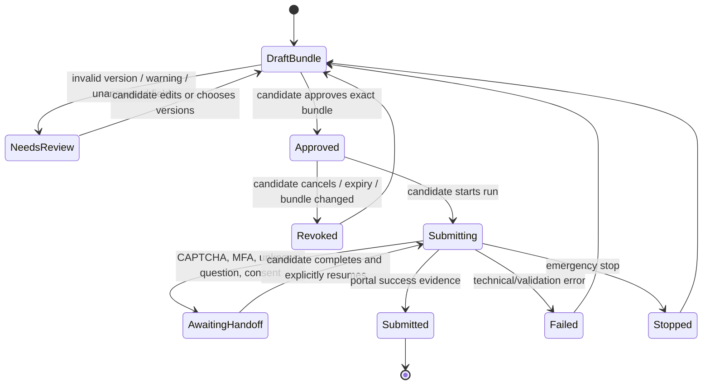

# 08 — Candidate Approval và Submission có Kiểm soát

**Trạng thái:** Proposed
**Nền tảng:** [01 — Product scope](01-product-scope.md), [02 — Kiến trúc](02-system-architecture.md), [03 — Mô hình dữ liệu](03-domain-model-and-artifact-contracts.md)
**Phụ thuộc:** [05 — Job discovery](05-job-discovery-and-ingestion.md), [06 — Explainable matching](06-explainable-matching.md), [07 — Document Studio](07-document-studio-and-versioning.md)
**Quyết định chung:** [00 — Decision log](00-decision-log.md)
**Đầu ra cho:** [09 — Application lifecycle](09-application-lifecycle-and-outcomes.md)

## 1. Mục tiêu

Cho phép ứng viên dùng agent/browser assistant để nộp vào một job cụ thể, nhưng **không có auto-apply hoàn toàn**. Mọi external submission cần một approval cryptographically/semantically bound vào destination, JD capture, document bundle và form answers chính xác; agent không được thay đổi các input đó sau approval.

Điều này áp dụng cho TopCV, VietnamWorks, LinkedIn, ITviec, CareerViet, Glints, company careers và email. Khác biệt portal chỉ thay đổi adapter/handoff; không thay đổi quyền quyết định của candidate.

## 2. Safety invariants

1. Candidate là actor duy nhất tạo approval và bật execution. Agent không thể tự approve, dùng approval cũ cho job khác, hoặc resume một run bị dừng.
2. Approval chỉ hợp lệ cho **một destination** + **một capture/job** + **một document/form bundle hash** + expiry.
3. Credential/session thuộc browser profile/OS keychain của người dùng. Workspace không lưu password, OTP, cookie raw hoặc token portal.
4. CAPTCHA, MFA, consent popup, unexpected question, payment, fee, off-platform request hoặc mismatch URL => agent dừng và handoff cho candidate.
5. User có emergency stop có hiệu lực ngay trên run queue local; stop không giả vờ undo submission đã thành công.
6. Receipt/audit log cần đủ chứng minh hành động, nhưng không log resume/CV raw, password, OTP hoặc page HTML nhạy cảm.

## 3. Submission bundle và approval record

Một `SubmissionBundle` chỉ được build từ published/reviewed versions:

```json
{
  "bundleId": "bundle_01J...",
  "jobRef": { "jobId": "job_...", "captureId": "cap_..." },
  "destination": { "portal": "linkedin", "canonicalUrl": "https://...", "externalJobId": "..." },
  "matchAssessmentId": "match_...",
  "documents": [{ "kind": "cv", "documentVersionId": "docv_...", "contentHash": "sha256:..." }],
  "formAnswerSetVersionId": "ansv_...",
  "contactDisclosure": ["email", "phone"],
  "anomalyAcknowledgements": ["anomaly_..."],
  "bundleHash": "sha256:..."
}
```

Approval contains bundle hash, `approvedAt`, `expiresAt`, candidate-local confirmation method, `approvalId`, and status `active|used|expired|revoked`. Expiry default is short (proposal: 30 minutes) and becomes invalid if job is possibly closed, destination URL changes, document/form/profile linkage changes, new blocking anomaly appears, or candidate revokes it.

Approval screen must show human-readable summary: company/title as stated, portal/domain, exact files and form answers, privacy fields disclosed, job source timestamp, warnings, and what happens next. It must not hide a free-text answer generated by agent below a generic "approve" button.

## 4. State machine



`Submitted` requires portal success signal plus receipt evidence, not merely a button click. If signal ambiguous (network interruption after click, portal changed), status is `submission-unknown`; agent must not retry automatically because duplicate application risk is higher than convenience. It guides candidate to inspect portal and then mark confirmed/failed manually with rationale.

## 5. Browser and adapter model

Execution occurs in a local browser profile chosen by candidate. The adapter is allowlisted per portal and has a minimal capability interface: open approved destination, read known form fields, fill only approved values/files, detect result/handoff, record safe receipt. It cannot navigate arbitrary domains, send messages, change profile settings, accept terms on candidate's behalf, add payment methods, or bypass technical controls.

For every field, the UI/adaptor categorizes:

- **Approved fill:** exact answer/value appears in bundle or candidate's allowed contact disclosure.
- **Review required:** question is new, options differ, asks sensitive/voluntary data, or answer transformation could be material.
- **Never fill automatically:** password, OTP, CAPTCHA, payment, identity verification, EEO/health/disability data unless candidate manually completes in browser.

Autofill may preview values before form submission, but final portal `Submit` click still requires a locally visible candidate confirmation. If product later supports direct final click, it needs a separate approved spec and cannot be inferred here.

## 6. Credential and privacy boundary

Prefer native browser session; do not copy cookie store into workspace. If an OS keychain integration is added later, store opaque secret references only and require user unlock per run. Never put secret values in agent prompts, logs, filesystem artifacts, screenshots, test fixtures or crash reports.

Submission agent receives only needed document bytes/paths and approved field values. It receives no whole profile by default. Temp files have restricted permissions, are scoped to one run and deleted after verified receipt/terminal failure according to [03](03-domain-model-and-artifact-contracts.md); deletion failure is surfaced as local security warning.

## 7. Receipt and audit record

A terminal run writes an immutable local `SubmissionReceipt`:

| Field | Purpose |
| --- | --- |
| Run/approval/bundle IDs and hashes | Proves exactly what was authorized |
| Portal/destination/external job ID | Identifies target without storing credentials |
| Started/ended timestamps and terminal state | Timeline and debugging |
| Event trail | navigation, fill, handoff, candidate resume, submit signal |
| Proof reference | confirmation number/text or redacted screenshot path when safe |
| Error classification | user-safe diagnosis; no secrets |

Receipt uses `submitted`, `failed`, `stopped`, or `unknown`, never claims employer received/reviewed application unless a portal result says so. A redacted screenshot is optional and user-visible before saving; default is textual confirmation reference.

## 8. Error and recovery rules

- **Expired/revoked approval:** return to bundle review; never reapprove silently.
- **Missing file/version hash mismatch:** block; rebuild bundle, run reviewer if content changed.
- **Rate limited:** stop, record portal-specific retry time if stated; no background retry.
- **Layout changed:** stop adapter, save diagnostic selector/version only; candidate can complete manually.
- **Network failure after submit:** mark unknown and suppress retry; offer portal inspection checklist.
- **Candidate emergency stop:** halt next safe boundary; mark what action may already have occurred.

## 9. Acceptance criteria

- An agent cannot reach any portal submission without a current candidate approval bound to exact inputs.
- Document, form-answer, destination or job-capture modification invalidates approval.
- CAPTCHA/MFA/new sensitive question blocks automation and produces candidate handoff.
- Portal result ambiguity does not trigger retry or a false `submitted` state.
- Audit receipt tells candidate what was done without retaining credentials or unredacted sensitive data.
- Tests cover approval replay, URL swap, CV hash change, emergency stop, challenge, rate limit and post-click network failure.

## Liên kết tiếp theo

- [09 — Application lifecycle and outcomes](09-application-lifecycle-and-outcomes.md) consumes receipt and tracks post-submission states.
- [07 — Document Studio](07-document-studio-and-versioning.md) governs every file allowed in a bundle.
