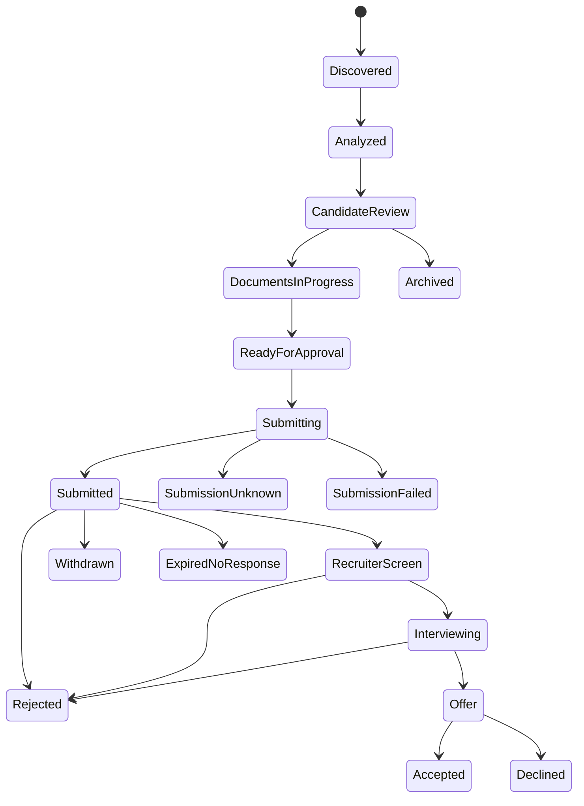

# 09 — Application Lifecycle, Outcomes và Local Analytics

**Trạng thái:** Proposed
**Nền tảng:** [01 — Product scope](01-product-scope.md), [02 — Kiến trúc](02-system-architecture.md), [03 — Mô hình dữ liệu](03-domain-model-and-artifact-contracts.md)
**Phụ thuộc:** [05 — Job discovery](05-job-discovery-and-ingestion.md), [07 — Document Studio](07-document-studio-and-versioning.md), [08 — Approval và submission](08-approval-and-submission.md)
**Quyết định chung:** [00 — Decision log](00-decision-log.md)
**Đầu ra cho:** [10 — Interview and coaching](10-interview-and-career-coaching.md)

## 1. Mục tiêu

Lưu hành trình từng application, từ job discovery đến outcome, để ứng viên kiểm soát follow-up và học từ dữ liệu của chính mình. Đây là local application CRM tối giản, không phải ATS, recruiter CRM hay email sync bắt buộc.

Analytics trả lời các câu hỏi thực dụng: nguồn JD nào tạo interview; strategy/document version nào tạo response; thời gian chờ thường gặp; yêu cầu/gap nào xuất hiện lặp lại. Analytics mô tả correlation trên local sample nhỏ, không đưa ra causal claims hoặc đánh giá giá trị ứng viên.

## 2. Application là record riêng với job

Một canonical job có thể có zero/one active application per destination. Nếu candidate áp dụng lại khi employer yêu cầu hoặc position repost mới, tạo application attempt mới với reason. Không dùng `job.status = submitted` làm nguồn chân lý vì một job có thể có nhiều portal/destination/capture.

```ts
type Application = {
  applicationId: string;
  jobRef: { jobId: string; captureId: string };
  destination: { portal: string; canonicalUrl: string; externalJobId?: string };
  submissionReceiptId?: string;
  currentState: ApplicationState;
  timeline: TimelineEvent[];
  documentBundleId?: string;
  ownerNotesPath?: string;
  createdAt: string;
  updatedAt: string;
};
```

Application must preserve references/hashes to source job, approved bundle and receipt even when job content or profile later changes. Private notes and message content are local and are not sent to agents unless candidate invokes an explicit task.

## 3. State machine



`Analyzed`, `CandidateReview`, `DocumentsInProgress` and `ReadyForApproval` can be job-level planning states, while `Submitting` onward must be application-at-destination level. UI may group them for readability but data must not lose the distinction.

`SubmissionUnknown` is a safety state from [08](08-approval-and-submission.md); user must confirm result before creating a duplicate attempt. `ExpiredNoResponse` means a user-defined follow-up horizon has elapsed, not proof of rejection.

## 4. Timeline and evidence

Every state transition creates an append-only timeline event:

- actor: candidate, named local agent, system deterministic action;
- action/state transition, timestamp, reason/category;
- supporting reference: receipt, user note, email export, calendar entry, portal confirmation;
- privacy visibility and optional redaction status.

The user may correct an incorrectly recorded state. Correction adds a superseding event/reason; it does not mutate or erase the original action from audit history. Manual updates use `candidate-reported` provenance. Import from email/calendar is future opt-in functionality and must retain source/datetime rather than agent inference.

## 5. Follow-up planner

Follow-up is a proposal queue, never a scheduled send. It can calculate local reminders from candidate-defined rules such as "consider follow-up 7 business days after submission if no response". It must account for actual application date, stated employer timeline and local public holidays only if a local reference dataset/version is installed; otherwise say date is approximate.

For each proposal, UI shows: why now, delivery channel, draft template, information source, and final candidate edit/send requirement. V1 does not send emails, LinkedIn messages or calendar invites. A future send integration requires its own approval model; submission approval does not grant messaging authority.

## 6. Outcome capture

Outcome types: `no-response`, `rejected`, `withdrawn`, `interview`, `offer`, `accepted`, `declined`, `unknown`. Add structured optional fields:

- stage/rejection reason only when employer/user says it;
- dates: response, interview, offer, decision; source/provenance;
- compensation offer: classification as sensitive, never added to profile automatically;
- candidate reflection: free text local only; consent setting before agent uses it;
- tags: technical screen, HR, coding test, system design, take-home, language interview.

Do not interpret silence as rejection automatically; a reminder may help candidate decide to mark it. Do not use employer feedback as universal truth (e.g., a rejection is not a profile fact nor an automatic skill gap).

## 7. Local analytics model

Analytics runs entirely on local application records. The default dashboard uses counts and denominators, explicit date filters, and explains incomplete data. Suggested views:

| View | Example calculation | Guardrail |
| --- | --- | --- |
| Funnel | discovered → analyzed → approved → submitted → response → interview → offer | Display denominator and incomplete/unknown counts |
| Source effectiveness | interviews/submissions by TopCV, ITviec, LinkedIn, company site | Do not compare tiny sample as definitive |
| Document experiment | response/interview by CV/cover-letter template/version family | Mark confounders: role, seniority, source, date |
| Time | median days to first response/interview | Separate censored/no-response attempts |
| Market signals | requirements/gaps in analyzed jobs | Distinguish JD mentions from candidate deficiencies |
| Strategy | arrangement, HCM area, language, salary range where stated | Never infer gross/net or commute preference |

Minimum sample threshold is a presentation rule (proposal: hide percentage comparison below 5 submitted applications and show counts instead). No recommendation should say a document "caused" an outcome. An agent may propose a hypothesis, label it low confidence and ask candidate before changing strategy.

## 8. Data retention, export and deletion

All records live in ignored local workspace storage. Candidate can export a portable, redacted archive with explicit include toggles for raw JD, documents, notes and receipt proof. Export does not include credentials/browser data. Deleting an application explains that it removes local analytics/timeline but cannot withdraw an external submission; dependent immutable documents/captures are retained or purged only under the explicit retention plan in [03](03-domain-model-and-artifact-contracts.md).

## 9. Acceptance criteria

- Application state cannot become `submitted` without a valid receipt or manual candidate correction with rationale.
- Duplicate/submission-unknown workflow prevents unsafe automatic retries.
- Every transition has actor/time/provenance and corrections are append-only.
- Follow-up tasks are local proposals; no agent sends or schedules external messages.
- Analytics is reproducible from local records, labels sample size/unknowns and avoids causal/fit-score claims.
- A later profile or document update never changes historical application bundle references.

## Liên kết tiếp theo

- [10 — Interview and career coaching](10-interview-and-career-coaching.md) uses opted-in application/outcome context.
- [08 — Approval and submission](08-approval-and-submission.md) defines the only way a run becomes a receipt-backed submission.
