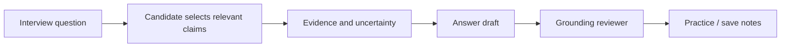

# 10 — Interview Preparation và Career Coaching

**Trạng thái:** Proposed
**Nền tảng:** [01 — Product scope](01-product-scope.md), [02 — Kiến trúc](02-system-architecture.md), [03 — Mô hình dữ liệu](03-domain-model-and-artifact-contracts.md)
**Phụ thuộc:** [04 — Profile and evidence](04-profile-and-evidence.md), [06 — Explainable matching](06-explainable-matching.md), [09 — Application lifecycle](09-application-lifecycle-and-outcomes.md)
**Liên quan:** [11 — Agent orchestration](11-agent-orchestration.md), [07 — Document Studio](07-document-studio-and-versioning.md), [00 — Decision log](00-decision-log.md)

## 1. Mục tiêu

Giúp một ứng viên IT chuẩn bị phỏng vấn và điều chỉnh chiến lược tìm việc dựa trên job, evidence profile và outcome local mà người dùng đã chọn chia sẻ với agent. Coaching tạo practice material, questions, feedback và experiments; nó không giả vờ là interviewer thật, không bịa kinh nghiệm, không đưa lời khuyên pháp lý/tài chính và không gửi message/đặt lịch thay ứng viên.

## 2. Context tối thiểu và consent

Candidate phải khởi chạy một coaching session rõ scope. Mặc định agent chỉ đọc:

- job capture/analysis và match assessment được candidate chọn;
- published document versions trong bundle đã chọn;
- candidate facts/evidence cần thiết cho câu trả lời.

Application notes, rejection email, interview transcript, salary offer, personal reflection và calendar details là opt-in theo session. UI hiển thị danh sách file/fact sẽ được đưa vào agent, có thể bỏ từng item. Session metadata lưu local: selected inputs, agent/policy version, timestamps; nội dung hội thoại chỉ giữ nếu user chọn Save.

## 3. Các mode hỗ trợ

| Mode | Đầu vào | Đầu ra | Không được làm |
| --- | --- | --- | --- |
| JD interview plan | Job + assessment | agenda, likely topic map, questions to ask employer | Khẳng định quy trình tuyển dụng nếu JD không nêu |
| Technical drill | Role/stack evidence + JD | coding/debugging/system design/test/SQL/cloud scenarios | Cho đáp án như thể candidate từng làm điều không có evidence |
| Behavioral rehearsal | Candidate selected claims | STAR outline, follow-up questions, feedback | Bịa conflict/metric/leadership story |
| Mock interview | candidate answers in session | transcript/feedback/action items local | Chấm "hire/no hire" hoặc impersonate employer |
| Offer/decision reflection | candidate-provided terms/context | comparison checklist/questions | Legal/tax/financial determination |
| Strategy review | opted-in outcomes/analytics | hypotheses and small experiments | Claim causal certainty or auto-change search plan |

Technical drill packs start with IT role families: backend, frontend, DevOps/SRE, QA/tester, BA, data/AI. Packs are curated versioned local content, not live interview leaks. Each scenario declares difficulty, skills tested, allowed constraints and evaluation rubric.

## 4. Grounded answer coaching

Coaching agent may help user structure a truthful answer using a `claim ledger`:

An answer is tagged:

- `grounded`: material factual portions link to supported/user-asserted claims;
- `candidate-to-confirm`: hypothetical transfer/wording needs user validation;
- `practice-only`: fabricated scenario explicitly marked, never reusable in CV/application;
- `unsupported`: cannot be exported or suggested as factual answer until corrected.

Agent should prefer clarifying questions over inventing. If candidate has no direct Kubernetes experience, it can help say what adjacent work exists, what was learned, and what candidate would do next — while making clear this is not a claim of operating Kubernetes in production.

## 5. Feedback rules

Feedback must separate observable input from suggestion:

- cite the candidate answer or question response, not personality inference;
- flag missing context/result/constraint as an improvement opportunity;
- distinguish content accuracy, clarity, structure and technical reasoning;
- use role/JD evidence where available; label generic advice as generic;
- avoid protected-class, age, appearance, accent, socioeconomic or health judgments.

Agent may produce a small rubric (e.g., `problem framing`, `trade-offs`, `testing/operability`, `communication`) but never collapse it into employability prediction. Candidate controls whether a session is saved, deleted or used in analytics.

## 6. Technical interview plans

Plan generator maps **explicit** JD requirements to plausible evaluation themes:

| Role context | Possible plan sections | Evidence discipline |
| --- | --- | --- |
| Backend | API/data modeling, concurrency, reliability, system design | JD names stack/scope; do not assume FAANG-style loop |
| DevOps/SRE | CI/CD, IaC, observability, incident/on-call discussion | Ask about exact cloud/tool if not stated |
| QA/Test | test design, automation architecture, API/UI/debugging | Separate manual, automation and performance scope |
| BA | requirements, stakeholder alignment, UAT/process/domain | Never state a domain was used unless JD/profile says so |
| Data/AI | data quality, evaluation, serving, privacy/cost | Do not turn LLM prompt use into ML production experience |

Each plan has `sourceBasis`: `job-stated`, `profile-stated`, `generic-role-practice`, or `candidate-requested`. UI displays this marker so candidates know what is inference rather than employer information.

## 7. Coaching from outcomes without overfitting

Strategy coach may read [09](09-application-lifecycle-and-outcomes.md) local analytics only with explicit consent. It outputs:

1. observations (counts/date range/unknowns);
2. tentative hypotheses with confidence and confounders;
3. at most a few reversible experiments; and
4. candidate decision required before changing profile, template or search plan.

Examples of valid output: "In 12 submitted applications with English CVs, 3 received a first response; your local record is too small to attribute result to language. Consider a controlled experiment on similar backend roles." Invalid output: "English CV is why you are rejected" or silently changing CV template.

Never add a rejection reason, interview weakness or skill gap into the base profile automatically. Candidate can turn a learning plan into a manually confirmed preference/note/claim only after reviewing it.

## 8. Notes and retention

Saved practice sessions, transcripts and reflection notes are private workspace artifacts. They are excluded from default document generation and submission bundle. User can export/delete a session independently. If delete cannot remove a backup/history copy, UI explains retention rather than falsely promising erasure. No remote observability captures answer text.

## 9. Acceptance criteria

- User explicitly selects job/profile/outcome context for each session; sensitive notes are opt-in.
- Factual interview answers have claim/evidence linkage or are visibly marked candidate-to-confirm/practice-only.
- Technical questions differentiate job-stated themes from generic role practice.
- Feedback remains evidence-based, respectful and does not make hireability or protected-trait judgments.
- Strategy suggestions display local sample/uncertainty and require user approval before any workflow change.
- Coaching cannot send messages, edit base profile, modify CV, or submit applications by itself.

## 10. Câu hỏi mở

1. V1 nên lưu full mock transcript hay chỉ selected Q&A/feedback to reduce sensitive data?
2. Có cần local voice mode, hay text-first để bảo vệ privacy và giảm surface area?
3. Vietnamese/English rehearsal có nên use separate rubrics or one bilingual shared rubric? Đề xuất: shared rubric, per-language clarity notes.

## Liên kết liên quan

- [04 — Profile and evidence](04-profile-and-evidence.md) là nguồn duy nhất cho career facts.
- [09 — Lifecycle and outcomes](09-application-lifecycle-and-outcomes.md) cung cấp optional context/analytics.
- [08 — Approval and submission](08-approval-and-submission.md) giữ external action ngoài phạm vi coaching.
