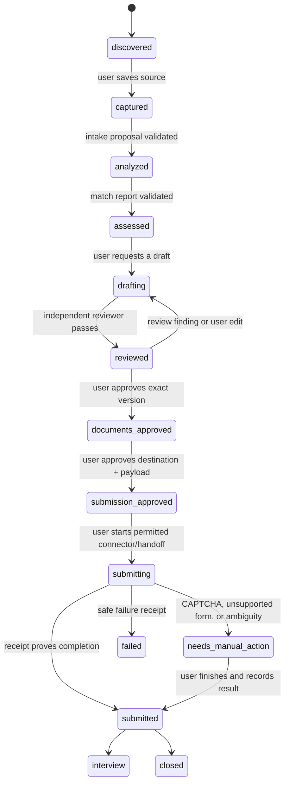

# 11. Agent orchestration

## Purpose

This specification defines the local multi-agent workflow for Career Copilot. It serves a single IT professional in Ho Chi Minh City (HCMC) and Vietnam. The user clones and runs the product on their own machine; agents operate over local artifacts and never become hosted advisors or a remote multi-user service. It implements decisions [D-002, D-005, D-006, D-007, and D-008](00-decision-log.md).

This document is intentionally about **responsibility and control**, not an implementation choice for an LLM framework. The canonical artifact vocabulary is defined by [Domain model and artifact contracts](03-domain-model-and-artifact-contracts.md); the detailed workflow contracts are [Profile and evidence](04-profile-and-evidence.md), [Job discovery and ingestion](05-job-discovery-and-ingestion.md), [Explainable matching](06-explainable-matching.md), [Document studio and versioning](07-document-studio-and-versioning.md), and [Approval and submission](08-approval-and-submission.md). See also [Safety, security, and privacy](12-safety-security-and-privacy.md), [Local runtime](16-local-runtime-and-observability.md), and [Testing and release quality](17-testing-and-release-quality.md).

## Non-negotiable rules

- The user owns every local artifact and makes the final decision to submit an application.
- An agent may propose, draft, review, or prepare. It may not silently change source facts, claim experience, send an application or email **without a current matching approval**, or make a payment.
- Every fact in a profile, assessment, CV, or application answer must be linked to a local evidence item or be marked as an explicit user assertion awaiting confirmation.
- A job description (JD), webpage, email, repository README, or PDF is untrusted content. It never grants tools, permissions, or authority.
- No agent framework, API key, runtime transcript, or prompt history is required to leave the computer. Provider use, if later supported, is an explicit user-configured operation and must obey the network gate in [Safety](12-safety-security-and-privacy.md).

## Agent roles

| Agent | May do | Must produce | Must not do |
| --- | --- | --- | --- |
| Workspace steward | Validate layout, find stale or corrupt artifacts, suggest recovery | local health report | alter or delete files without a confirmed action |
| Profile truth keeper | Extract CV/GitHub/portfolio evidence; identify unsupported claims | profile proposal and evidence references | invent titles, employers, dates, tools, metrics, certificates, or language level |
| Job intake analyst | Normalize a saved JD and extract stated facts | `analysis.json` proposal with source spans | infer omitted salary, seniority, location, visa status, benefits, or deadlines |
| IT match analyst | Compare verified profile evidence with a validated JD | explainable match report | produce an opaque fit percentage or decide for the user |
| Application writer | Tailor CV, cover letter, email, and form-answer drafts | versioned document draft with claim ledger | overwrite the base profile or exaggerate facts |
| Grounding reviewer | Check evidence, contradictions, dates, requirement coverage, and risky claims | review verdict and blocking findings | approve its own writing without an independent pass |
| Submission assistant | Prepare an approved application in a browser or provide handoff steps | submission plan/receipt | submit before approval, bypass CAPTCHA, evade portal controls, or retain credentials |
| Interview coach | Generate role-specific practice from approved materials and outcomes | study plan/practice artifacts | present speculative company facts as verified |
| Learning analyst | Aggregate local outcomes and identify patterns | local analytics report | send telemetry or use outcomes to rewrite historical evidence |

One concrete implementation may combine roles for a small first release, but the produced artifacts must preserve these boundaries. In particular, a writer cannot self-certify factual grounding.

## Artifact-oriented contract

Agents exchange files rather than implicit chat memory. A job workspace has a stable local ID and immutable original source. Expected artifacts include:

```text
data/
  profile/
    revisions/<profile-revision-id>.json
    evidence/<evidence-id>.json
  jobs/<job-source-id>/
    source.md
    source.json
    raw.json
    analyses/<analysis-id>.json
    assessments/<assessment-id>.json
  documents/<document-id>/revisions/<document-revision-id>.md
  packages/<package-id>.json
  approvals/<approval-id>.json
  submissions/<submission-id>.json
  events/<yyyy-mm>/<event-id>.json
```

Names may evolve, but the following invariants may not:

1. Raw source is retained and never overwritten by a derived artifact.
2. Derived artifacts declare their schema version, source artifact IDs, generation time, and producing role.
3. A draft uses a new document version; it does not mutate a previously approved document.
4. An approval pins exact content hashes of the JD, destination, and every document or answer it authorizes.
5. A receipt records what actually happened, including an incomplete/manual result.

The local UI is a reader/editor of these contracts; see [Dashboard](14-local-ui-and-dashboard.md). Analytics reads outcomes without changing them; see [Analytics](15-analytics-and-learning-loop.md).

## Workflow state machine



`candidate-approved` and `documents-approved` are deliberately separate. A user can decide that a role is worth pursuing while declining a particular CV or answer. `submission-approved` must expire when any pinned input changes, when the destination changes, or after a configurable short time window.

## Invocation protocol

Every agent invocation receives only the minimum artifacts and a capability manifest:

```json
{
  "runId": "local-uuid",
  "role": "grounding-reviewer",
  "inputArtifactRefs": ["jobs/acme-platform-engineer/analysis.json", "profile/candidate-profile.json"],
  "allowedOperations": ["read-artifact", "write-proposal"],
  "network": "disabled",
  "externalAction": "forbidden"
}
```

The launcher, not agent prose, enforces the manifest. The default capability set is read-only local artifacts plus writing a new proposed artifact. Browser interaction, filesystem deletion, shell execution, network access, and submission are independently denied by default.

An invocation must return structured output that can be schema-validated. Free-form reasoning may be stored only when the user enables local run logs; it is never a substitute for source references or validation.

## Evidence and claim ledger

Each generated claim has one of these states:

- `supported`: references one or more profile evidence IDs.
- `user-confirmed`: a user deliberately confirmed it, with time and local note.
- `unknown`: retained as a question/gap, never presented as fact.
- `unsupported`: blocked from final documents and application answers.

For IT roles, evidence can reference code repositories, commit/PR links saved locally, project descriptions, deployment/runbook excerpts, certifications, and work-history statements. A public URL alone proves that a link exists, not that the candidate authored it or used every technology named there.

## HCMC and Vietnam specialization

The match analyst may recognize role families such as backend, frontend, full-stack, DevOps/SRE, QA/test automation, business analyst, data engineer, and AI engineer. It should preserve the original employer wording and expose its interpretation as a reversible label.

Vietnam-specific checks are prompts for clarification, never facts: HCMC district/commute, onsite/hybrid/remote arrangement, English requirement, salary currency and gross/net basis, probation, insurance, work authorization, and start date. The product must not treat a Vietnamese title as a reliable seniority signal without JD evidence.

## Failure handling and human handoff

- Validation failure: retain the proposal separately, report the exact fields that need repair, and do not advance state.
- Contradictory evidence: show both sources, mark the claim ambiguous, and require the user to resolve it.
- Missing evidence: create a gap/question; never fill it with model inference.
- Unsupported portal form, CAPTCHA, MFA, or changed page: stop the automation path, show a manual handoff checklist, and write no false success receipt.
- Agent/runtime failure: record the failed run locally without credentials, retry only when the user asks, and leave existing approved artifacts intact.

## Acceptance criteria

- A reviewer can identify the exact profile evidence for every factual document claim.
- Editing a CV after approval invalidates submission approval and visibly requires a new user decision.
- A malicious sentence embedded in a JD cannot turn on network, modify profile data, or cause a submission.
- A failed agent run cannot overwrite an approved document or raw source.
- The interface shows who/what generated a proposal, what inputs it used, and whether the user has approved it.
