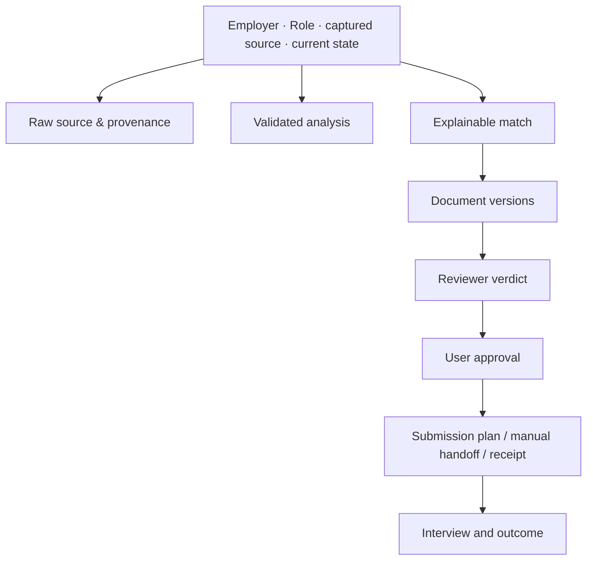

# 14. Local UI and dashboard

## Purpose

The dashboard makes the local artifact workflow understandable without turning it into a remote service. It is served only to the local machine, reads/writes validated workspace artifacts, and lets an IT professional in HCMC track evidence, jobs, drafts, approvals, submissions, interviews, and learning outcomes. It realizes the local-dashboard decision in [D-003](00-decision-log.md).

The UI is not an AI chat replacement. It shows what agents proposed, what evidence supports it, and what the user must decide. Its data relationships originate in [Domain model and artifact contracts](03-domain-model-and-artifact-contracts.md), while detailed screens consume [Explainable matching](06-explainable-matching.md), [Document studio and versioning](07-document-studio-and-versioning.md), [Approval and submission](08-approval-and-submission.md), and [Application lifecycle and outcomes](09-application-lifecycle-and-outcomes.md). See also [Agent orchestration](11-agent-orchestration.md), [Safety](12-safety-security-and-privacy.md), and [Analytics](15-analytics-and-learning-loop.md).

## Design principles

- **Local and legible:** show local data location, last refresh time, schema/parse problems, and no false sync status.
- **Evidence before recommendation:** a match verdict links to requirements, profile evidence, explicit gaps, and confidence/uncertainty.
- **Drafts are not facts:** visually distinguish raw source, validated analysis, AI proposal, user edit, reviewer verdict, approved version, and external receipt.
- **Approval is deliberate:** the primary submit control never collapses multiple decisions into one ambiguous click.
- **Safe degradation:** one corrupt job or missing optional artifact does not blank the library/dashboard.
- **Accessible Vietnamese-first:** Vietnamese UI copy, plain terms, keyboard navigation, visible focus, sufficient contrast, and English technical terms where they preserve precision.

## Information architecture

| Screen | Purpose | Primary actions |
| --- | --- | --- |
| Overview | current local workspace health and next decisions | open blocked job, refresh local artifacts, start import |
| Job inbox | all captured jobs, status and duplicate suggestions | filter, archive, choose one to inspect |
| Job detail | raw source, analysis, match evidence, documents, approval and receipts | request analysis/draft, review evidence, approve a version |
| Profile and evidence | reusable base profile plus source-backed evidence | edit/validate profile, attach evidence, resolve conflicts |
| Document studio | document versions per job | compare, edit a draft, request reviewer, download/export explicitly |
| Applications | state machine, handoffs, receipts, interview/outcome notes | approve a single attempt, open manual handoff, record real outcome |
| Analytics | local trends and data quality | change local filters, inspect underlying records |
| Settings and health | folders, local provider/connector state, log/redaction controls, backup/export | enable a reviewed local configuration, run health check |

Stable local routes may use hash URLs so browser refresh keeps context, for example `#jobs/<job-id>/documents/<document-id>`. Routes contain safe IDs only; private content stays in local APIs/artifacts rather than URL query strings.

## Job detail layout

The job detail page is the central decision surface:

Raw source is always reachable. Analysis panels show a `not stated` value where the JD is silent. Match panels must not lead with a single percentage; they show eligibility blockers, supported strengths, requirements needing clarification, gaps, and confidence with reasons.

## Approval experience

The approval page must render a human-readable immutable review card before the action is enabled:

- employer/role and source destination;
- exact CV/cover letter/attachment version names and hashes; download/compare links;
- every form answer, particularly salary, availability, work authorization, voluntary demographic data, and consent responses;
- reviewer status and unresolved warnings;
- the current connector capability (`manual handoff`, `prepare only`, or a precisely reviewed submission action);
- scope: one attempt only, expiry, and revocation control.

The action labels distinguish **Approve documents**, **Approve this submission attempt**, and **Open portal to finish manually**. “Auto apply” is never a default or a hidden setting. A changed input marks the card stale, disables the final action, and explains why re-approval is needed.

## Handling agent activity

Agent runs appear as local jobs with role, inputs, capability scope, start/end time, output proposal, and concise error state. The UI cannot imply background work if the local process has stopped. It must provide a copyable/re-runnable local command or a clear “run with your configured agent” handoff where direct execution is unavailable.

Review findings are actionable: jump to source evidence, mark a user confirmation, edit a draft, or abandon/archive the proposed version. A model’s chain-of-thought is not required or displayed; concise rationale and evidence references are sufficient.

## Error and corruption UX

Each artifact loads independently. If `analysis.json` is malformed, show the raw JD and a localized recovery panel: file path, safe backup status if known, parse/schema error, and non-destructive repair choices. Never silently replace it with a new analysis. Similar treatment applies to profile, approval, submission receipt, and analytics log errors.

Empty states should direct users to the next local action: save a JD, validate profile, attach evidence, or record a result. They must not invite account registration or cloud sync.

## Search, filtering, and HCMC relevance

All filtering executes locally. Useful dimensions include role family (backend/frontend/DevOps/SRE/QA/BA/data/AI), seniority stated in the JD, language, skill evidence/gaps, HCMC/district/location text, onsite/hybrid/remote, gross/net salary label, source, workflow state, and capture date. Filters show their source/derived nature and never claim a missing value is negative.

## Accessibility and privacy

- Support keyboard completion for the approval and manual-handoff flow; no pointer-only confirmation.
- Do not place CV content, contact data, source text, or approval hashes in browser titles, URLs, clipboard automatically, analytics beacons, or crash reports.
- Confirm before opening an external portal; show the origin about to be opened.
- Use local bundle assets and restrictive content security policy. Render imported HTML/text as inert content.
- Display time in the user’s configured timezone, defaulting to Asia/Ho_Chi_Minh, with ISO timestamp available in details.

## Acceptance criteria

- Every state on the main workflow is understandable from the dashboard without reading source code.
- A user can see exactly why a recommendation exists and what must be fixed before submission.
- A one-job corruption error is isolated while other jobs/profile remain usable.
- An approval card cannot be reused after any pinned artifact or target changes.
- No UI path causes a network request, portal action, or disclosure merely by opening/reloading a page.
