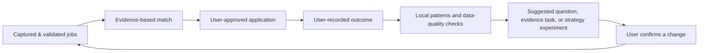

# 15. Analytics and learning loop

## Purpose

Local analytics helps a single user learn which job-search strategy works without uploading their private career history. It is a decision-support feature: it identifies patterns and data gaps, not a prediction engine or an authority that applies to jobs. It consumes only local, user-visible artifacts. It operationalizes [D-001 and D-007](00-decision-log.md).

See [Application lifecycle and outcomes](09-application-lifecycle-and-outcomes.md) for the lifecycle source of truth, [Explainable matching](06-explainable-matching.md) for interpretable dimensions, [Agent orchestration](11-agent-orchestration.md) for outcomes and evidence, [Dashboard](14-local-ui-and-dashboard.md) for presentation, and [Safety](12-safety-security-and-privacy.md) for privacy controls.

## Questions analytics should answer

- Which locally saved sources produce interviews or replies for this user?
- What IT role families, stacks, seniority requirements, arrangements, and HCMC locations occur most often in the user’s viable job set?
- Which requirements recur as documented evidence gaps versus merely being absent from a JD?
- How long does each stage take, and where does the user pause (review, document preparation, manual submission, follow-up)?
- Which approved document strategy/version correlates with callbacks, while clearly showing small sample size and confounding factors?
- Which data quality problems make a conclusion unreliable?

The product must not state that one CV “caused” an interview, rank human worth, infer protected characteristics, or use private outcomes to train/share a global model.

## Local event model

Write an append-only local event log with a schema version and stable IDs. Events hold minimal metadata and artifact references rather than full document text.

```json
{
  "eventId": "evt-local-uuid",
  "occurredAt": "2026-08-31T10:00:00+07:00",
  "type": "application.submitted",
  "jobId": "job-uuid",
  "applicationId": "app-uuid",
  "sourceId": "src-uuid",
  "documentVersionIds": ["cv-v3", "letter-v2"],
  "channel": "manual-handoff",
  "recordedBy": "user",
  "schemaVersion": 1
}
```

Suggested event families:

| Family | Examples | Notes |
| --- | --- | --- |
| capture | `job.captured`, `job.duplicate-resolved`, `analysis.validated` | record source snapshot, not live availability |
| decision | `match.reviewed`, `documents.approved`, `submission.approved`, `approval.revoked` | tie to hashes/version IDs |
| submission | `submission.started`, `submission.manual-handoff`, `application.submitted`, `application.failed` | receipt is the authoritative result |
| outcome | `reply.received`, `interview.scheduled`, `rejected`, `offer.received`, `withdrawn`, `closed` | user confirms/edits status |
| learning | `gap.confirmed`, `evidence.added`, `strategy.note-added` | no automatic mutation of profile |

Events are append-only for history. Corrections append a new event with `supersedesEventId`; they do not rewrite the past. The UI always shows the latest effective state and gives access to the history.

## Metrics definitions

Each metric displays its definition, filters, time window, denominator, unknown count, and sample size.

| Metric | Definition | Guardrail |
| --- | --- | --- |
| Capture-to-review | reviewed jobs / captured jobs | exclude corrupt/unclassified records visibly |
| Approval rate | approved submissions / reviewed jobs | not a quality score; user availability may affect it |
| Submission completion | receipts marked submitted / approved attempts | manual handoff may be unconfirmed, not failed |
| Reply rate | jobs with user-recorded reply / submitted jobs | show jobs still within a waiting window separately |
| Interview conversion | jobs with interview / submitted jobs | no causal interpretation |
| Median response time | median(reply time − submitted time) | show timezone and omit unknown timestamps |
| Evidence-gap frequency | jobs requiring a gap / analyzed jobs | group only evidence-backed normalized labels |

Do not calculate outcome metrics for a source until a user confirms which applications are actually associated with it. For small samples, favor counts and a “too little data” label over rankings.

## Dimensions and Vietnam context

User-controlled local dimensions may include source, employer, role family, IT stack requirement, seniority stated, English requirement, HCMC/district/location text, remote/hybrid/onsite, salary currency/gross-net label, and document version. Unknown/not-stated are separate values, never silently coerced to a default.

Salary comparisons are opt-in and descriptive. Do not convert currencies or compare gross and net values without the user’s chosen assumptions; values need not enter analytics at all.

## Learning loop



The learning analyst may propose small experiments such as trying a different verified CV version for a specific role family or documenting an evidence gap. Every suggestion includes the local observations behind it and alternatives. It cannot change a profile, send an application, alter a historical outcome, or label a candidate unqualified.

## Data quality and uncertainty

Analytics must surface missing outcomes, stale applications, manually entered dates, unconfirmed handoffs, duplicate jobs, changed JDs, and mixed document strategies. If the user used multiple CV versions or different roles at once, comparisons say so. The dashboard should offer “record outcome” and “mark unknown/no longer tracking” rather than treating silence as rejection.

## Local retention, export, and deletion

Analytics data remains under the workspace data root and is covered by Git ignore. Users may export a selected local report with clear fields and date range. Exporting, backup, deletion, and compaction are explicit actions; a deletion can be recoverable but must never silently remove source, approval, or receipt records.

## Acceptance criteria

- Analytics renders correctly with no network connection and creates no telemetry.
- Every chart/table can show the local records and formula behind it.
- Unknown, too-small, or corrupt data produces an uncertainty state rather than a misleading score.
- An analytics suggestion never modifies profile, document, approval, or application state without the user acting.
- A user can record outcomes manually even when no portal connector exists.
