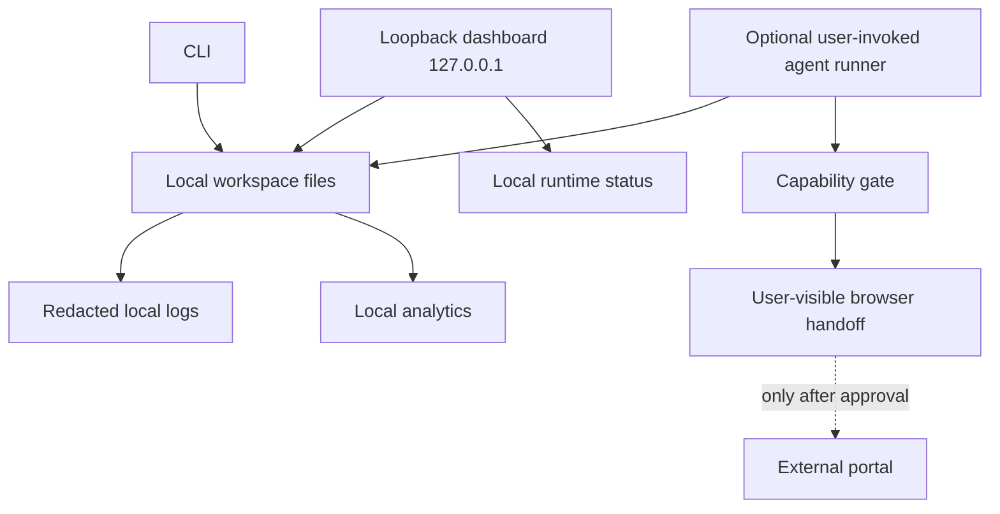

# 16. Local runtime and observability

## Purpose

This specification defines how Career Copilot runs after a developer clones the repository. It prioritizes inspectability, offline-safe behavior, and recovery over invisible services. No account, hosted backend, cloud database, background sync, or required remote agent runtime is part of the product. It implements [D-001 and D-003](00-decision-log.md) and follows the system boundary in [System architecture](02-system-architecture.md).

Runtime behaviour enforces [Safety](12-safety-security-and-privacy.md), persists [Domain model and artifact contracts](03-domain-model-and-artifact-contracts.md), executes [Agent orchestration](11-agent-orchestration.md), exposes [Dashboard](14-local-ui-and-dashboard.md), and supports [Release quality](17-testing-and-release-quality.md).

## Runtime shape



The core must work with no network: capture pasted JDs, validate artifacts, inspect dashboard, produce local health reports, and record outcomes. Optional operations are absent/disabled rather than retried in the background.

## Local process boundaries

| Process | Responsibility | Default network status |
| --- | --- | --- |
| CLI | normalize/import input, validate schemas, manage explicit artifacts and maintenance commands | disabled/not needed |
| Dashboard server | bind loopback, serve bundled UI and local JSON APIs | loopback only |
| Workspace service | safe paths, atomic writes, version/history, integrity checks | no network |
| Agent runner | launch a user-selected local workflow with a limited manifest | disabled unless invoked/configured |
| Connector/browser bridge | execute a named reviewed capability in a visible user session | disabled unless user starts an approved attempt |
| Analytics worker | derive local aggregates from local events | no network |

The dashboard remains loopback-only. A LAN bind mode is outside the accepted M0 scope and requires a separate architecture decision; no alternative bind flag is part of the planned baseline. The table lists responsibilities, not a requirement for separate processes or an analytics worker in the first release.

## Workspace layout and configuration

Runtime state is separated from source code and excluded from Git. A typical layout is:

```text
data/                  # private career artifacts
  profile/
  jobs/
  analytics/
.career-copilot/       # local runtime state, logs, locks, config migrations
exports/               # user-created private exports
```

Configuration is local, schema-versioned, and conservative. It holds paths, preferred timezone/language, enabled agent launcher, local log verbosity, and explicitly reviewed connector capability IDs. It never holds plaintext portal passwords. A first-run wizard creates no account and asks before enabling any network-capable integration.

## Lifecycle commands and status

The project should provide clear, non-destructive commands (exact command names are implementation decisions):

- `doctor`: validate runtime/version, data-root permissions, config schema, loopback bind availability, and private-path ignore status;
- `serve`: start dashboard on loopback and print its exact local URL;
- `validate`: validate selected artifacts without modifying the input;
- `migrate`: preview and then apply a versioned local data migration with backup;
- `backup` / `export`: create user-selected local copies; no remote target by default;
- `logs`: display redacted local diagnostics;
- `repair`: inspect an artifact and propose a non-destructive repair plan.

Status is truthful: “agent runtime not configured,” “connector suspended,” “manual handoff required,” and “network unavailable” are normal operating states, not product failures.

## Concurrency, integrity, and migration

Only one writer may modify a particular artifact at a time. Use a short-lived per-artifact lock, atomic temporary-file write/rename, and version/hashes to detect conflicts. A second dashboard tab/process receives a conflict result with both versions available for comparison. Reads never mutate data.

Schema migrations are explicit and idempotent. Before applying, the runtime validates the current artifact, previews affected files, creates a local backup/recovery record, and writes migration metadata. It must stop safely on corruption instead of attempting a bulk rewrite. Downgrade support requires a documented compatible export or migration path; never pretend an older build can read newer data safely.

## Browser and external action lifecycle

The browser bridge starts only from a user gesture after the system verifies the current approval, connector capability, and origin. It displays the proposed action and destination, has a stop/cancel control, and emits a local receipt of `submitted`, `manual-handoff`, `failed`, or `cancelled`. Browser state/credentials live in the user’s browser/OS mechanisms, not workspace logs or agent prompts.

The bridge does not solve CAPTCHA, defeat MFA, expand an allowlist, or continue through a redirected/unrecognized portal page. These conditions create a manual handoff.

## Local observability

Observability answers “what happened on this machine?” without telemetry. The health view includes process/version information, config validation, data-root availability, artifact counts, parse errors, lock conflicts, current schema versions, connector status, recent agent runs, and redacted error categories.

Structured local logs record timestamp, component, severity, correlation/run ID, event type, safe artifact IDs, result code, and redacted cause. They do not include passwords, cookies, tokens, private document body, raw JD text, or complete form answers. Debug logging of content is opt-in, visibly risky, local-only, and automatically expires/rotates.

## Recovery

- If dashboard startup fails, the CLI provides a port/config diagnosis and leaves data untouched.
- If one artifact fails schema/JSON parsing, isolate it and retain raw bytes/backup for manual repair; other records remain readable.
- If a process crashes during write, atomic replacement preserves either the old valid file or the new valid file, never a partial final file.
- If disk space/permission prevents a write, report it before state transition and do not claim success.
- If a connector fails, leave the application in a non-submitted state unless the user records/observes actual external completion.

## Acceptance criteria

- A new clone can run `doctor`, start the dashboard, and use existing local data without creating an account or contacting a network service.
- The dashboard is reachable from the same machine via loopback but is not exposed on the LAN by default.
- Two local writers cannot silently overwrite one another.
- Logs are useful for diagnosis while tests demonstrate they omit credentials and raw private documents.
- Every migration has preview, backup, validation, and failure recovery behaviour.
