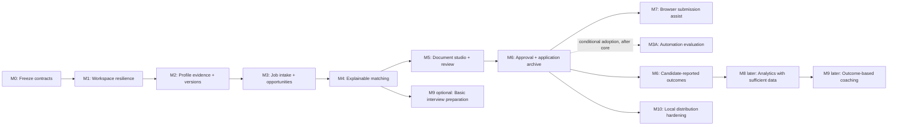

# 19 — Roadmap and milestones

> **Status:** M0 and M1 accepted; M2 profile evidence and immutable versions delivered 2026-09-04. Later milestones remain gated and planned.
> **Related foundation:** [product scope](01-product-scope.md), [system architecture](02-system-architecture.md), [domain and artifact contracts](03-domain-model-and-artifact-contracts.md), [Vietnam IT localisation](18-vietnam-it-market-localization.md)
> **M2 delivery record:** [profile evidence and versions](../../../reports/m2-profile-evidence-versions.md) · [M2 contract](04-profile-and-evidence.md)

## 1. Roadmap intent

The goal is a trustworthy local IT job-search workstation, not a rush toward a broad automated application bot. Every milestone produces a small, usable improvement with a clear safety boundary. No milestone authorises accounts, cloud storage, cloud sync, or autonomous submission.

Implementation work starts from a bounded plan against current source. The [M0 baseline and delivery inventory](27-m0-baseline-and-delivery-inventory.md) defines the accepted first-release subset and remaining contract decisions. A milestone may be paused without blocking already-delivered local capabilities.

## 2. Delivery principles

- **Artifact contract first:** define and test the data relationship before adding a UI screen or agent prompt.
- **No silent migration:** source data survives each release, and migration is additive/reversible where possible.
- **One external boundary at a time:** browser/portal integration begins only after approval, package integrity, and receipt contracts exist locally.
- **Manual handoff is a feature:** a user-completed portal step is preferable to unsafe or brittle automation.
- **Real local fixtures before real portals:** tests use stored fixtures and mocks; no CI test logs into a portal or sends a real application.
- **Evidence before cleverness:** matching and drafting quality are evaluated through traceability and false-claim prevention, not a fit score alone.
- **Scope is earned:** each later milestone is gated by the acceptance criteria of the preceding foundation.

## 3. Milestone map

M0–M6 form the primary core sequence, narrowed by the M0 first-release list. Manual application/outcome recording ships with the application archive and does not depend on M7. M3A and M7 are optional branches. Basic backup/restore belongs in M1; M10 hardens distribution without waiting for browser automation or coaching.

## 4. M2 delivery record

### M2 — Profile evidence and immutable versions — delivered

M2 is implemented and verified as a local profile foundation. The candidate can publish a validated profile only after explicit confirmation and an exact current hash check. The active profile is represented by an immutable revision and `data/profile/current.json`; each non-empty profile leaf receives an evidence item under `data/profile/evidence/`. Existing `data/profile/candidate-profile.json` remains a read-compatible legacy fallback and is not silently rewritten.

The dashboard and API expose revision history, the current revision hash and unresolved evidence. Verification is visible as `user-asserted`, `supported` or `needs-confirmation`. Vietnamese/English content and free-text role tracks are accepted without imposing a closed taxonomy. History preserves prior revisions; malformed orphan revisions are isolated, and a broken current pointer fails closed for manual recovery.

M2 explicitly stops before PDF parsing, GitHub/URL fetching, salary model restructuring, M3 job provenance/opportunity grouping, M4 explainable matching, portal automation, product-controlled submission, accounts, cloud sync or remote storage. See the [M2 report](../../../reports/m2-profile-evidence-versions.md) for implementation and verification details.

**Exit criteria:** A document or assessment can later reference a fixed profile hash; profile edits do not rewrite a previously referenced revision; unsupported claims remain visibly unresolved. The consumers and package binding are future work in M4–M6.

## 5. Small specification sequence

The detailed documents in this folder isolate one decision surface at a time. The M2 contract is [04 — Profile and evidence](04-profile-and-evidence.md); implementation begins only after the relevant document is approved.

| Order | Specification | Decision isolated by the document | Depends on |
| --- | --- | --- | --- |
| 04 | [Profile and evidence](04-profile-and-evidence.md) | Candidate facts, evidence, verification level, and immutable profile history | 01–03 |
| 05 | [Job discovery and ingestion](05-job-discovery-and-ingestion.md) | Intake provenance, untrusted content, normalisation, deduplication, and source retention | 03, 18 |
| 06 | [Explainable matching](06-explainable-matching.md) | Match evidence, gaps, exclusions, confidence, and candidate-controlled override | 04–05 |
| 07 | [Document studio and versioning](07-document-studio-and-versioning.md) | CV/letter/form-answer revisions, document claim map, and retained history | 04, 06 |
| 08 | [Approval and submission](08-approval-and-submission.md) | Exact package binding, approval expiry/invalidation, manual handoff, and receipts | 05–07 |
| 09 | [Application lifecycle and outcomes](09-application-lifecycle-and-outcomes.md) | State transitions, event chronology, correction, retention, and outcome truthfulness | 05, 07–08 |
| 10 | [Interview and career coaching](10-interview-and-career-coaching.md) | Coach inputs/outputs and its prohibition on changing candidate facts or submissions | 04, 06, 09 |
| 11 | [Agent orchestration](11-agent-orchestration.md) | Agent role scopes, input/output permissions, and handoff behaviour | 01–03 |
| 12 | [Safety, security, and privacy](12-safety-security-and-privacy.md) | Threat model, redaction, prompt-injection defence, and local-only controls | 01–03, 11 |
| 13 | [Job source connectors](13-job-source-connectors.md) | Connector capability declarations, terms/policy review, rates, and stop conditions | 05, 08, 12, 18 |
| 14 | [Local UI and dashboard](14-local-ui-and-dashboard.md) | Local user interaction, visibility of evidence/approval state, and error UX | 04–10 |
| 15 | [Analytics and learning loop](15-analytics-and-learning-loop.md) | Local metric definitions, denominators, small-sample limits, and coaching inputs | 09, 12, 14 |
| 16 | [Local runtime and observability](16-local-runtime-and-observability.md) | Loopback runtime, local diagnostics, audit/event boundaries, and recovery | 02–03, 11–14 |
| 17 | [Testing and release quality](17-testing-and-release-quality.md) | Fixtures, test layers, privacy/security gates, and connector release rules | 04–16 |
| 18 | [Vietnam IT market localisation](18-vietnam-it-market-localization.md) | Language, location, salary and work-authorisation fixtures | 01, 03–05 |
| 20 | [Risk register](20-risk-register.md) | Cross-cutting operational risks and stop conditions | 08, 12–13 |
| 21 | [Acceptance-criteria catalog](21-acceptance-criteria-catalog.md) | Traceability from product promise to observable verification | 01–20 |
| 25 | [AI provider and data egress](25-ai-provider-and-data-egress.md) | Local/remote model selection, consent, data boundary, cost and fallback | 06, 11–12, 16–17 |

Future additions such as a specific portal connector, document renderer or automation runtime receive their own narrowly scoped specification. M2 does not authorize them.

## 6. Later milestones remain planned

M3 adds job intake provenance and opportunity grouping. M4 adds explainable matching over fixed profile/job evidence. M5 adds document studio and review. M6 adds manual application archive/outcomes and approval foundations. M7 is controlled browser assistance only after those contracts exist. M3/M4 behavior is not part of the M2 implementation.
