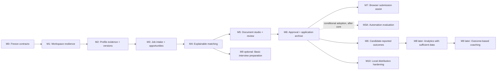

# 19 — Roadmap and milestones

> **Status:** M0 baseline accepted, 2026-09-04; subsequent implementation remains planned
> **Related foundation:** [product scope](01-product-scope.md), [system architecture](02-system-architecture.md), [domain and artifact contracts](03-domain-model-and-artifact-contracts.md), [Vietnam IT localisation](18-vietnam-it-market-localization.md)

## 1. Roadmap intent

The goal is a trustworthy local IT job-search workstation, not a rush toward a broad automated application bot. Every milestone produces a small, usable improvement with a clear safety boundary. No milestone authorises accounts, cloud storage, cloud sync, or autonomous submission.

Implementation work starts from a bounded plan against current source. The [M0 baseline and delivery inventory](27-m0-baseline-and-delivery-inventory.md) defines the accepted first-release subset and remaining contract decisions. A milestone may be paused without blocking already-delivered local capabilities.

## 2. Delivery principles

- **Artifact contract first:** define and test the data relationship before adding a UI screen or agent prompt.
- **No silent migration:** source data survives each release, and migration is additive/reversible where possible.
- **One external boundary at a time:** browser/portal integration begins only after approval, package integrity, and receipt contracts exist locally.
- **Manual handoff is a feature:** a user-completed portal step is preferable to unsafe or brittle automation.
- **Real local fixtures before real portals:** tests use stored fixtures and mocks; no CI test logs into a portal or sends a real application.
- **Evidence before cleverness:** matching and drafting quality are evaluated through traceability and false-claim prevention, not a fit score alone.
- **Scope is earned:** each later milestone is gated by the acceptance criteria of the preceding foundation.

## 3. Milestone map

M0–M6 form the primary core sequence, narrowed by the M0 first-release list. Manual application/outcome recording ships with the application archive and does not depend on M7. Basic interview preparation can follow matching without analytics. M3A and M7 are optional branches. Basic backup/restore belongs in M1; M10 hardens distribution without waiting for browser automation or coaching.

## 4. Small specification sequence

The detailed documents in this folder deliberately isolate one decision surface at a time. They are the review inputs for the corresponding milestone; implementation begins only after the relevant document is approved.

| Order | Specification | Decision isolated by the document | Depends on |
| --- | --- | --- | --- |
| 04 | [Profile and evidence](04-profile-and-evidence.md) | Candidate facts, evidence, verification level, and immutable profile history | 01–03 |
| 05 | [Job discovery and ingestion](05-job-discovery-and-ingestion.md) | Intake provenance, untrusted content, normalisation, deduplication, and source retention | 03, 18 |
| 06 | [Explainable matching](06-explainable-matching.md) | Match evidence, gaps, exclusions, confidence, and candidate-controlled override | 04–05 |
| 07 | [Document studio and versioning](07-document-studio-and-versioning.md) | CV/letter/form-answer revisions, document claim map, and retained history | 04, 06 |
| 08 | [Approval and submission](08-approval-and-submission.md) | Exact package binding, approval expiry/invalidation, manual handoff, and receipts | 05–07 |
| 09 | [Application lifecycle and outcomes](09-application-lifecycle-and-outcomes.md) | State transitions, event chronology, correction, retention, and outcome truthfulness | 05, 07–08 |
| 10 | [Interview and career coaching](10-interview-and-career-coaching.md) | Coach inputs/outputs and its prohibition on changing candidate facts or submissions | 04, 06, 09 |
| 11 | [Agent orchestration](11-agent-orchestration.md) | Agent role scopes, input/output permissions, and handoff behaviour | 01–03 |
| 12 | [Safety, security, and privacy](12-safety-security-and-privacy.md) | Threat model, redaction, prompt-injection defence, and local-only controls | 01–03, 11 |
| 13 | [Job source connectors](13-job-source-connectors.md) | Connector capability declarations, terms/policy review, rates, and stop conditions | 05, 08, 12, 18 |
| 14 | [Local UI and dashboard](14-local-ui-and-dashboard.md) | Local user interaction, visibility of evidence/approval state, and error UX | 04–10 |
| 15 | [Analytics and learning loop](15-analytics-and-learning-loop.md) | Local metric definitions, denominators, small-sample limits, and coaching inputs | 09, 12, 14 |
| 16 | [Local runtime and observability](16-local-runtime-and-observability.md) | Loopback runtime, local diagnostics, audit/event boundaries, and recovery | 02–03, 11–14 |
| 17 | [Testing and release quality](17-testing-and-release-quality.md) | Fixtures, test layers, privacy/security gates, and connector release rules | 04–16 |
| 25 | [AI provider and data egress](25-ai-provider-and-data-egress.md) | Local/remote model selection, consent, data boundary, cost and fallback; independent of n8n | 06, 11–12, 16–17 |
| 22 | [n8n local automation](22-n8n-local-automation.md) | Deferred option: workflow boundaries and safety posture, considered only after an adoption decision | core M0–M6 plus one concrete automation need |
| 23 | [n8n workflow package and versioning](23-n8n-workflow-package-and-versioning.md) | Deferred package/release model, needed only after n8n is selected | 22 |
| 24 | [Gmail Job Alert connector](24-gmail-job-alert-connector.md) | Candidate first automation; compare a bounded Node spike with n8n before selecting its runtime | 05, 12–13, 22 only if n8n is selected |
| 26 | [n8n setup and recovery](26-n8n-local-setup-backup-and-recovery.md) | Deferred n8n operations, used only after n8n is selected | 16–17, 22–23 |
| 20 | [Risk register](20-risk-register.md) | Cross-cutting operational risks and stop conditions | 08, 12–13 |
| 21 | [Acceptance-criteria catalog](21-acceptance-criteria-catalog.md) | Traceability from product promise to observable verification | 01–20 |

If a future change requires a new concern—such as export/backup, desktop packaging, a specific TopCV connector, or a new document renderer—it receives a new narrowly scoped document rather than expanding unrelated specifications.

## 5. Milestone definitions

### M0 — Freeze foundation and current-state inventory

**Status:** Completed as documentation/inventory on 2026-09-04. Evidence, legacy mappings, superseded statements and the ordered backlog are in [the M0 record](27-m0-baseline-and-delivery-inventory.md). Detailed schemas remain subject to the milestone-specific decisions recorded there; no later feature is marked implemented.

**Outcome:** The product has one approved direction: local-only, single-user, IT/Vietnam-first, constrained agents, evidence-led matching, and candidate approval before submission.

**Deliverables:** This foundation set; an inventory that maps current Slice 1–4 files to target artifacts; explicit list of deprecated statements in older docs.

**Exit criteria:** No active product document contradicts the approved scope. Existing source/profile/decision/CV files remain documented as compatible starting artifacts. No production code changes are implied solely by this milestone.

### M1 — Workspace resilience and privacy guard

**Delivery record:** [M1 implementation and verification](../../../reports/m1-workspace-resilience.md), 2026-09-04. Hash/read metadata and conditional writes are implemented without changing legacy JSON schemas; persisted version envelopes remain part of M2's artifact contract. Recovery is a tested local copy/restore runbook, not an automated restore engine.

**Outcome:** The local data root is safe to use as the durable workspace.

**Deliverables:** Workspace-root selection, private Git-ignore verification/warning, envelope/hash utilities, shared atomic writer/conflict handling, artifact-level corruption recovery, fixtures, and a minimal documented local backup/restore procedure before real-data migration or dogfood.

**Exit criteria:** A corrupt optional analysis does not break job list/dashboard; invalid source/profile errors are contained and recoverable; batch output refuses accidental overwrite unless an explicit replacement path is chosen; a sample workspace can be copied and restored; concurrent CLI/server writes cannot silently overwrite newer data.

### M2 — Profile evidence and immutable versions

**Outcome:** The candidate can maintain a reusable, trustworthy technical profile with history.

**Deliverables:** Evidence model, profile revisions/current pointer, candidate confirmation UX, basic IT role tracks and bilingual evidence mapping.

**Exit criteria:** A document or assessment can reference a fixed profile hash; profile edits never rewrite a previously referenced revision; unsupported candidate claims are visibly unresolved.

### M3 — Job intake, provenance, and opportunity grouping

**Outcome:** The candidate can capture HCMC/Vietnam IT roles without losing origin or applying twice to the same opening.

**Deliverables:** Paste/file/browser-handoff source capture, source metadata, normalised job analysis traceability, duplicate suggestions, candidate-controlled opportunity grouping.

**Exit criteria:** The original JD is always recoverable; a suspected duplicate preserves both sources; Vietnam location/salary/language fixtures pass [18's acceptance checks](18-vietnam-it-market-localization.md#10-acceptance-checks).

### M3A — Conditional automation evaluation

**Outcome:** A concrete, candidate-valued automation has a deliberately chosen runtime. Core manual intake remains the default and continues to work if no automation is enabled.

**Deliverables:** One written automation problem statement; a bounded Node-versus-n8n spike for that workflow; an operational-cost comparison; and an explicit adopt/defer decision. Gmail Job Alert is the first candidate, not a preselected implementation. No workflow package, scheduler, credential connector, or n8n runtime is built before adoption.

**Exit criteria:** The chosen automation demonstrably reduces total complexity for its defined user value; its manual fallback remains usable; its state is idempotent and locally inspectable; and the decision records why the rejected option was not selected. If n8n is adopted, applicable loopback, credential and recovery controls in 22 and 26 are required before a credential-backed or scheduled connector is enabled. The package controls in 23 apply when multiple maintained workflows justify a package; a first bounded workflow does not require the full catalogue/package model.

### M4 — Explainable matching

**Outcome:** The candidate receives an inspectable disposition (`consider`, `clarify`, or `not-ready`) rather than an opaque score.

**Deliverables:** Assessment artifact, evidence/gap/blocker/question UX, confidence rules, technical-evidence comparison, and safety tests against unsupported inferences. Remote provider use is a separate, opt-in follow-on governed by [25](25-ai-provider-and-data-egress.md); local/manual matching does not wait for it.

**Exit criteria:** Each stated match points to a job requirement and profile evidence; unknown data is not shown as a match; and a hard preference conflict is distinguishable from missing job data. Any later remote provider use must satisfy [25](25-ai-provider-and-data-egress.md), including visible scope/consent and a local/manual fallback.

### M5 — Document studio and grounding review

**Outcome:** The candidate can prepare job-specific Vietnamese or English materials without corrupting their base profile.

**Deliverables:** Document revisions, document language metadata, claim maps, review findings, Markdown preview/download, candidate edits as new versions.

**Exit criteria:** A reviewer can block a material unsupported claim; a bilingual draft preserves original factual references; all package-ready documents link to a selected job analysis and profile revision.

### M6 — Manual application archive/outcomes and approval foundation

**Outcome:** The system can safely represent an application that is ready for a candidate to submit.

**Deliverables:** Local application archive with exact selected document references, candidate-reported manual submission/outcome records and event history. Consolidate the package/approval contract before any product-controlled submission capability; the approval screen, content-hash binding and invalidation/expiry gate must exist before M7 is enabled.

**Exit criteria:** Manual records preserve what is known and distinguish candidate-reported history from system-observed receipts; they never fabricate prior approval. When approval capability is enabled, changing a bound outgoing artifact or destination invalidates approval; no product-controlled route can enter `submitting` with an invalid approval. Manual archive remains useful without a connector.

### M7 — Browser submission assistant, one source at a time

**Outcome:** The candidate receives controlled portal assistance while retaining login and final-submit control where required.

**Deliverables:** Connector capability registry, source policy review, browser handoff, rate-limit policy, screenshot/confirmation reference handling, failure and unknown states.

**Exit criteria:** The connector operates only for the source/fields approved in its spec; it never stores passwords/cookies; login/CAPTCHA/final confirmation stop safely; the receipt does not claim success without observable proof.

The first connector should be selected by user value and policy feasibility, not by implementation convenience. TopCV, VietnamWorks, LinkedIn, and ITviec are candidates; each requires its own review current at the time of implementation.

### M8 — Privacy-preserving local analytics

**Outcome:** The workstation learns from the candidate's recorded job-search history without exporting it.

**Deliverables:** Outcome event entry/correction is delivered with M6. Later analytics adds local metric definitions, filters, small-sample labels and dashboard reports only when recorded outcomes justify them. Neither part requires M7.

**Exit criteria:** Every rate has a visible numerator, denominator, time window, and handling of unknown outcomes; reports distinguish observation from causation; no analytics network request occurs.

### M9 — Interview coach

**Outcome:** The candidate can use validated application context to practise interviews and turn outcomes into local learning notes.

**Deliverables:** Basic JD/profile-aware interview questions can follow M4 independently. Rich practice modes and strategy coaching based on outcomes are later additions; the latter requires reliable M8 data and explicit context selection. No coaching feature is a first-release gate.

**Exit criteria:** The coach draws only from selected local artifacts, labels assumptions/questions, and cannot mutate submitted documents, approvals, or outcomes.

### M10 — Local distribution and recovery hardening

**Outcome:** A developer can install, update, back up, and recover the workstation with confidence.

**Deliverables:** Clean-install/upgrade diagnostics, hardened local export/import and restoration tests building on M1 backup, optional desktop-wrapper decision record, and applicable third-party notices. An n8n upgrade/restore drill applies only if n8n has been adopted.

**Exit criteria:** A documented clean-machine install works; a backup can restore a sample workspace and enabled local automation; private artifacts remain ignored and no account/cloud dependency is introduced.

## 6. Cross-cutting acceptance gates

Every implementation task, regardless of milestone, must pass these gates before it is considered complete:

1. **Contract gate:** schema, versioning, ownership, and migration consequences are documented and tested.
2. **Privacy gate:** no source/profile/document/receipt content is sent remotely except through a user-visible, explicitly requested external action.
3. **Safety gate:** agent input treats external content as untrusted; claimed facts link to evidence; the approval boundary is not bypassable.
4. **Recovery gate:** invalid derived artifacts degrade locally; writes preserve prior valid data; error states are honest.
5. **Local UX gate:** dashboard behaviour works at loopback and exposes enough context for the candidate to understand next actions.
6. **Fixture gate:** normal, missing-data, Vietnamese/English, duplicate, stale-approval, and portal-handoff cases have deterministic fixtures/tests appropriate to the changed capability.

## 7. Prioritisation and stop rules

Do not begin M7 simply because automation is appealing. Stop and address the earliest unresolved gate if any of these occur:

- the existing workspace can overwrite source data or an output folder without an explicit user choice;
- profile/document versions cannot be tied to an application package;
- an assessment has no way to distinguish evidence from inference;
- a reviewer cannot block an unsupported claim;
- the dashboard/server can listen beyond loopback by default;
- a connector needs credentials, CAPTCHA bypass, or an unreviewed portal policy assumption.

Likewise, analytics must wait until outcome records are sufficiently reliable. A dashboard with a small, honest local history is more useful than a broad report that implies unsupported market conclusions.

## 8. What is already present versus what is planned

The repository already contains a local CLI/dashboard and early artifacts for source JDs, job analyses, candidate profiles, decisions, and job-specific Markdown CV drafts. That proves the initial workflow, but it does not yet satisfy the target contracts for immutable profile/document versions, claim maps, approvals, submission receipts, connector policy, or analytics.

The planned work evolves rather than discards this foundation. See [the mapping and compatibility rules](03-domain-model-and-artifact-contracts.md#13-initial-mapping-from-the-current-implementation). No code is authorised by this roadmap alone; each next numbered specification must narrow the decision and state its own acceptance criteria.
