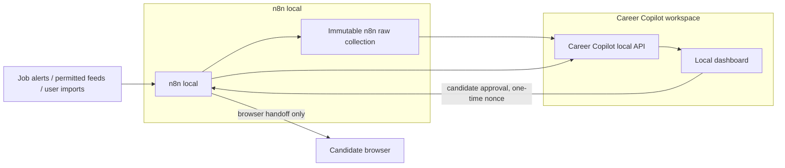
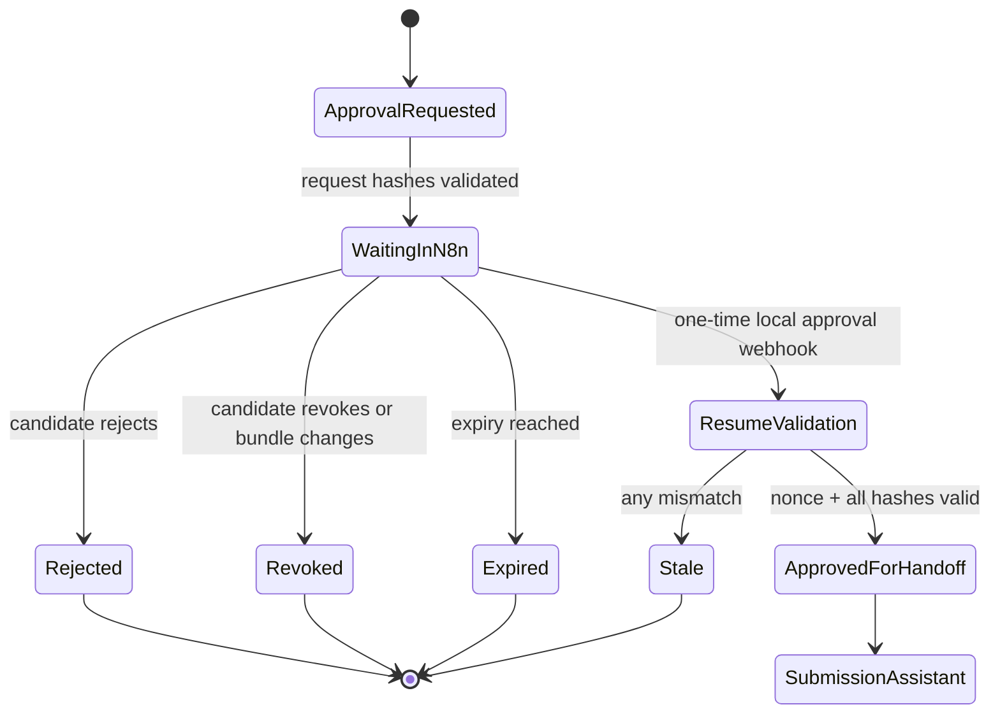

# 22 — Deferred n8n Automation Option: Reference Workflows, Raw Evidence, and Human Gates

**Status:** Proposed for review
**Scope:** Deferred design for an optional local automation subsystem; it is not a baseline requirement or an implementation commitment.
**Depends on:** [Job discovery](05-job-discovery-and-ingestion.md), [Approval and submission](08-approval-and-submission.md), [Agent orchestration](11-agent-orchestration.md), [Safety](12-safety-security-and-privacy.md), [Runtime health](16-local-runtime-and-observability.md), and [Risk register](20-risk-register.md).

## 1. Decision and boundary

n8n is a candidate local workflow orchestrator, not a default dependency. Career Copilot does not adopt it until a concrete automation need has been defined and a bounded Node-versus-n8n spike shows that n8n lowers total user and maintenance complexity. The fifteen reference workflows describe a possible later operating model; they do not commit the product to build, package, schedule, or support all fifteen.

Until that adoption decision, core work takes priority and manual intake remains the supported path. This document must not be used to justify adding a container, credentials, scheduled polling, or an automation health surface to the core release.

This decision does **not** make n8n the owner of all career data. The split of responsibility is:

| Concern | Owner | Reason |
| --- | --- | --- |
| Trigger, scheduling, retry, workflow status, raw intake evidence, pause/resume | n8n local instance | This is orchestration and operational provenance. |
| Immutable candidate profile, evidence, job artifacts, document versions, approval receipt, submission receipt, and business audit | Career Copilot local workspace | These records must survive a workflow edit, migration, reset, or removal of n8n. |
| Login session, MFA, CAPTCHA, final portal consent | Candidate in normal browser | A local agent may not assume identity or bypass external controls. |

The candidate does not need a Career Copilot account. An optional n8n local-instance owner credential, if required by n8n setup, is an administrative credential for the process running on the candidate's own computer; it is not a product identity, cloud account, or shared service account.

## 2. Architecture



The local API is bound to loopback only and accepts a narrow allowlisted contract. n8n never receives arbitrary filesystem paths, arbitrary URLs, browser cookies, portal passwords, OTPs, or a generic command execution capability.

## 3. Workflow classes

| Class | Workflows | Permission model |
| --- | --- | --- |
| Automatic | 01–08, 13, 15 | Can collect only from approved intake paths and can never perform an external application. |
| Candidate-triggered | 09, 10, 14 | Starts only from a visible dashboard action. |
| Human-gated | 11, 12 | An active candidate approval is required; final external submission remains visible to the candidate. |

Agents are workers inside selected workflows, not workflow owners. They receive structured input and return structured output. A job posting is data, never an instruction capable of activating another workflow or changing n8n permissions.

## 4. Raw collection: evidence before interpretation

### 4.1 Purpose

The n8n raw collection exists to answer: **what did the source actually provide at this time?** It lets the candidate inspect a captured alert/page/export when normalization, matching, or an agent appears wrong. It is not an LLM cache and must never be silently rewritten by an agent.

### 4.2 Logical collections

The physical implementation may use an n8n data store plus local files, or a dedicated local SQLite/Postgres schema. Regardless of storage technology, it exposes these logical collections:

| Collection | Write rule | Retention | Contents |
| --- | --- | --- | --- |
| `raw_job_captures` | append-only | user-configured; default 180 days | received email/export/API payload, source metadata, extraction boundary and hash |
| `raw_capture_events` | append-only | same as parent capture | fetch/import attempt, error category, dedupe decision and workflow execution reference |
| `workflow_checkpoints` | replaceable by key | until run terminal state + 30 days | cursors, message IDs, rate-limit deadline and idempotency key; never document text |
| `workflow_dead_letters` | append-only | 90 days by default | sanitized failures requiring review |

`raw_job_captures` stores the unmodified body or attachment reference, a canonical byte/content hash, `capturedAt`, source origin, source message/job ID when available, connector version, and a `captureDisposition`. A later capture creates a new record even if it is a duplicate/repost.

### 4.3 Required capture dispositions

| Value | Meaning |
| --- | --- |
| `received-unreviewed` | Raw input is saved; no semantic conclusion has been made. |
| `needs-manual-jd` | A lead/link was found but full JD was not supplied through a permitted path. |
| `quarantined` | Security scan found a high-risk signal. No agent processing occurs. |
| `normalized` | Deterministic extraction completed, with warnings retained. |
| `duplicate-observed` | Same/related candidate job was observed; raw capture remains available. |
| `accepted-for-analysis` | Passed deterministic gates and was handed to the matcher. |
| `rejected-by-rule` | Failed a visible hard filter; no LLM call was made. |

### 4.4 Candidate review

The dashboard must provide a Raw Capture view with source, time, original text/file reference, normalized fields, warnings, hash, related execution IDs and a redacted error trail. It must make clear that raw data proves the input, not the continued availability or authenticity of an external posting.

Raw text may contain personal recruiter details or harmful content. It is locally visible to the candidate only and is never copied wholesale into routine execution logs, analytics, agent prompts, or error telemetry.

## 5. Shared workflow contract

Every workflow has a versioned definition and declares its trigger, input contract, output contract, side effects, retry policy, idempotency key, timeout, stop conditions and owner. Its final state is one of `succeeded`, `skipped`, `waiting-for-user`, `needs-review`, `failed-safe`, `cancelled`, or `expired`.

All transitions carry:

```json
{
  "runId": "run_...",
  "workflowId": "wf-07-ai-match",
  "workflowVersion": "1.0.0",
  "causationId": "rawcap_... | approval_... | useraction_...",
  "idempotencyKey": "sha256:...",
  "occurredAt": "2026-08-31T10:00:00+07:00"
}
```

An automatic retry is permitted only when it cannot duplicate an external effect. Examples: retrying an allowed read request or a local write protected by an idempotency key is safe; retrying a potentially completed portal submission is not.

## 6. Reference future workflow set

### 01 — Job Discovery, if selected

- **Trigger:** explicit manual run first; a local schedule is considered only after the selected automation has demonstrated value. No hourly default is assumed.
- **Inputs:** current source capability declarations and source-specific checkpoint cursors.
- **Allowed sources:** user-supplied local inbox, job-alert email, RSS/export, or a connector explicitly marked `connector-enabled` in [13](13-job-source-connectors.md).
- **Output:** one raw capture per observed input, then an event to Workflow 02.
- **Must not:** crawl arbitrary job portals, use an authenticated browser session without user action, fetch a new source merely because a URL appears in a JD, or invoke an LLM.
- **Recovery:** source failure produces a dead letter and leaves its checkpoint unchanged; another source can continue. A rate-limit response schedules the next allowed attempt.

### 02 — Parse and Normalize

- **Trigger:** new `received-unreviewed` raw capture.
- **Input:** immutable capture ID only; the worker retrieves raw content from the collection.
- **Work:** deterministic metadata extraction: subject/source, title/company/location hints, URL, source job ID, attachment types, language and extraction warnings.
- **Output:** `normalized` capture or `needs-review`; all unparsed data remains in raw.
- **Must not:** invent seniority, company, salary, missing requirements, or job location.

### 03 — Deduplication

- **Trigger:** normalized capture.
- **Work:** compare source+source-job-ID first; fall back to canonical URL and a transparent fingerprint of title/company/location/content. It produces a confidence and reasons rather than silently merging.
- **Output:** `duplicate-observed`, a user-review candidate pair, or a new candidate job event for Workflow 04.
- **Idempotency:** source ID/hash for exact duplicates; a changed body always remains a new raw snapshot.

### 04 — JD Acquisition

- **Trigger:** new non-duplicate lead/candidate job.
- **Work:** decide whether the raw capture already contains enough JD content. If not, consult the source capability declaration.
- **Output:** a complete raw JD snapshot, or `needs-manual-jd` with a visible request for candidate import.
- **Hard stop:** unknown source permission, redirect outside the allowlist, CAPTCHA/MFA, or unauthenticated page that becomes a login flow.

### 05 — JD Security Scan

- **Trigger:** raw JD snapshot.
- **Work:** sanitize presentation markup, detect prompt-injection language, suspicious URLs, credentials/financial requests, scam signals and extraction anomalies.
- **Output:** `quarantined`, `needs-review`, or safe JD reference for Workflow 06.
- **Rule:** scanner findings are warnings/evidence, not a reason for the agent to obey text inside the JD.

### 06 — Hard Filter

- **Trigger:** safe JD reference plus active local preferences.
- **Work:** deterministic, explainable filters for chosen role family, location/arrangement, seniority, minimum years, language, employment type and explicit exclusions. Missing fields produce `not-stated`, not a guessed value.
- **Output:** `rejected-by-rule` with reasons, or `accepted-for-analysis` for Workflow 07.
- **Cost rule:** no LLM call occurs for a hard rejection.

### 07 — AI Job Matcher

- **Trigger:** `accepted-for-analysis`.
- **Input minimization:** safe JD, the candidate's relevant evidence references and preferences only. It does not receive portal credentials, raw mail headers, unrelated documents or browser data.
- **Work:** return structured score, confidence, supporting evidence, gaps, disqualifiers and uncertainty. A model response failing schema/evidence checks becomes `needs-review`.
- **Concurrency:** default one active matching task per local workspace; queue excess work to avoid API spikes or exhausting a local model.
- **Output:** a versioned assessment consumed by Workflow 08.

### 08 — Save Result and Job Inbox

- **Trigger:** matcher outcome or deterministic rejection.
- **Work:** call the loopback Career Copilot API with idempotency key to create/update the local Job Inbox projection. Link raw capture IDs, derived analysis versions and workflow execution references.
- **Output:** visible inbox entry; update the discovery checkpoint only after a durable local acknowledgement.
- **Boundary:** n8n may keep raw evidence, but Career Copilot owns the candidate-facing job state and subsequent application lifecycle.

### 09 — Prepare Application

- **Trigger:** explicit candidate action on one Job Inbox entry.
- **Work:** freeze the selected JD capture, select a base document version, ask document agents for CV/cover-letter/form-answer drafts, then create a draft bundle.
- **Output:** draft bundle only. It cannot produce an approval or begin a browser run.
- **Failure:** preserve all drafts and disclose missing evidence or unresolved question.

### 10 — Factual and ATS Review

- **Trigger:** draft bundle from Workflow 09.
- **Work:** extract material claims, compare them to evidence, run format/ATS checks, and mark unsupported/ambiguous statements. It does not auto-delete material facts or hide gaps.
- **Output:** review report and either `needs-review` or an approval-ready bundle.
- **Rule:** a passing formatting check never authorizes an external action.

### 11 — Candidate Approval Wait

- **Trigger:** candidate requests approval for an approval-ready bundle.
- **Work before wait:** Career Copilot writes the canonical approval request and presents the human-readable summary. n8n verifies the exact bundle/job/document hashes, stores minimal wait context and enters `WAITING_FOR_USER`.
- **Wait payload:** `approvalId`, raw/job IDs, bundle/document/JD hashes, policy version, one-time resume nonce and expiry. It must not carry CV bytes, complete JD text, passwords, cookies, OTPs or a generic portal URL.
- **Resume:** Career Copilot sends a loopback-only, one-time authenticated webhook event when the candidate approves, rejects, revokes or the request expires.
- **On resume:** n8n fetches the current canonical approval record, verifies the nonce and every hash again, then routes only a valid approval to Workflow 12.
- **Expiry:** default 30 minutes for a submission approval. A separate daily sweep marks abandoned waits expired; it does not rely on execution pruning because waiting executions are retained.

### 12 — Submission Assistant

- **Trigger:** successful resume from Workflow 11 only.
- **Work:** verify destination capability and origin, open the approved browser handoff, fill only approved values/files, pause for MFA/CAPTCHA/new question/consent and record a safe receipt reference.
- **Final action:** candidate remains the visible actor for the portal's final submit control. The workflow must not bypass technical measures or automatically retry an ambiguous submit.
- **Output:** canonical `SubmissionReceipt` is persisted by Career Copilot, then n8n records a minimal operational result.

### 13 — Follow-up and Outcome Reminder

- **Trigger:** confirmed submission receipt or candidate-configured reminder.
- **Work:** wait until candidate-selected dates, surface a local reminder, and optionally prepare a follow-up draft. It never sends email/messages without a separate candidate approval.
- **Output:** reminder/outcome event to local analytics.

### 14 — Interview Preparation

- **Trigger:** candidate marks an application as interview stage.
- **Work:** use the frozen JD, candidate-approved materials, match gaps and selected interview type to prepare questions, practice plans and evidence-based answers.
- **Output:** local interview preparation artifacts; no external communications.

### 15 — Daily Maintenance

- **Trigger:** daily local schedule and manual run.
- **Work:** inspect failed-safe runs, resume only explicitly retry-safe failures, expire stale waits, report source health, prune routine execution data according to retention policy, validate backups and summarize dashboard health.
- **Must preserve:** raw captures within their retention period, canonical approvals, submission receipts, artifact versions and business audit records. n8n execution data is operational history, not the legal/business record.

## 7. Waiting-for-user state machine



The n8n wait execution is a useful process checkpoint, not sufficient proof by itself. The canonical approval record and every terminal submission receipt remain in Career Copilot's durable audit because n8n workflows can be edited, re-imported, deleted or migrated independently.

## 8. Data retention, logs, and backup

### 8.1 Separate raw evidence from execution telemetry

| Data type | Default handling |
| --- | --- |
| Raw capture and capture event | Keep in n8n raw collection for 180 days; candidate can archive/delete by explicit action. |
| Successful n8n execution node payload | Do not persist full payload by default; retain summary IDs/status/timestamps. |
| Failed execution | Retain redacted diagnostic input/output for 30 days, then prune unless candidate pins it for investigation. |
| Waiting execution | Keep until candidate action or explicit expiry sweep; store references, not document bodies. |
| Approval/receipt/audit | Persist in Career Copilot according to its artifact/audit retention, independent of n8n. |

n8n supports execution-data pruning and does not prune active waiting executions. The runtime configuration must set bounded retention for completed execution data and a separate expiry policy for waits. See n8n's [execution-data documentation](https://docs.n8n.io/hosting/scaling/execution-data/).

### 8.2 Backup and restore

The local backup set contains the n8n database/volume, raw collection, workflow templates, non-secret configuration, and Career Copilot workspace. Credentials are backed up only through an explicitly documented encrypted recovery procedure; plaintext credential export is prohibited.

Restore drills must prove that: raw capture hashes still match; an eligible wait can resume only once; a reused nonce fails; a missing/changed Career Copilot approval blocks the downstream workflow; and canonical receipts remain readable even if n8n is absent.

## 9. Security configuration baseline

1. Bind n8n, its API and all internal resume webhooks to `127.0.0.1`/localhost; do not expose the editor or webhook endpoints through a public tunnel by default.
2. Set and back up an instance encryption key; n8n uses `N8N_ENCRYPTION_KEY` to protect credential encryption keys. See [n8n encryption-key documentation](https://docs.n8n.io/hosting/securing/encryption-key-rotation/).
3. Allow only reviewed built-in nodes and versioned local workflow templates. Disable community nodes, arbitrary `Execute Command`, arbitrary shell/script execution and unreviewed custom nodes in the distributed default.
4. Restrict HTTP requests to the origin allowlists declared by connectors. Do not permit raw JDs, agents or users to supply arbitrary destination URLs to automated nodes.
5. Store external service OAuth/API credentials only in n8n's encrypted credential store. Never copy them into Career Copilot artifacts, prompt context, raw captures, screenshots or normal logs.
6. Run n8n's security audit after setup and upgrade; it reports credential, database, filesystem, risky-node and instance findings. See [n8n security audit](https://docs.n8n.io/hosting/securing/security-audit/).
7. Pin container/package versions, keep a local changelog of workflow template version and n8n version, and test upgrades on a copied local workspace before replacing the active one.

## 10. Runtime and machine-load policy

n8n can be appropriate for a single local machine after adoption and does not need Kubernetes. If adopted, the supported shape is one local n8n process/container plus persistent local storage. K8s, queue-mode workers, Redis and multiple replicas are out of scope until there is a genuinely distributed, always-on product requirement.

The main resource risks are Docker Desktop overhead, retained execution data, browser automation, large email attachments and local LLM inference. If a schedule is enabled after adoption, start with one worker and serial connectors; choose a cadence from observed need rather than assuming hourly polling. The first implementation needs only locally inspectable run state, a manual fallback, and bounded retention. Queue dashboards, multiple connectors, and richer health reporting are justified only when the selected workflow needs them.

## 11. Non-commercial licensing policy

### 11.1 Current permitted repository model

This repository is non-commercial. The intended use is: a person clones it without charge, runs it on their own machine for their own personal career work, and may separately install/run a local n8n instance. Under n8n's Sustainable Use License, personal/non-commercial use and free non-commercial distribution are within the stated permitted scope. The repository must retain n8n license/copyright notices for any distributed n8n material. See the [n8n Sustainable Use License](https://github.com/n8n-io/n8n/blob/master/LICENSE.md?plain=1).

The default distribution should provide Docker Compose/examples and versioned workflow-template JSON, not a modified hidden fork of the n8n editor. A `THIRD_PARTY_NOTICES` file and setup documentation must name n8n, link its license, and state that external integrations require the candidate's own account/permission.

### 11.2 Explicitly out of scope

The repository must not, under this policy:

- charge for access to the repository, bundle, workflow service or managed execution;
- host n8n workflows, credentials or data for other people;
- offer a shared n8n instance, a hosted Career Copilot service, or paid workflow support that operates users' credentials;
- hide, remove or alter n8n licensing/copyright notices;
- represent n8n as Career Copilot-owned software; or
- expose an embedded n8n canvas/editor as a product feature without a separate license review.

### 11.3 Commercial-change gate

Before any of the following, shipping stops until a dated legal/license review is recorded: monetization, paid support involving n8n execution, bundling n8n as a paid local product, managed hosted automation, multi-user sharing, or exposing an n8n canvas/editor to users. n8n states that embedding its workflow interface for customers requires an Embed license, while using it as a non-visible product backend is an Enterprise licensing discussion. See n8n's [licensing FAQ](https://support.n8n.io/article/can-i-use-your-license-for-my-use-case) and [OEM information](https://n8n.io/oem/).

This is a product constraint, not legal advice. The license must be rechecked against the current n8n terms at the time the product's commercial model changes.

## 12. Verification and acceptance criteria

- A clean, offline Career Copilot install works without n8n; automation is an optional local capability.
- If n8n is adopted, each selected workflow stores a raw capture before any normalization/agent call and the candidate can inspect its hash and source metadata.
- A malformed/hostile JD is quarantined before it reaches an agent or connector action.
- A hard-filtered job incurs no model call and records visible reasons.
- The same source event replayed twice does not create two Job Inbox jobs, two approval requests or two submissions.
- A candidate can approve, reject, revoke and expire Workflow 11; only a valid one-time local resume event may reach Workflow 12.
- Changing JD, destination, document, answer, policy version or approval expiry causes resume validation to fail safely.
- CAPTCHA/MFA/unrecognized field/origin mismatch results in candidate handoff and never an automated retry.
- Execution pruning removes only completed operational data within policy; raw capture retention and Career Copilot receipt/audit data remain unaffected.
- Default configuration has no publicly exposed n8n port, no generic command node, no unreviewed community node and no plaintext credential in the workspace.
- The repository's non-commercial distribution documentation includes n8n notices and clearly blocks commercial/hosted/embedded use until license review.

## Related specifications

- [05 — Job discovery and ingestion](05-job-discovery-and-ingestion.md) defines candidate-facing job artifact semantics.
- [08 — Approval and submission](08-approval-and-submission.md) defines the canonical candidate approval and receipt contract.
- [12 — Safety, security, and privacy](12-safety-security-and-privacy.md) defines broader privacy and external-action stop conditions.
- [13 — Job source connectors](13-job-source-connectors.md) defines source-permission capability declarations.
- [16 — Local runtime and observability](16-local-runtime-and-observability.md) defines local operational health beyond n8n.
