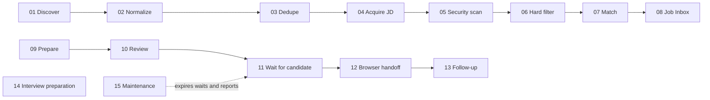

# 23 — n8n Workflow Package and Versioning

**Status:** Proposed for review
**Scope:** A possible reproducible, local-only package model after n8n has been selected. It is not a requirement to distribute, inspect, upgrade, or roll back fifteen workflows in the core release.
**Depends on:** [Domain model and artifact contracts](03-domain-model-and-artifact-contracts.md), [Approval and submission](08-approval-and-submission.md), [Safety](12-safety-security-and-privacy.md), [Local runtime](16-local-runtime-and-observability.md), [Release quality](17-testing-and-release-quality.md), and [n8n local automation](22-n8n-local-automation.md).

## 1. Purpose and decision

If n8n is adopted for more than one maintained workflow, selected workflows become product configuration rather than hand-edited personal automations. They then require a reviewed **workflow package** with a machine-readable manifest, contracts, fixtures, release metadata, and migration instructions. The initial adoption decision may instead remain a single bounded workflow without committing to this package model or a fifteen-workflow release.

The package makes four promises:

1. A candidate can identify which exact workflow definition processed a capture, match, approval wait, or browser handoff.
2. A package upgrade cannot silently change a running approval or an existing raw capture.
3. A failed import or upgrade can return schedulers to a known prior release without deleting n8n raw evidence or Career Copilot business records.
4. A reviewer can validate a package without needing a candidate's credentials, CV, JD, browser profile, or live portal session.

It does **not** promise that a workflow JSON hash proves authorship, a portal permits automation, or a rollback can undo an external side effect. Hashes detect accidental or visible modification only when compared with a separately trusted expected value; they are not a substitute for a signing service, code review, candidate approval, or a portal receipt.

The package remains optional. Career Copilot's offline core must work when n8n is not installed, disabled, removed, or temporarily unhealthy.

## 2. Scope and non-goals

### 2.1 In scope

- fifteen small templates, their stable logical IDs, dependencies, and declared capabilities;
- local package import, validation, activation, deactivation, rollback, and compatibility checks;
- immutable release metadata and reproducible content hashing;
- safe handling of old, active `WAITING_FOR_USER` executions during a package change;
- fixture-based CI validation and change-control rules;
- a local mapping from package workflow IDs to n8n runtime workflow IDs and execution IDs.

### 2.2 Out of scope

- a cloud control plane, remote package registry, telemetry, collaborative editing, or automatic remote updates;
- synchronising credentials, n8n execution databases, or candidate data between machines;
- direct edits to n8n's internal database or execution rows;
- mutating a historical release in place;
- automatic migration or retry of an ambiguous external submission; and
- treating a raw capture, approval, receipt, document revision, or business audit as owned by this package. Those remain Career Copilot artifacts under [03](03-domain-model-and-artifact-contracts.md).

## 3. Terms and identifiers

| Term | Meaning |
| --- | --- |
| **Template** | One reviewed n8n workflow definition, stored as source-controlled JSON plus package metadata. It has no user credential values. |
| **Logical workflow ID** | Stable product identifier such as `wf-01-job-discovery`. It survives an import that creates a different n8n runtime ID. |
| **Runtime workflow ID** | ID assigned by the candidate's n8n instance after import. It is local implementation state, never a cross-machine product identifier. |
| **Package** | A compatible set of templates and supporting metadata released together. |
| **Release** | An immutable package version and its exact content digest. A correction creates a new release. |
| **Contract version** | Version of the input/output envelope exchanged with Career Copilot or another workflow. |
| **Generation** | One installed package release mapping on one machine. A generation can remain present but inactive so old waits can finish safely. |
| **Waiting execution** | An n8n execution paused at Workflow 11 or another approved Wait node. It is operational state, not a durable approval record. |
| **Compatibility adapter** | A small, versioned local translation approved by this specification. It transforms a declared old envelope into a declared new envelope; it never invents candidate facts or changes approval hashes. |

IDs are opaque ASCII slugs. They must not derive filesystem paths, email addresses, company names, raw JD text, or portal credentials.

## 4. Package model and source layout

The repository SHOULD keep package source separate from private runtime state. Exact paths are implementation decisions, but a release has this logical shape:

```text
n8n-package/
  manifest.json
  workflows/
    wf-01-job-discovery.json
    ...
    wf-15-daily-maintenance.json
  contracts/
    workflow-envelope.schema.json
    raw-capture-v1.schema.json
    approval-resume-v1.schema.json
  fixtures/
    valid/
    invalid/
  migrations/
    package-1.0.0-to-1.1.0.md
  release/
    CONTENTS.sha256
    CHANGELOG.md
    COMPATIBILITY.md
```

Private n8n database/volume, encrypted credentials, raw captures, execution data, generated package-install reports, and Career Copilot workspace data MUST be outside this source directory and ignored by Git. No template or fixture may include a real OAuth refresh token, API key, CV, recruiter email, browser cookie, portal DOM from an authenticated session, or candidate approval nonce.

### 4.1 Required manifest

`manifest.json` is the authoritative package declaration. It MUST contain at least:

```json
{
  "packageId": "career-copilot-n8n-local",
  "packageVersion": "1.0.0",
  "releaseId": "career-copilot-n8n-local@1.0.0",
  "createdAt": "2026-08-31T00:00:00Z",
  "n8nCompatibility": {
    "supported": [">=X.Y.Z <X+1.0.0"],
    "tested": ["X.Y.Z"]
  },
  "workflowContractCompatibility": {
    "workflowEnvelope": 1,
    "approvalResume": 1,
    "rawCapture": 1
  },
  "workflowDefinitions": [],
  "dependencyEdges": [],
  "credentialAliases": [],
  "contentDigest": "sha256:...",
  "releaseNotes": "release/CHANGELOG.md"
}
```

`X.Y.Z` is deliberately a placeholder in this planning specification. Before implementation, each release must name exact tested n8n versions; it must never ship an unconstrained `latest` compatibility claim.

Each item in `workflowDefinitions` MUST declare:

| Field | Rule |
| --- | --- |
| `logicalId` | One of the stable IDs in section 5; unique within the package. |
| `displayName` | Human-readable numbered name matching [22](22-n8n-local-automation.md). |
| `templatePath` | Package-relative JSON path; no traversal or absolute path. |
| `templateDigest` | SHA-256 of the canonical template bytes. |
| `templateVersion` | Semantic version for the definition itself. |
| `contractIn` / `contractOut` | Named schema and version, or `none` for a schedule root. |
| `sideEffectClass` | `local-read`, `local-write-idempotent`, `wait`, `browser-handoff`, or `notification-draft`. |
| `activationClass` | `automatic`, `candidate-triggered`, or `human-gated`. |
| `requiredCredentialAliases` | Alias names only; never credential IDs or values. |
| `dependsOn` | Logical IDs that must have compatible output contracts. |
| `stopConditions` | Declarative references to the relevant safety rules. |

### 4.2 Credential aliases, not exported credentials

Templates refer only to a stable alias such as `job-alert-mail-read` or `approved-feed-api`. During local installation, the candidate maps that alias to a credential they created in their own encrypted n8n store, or leaves the related connector disabled.

The mapping report stores the alias, capability scope, creation/last-validation timestamp, and enabled state. It MUST NOT store secret values, OAuth tokens, n8n encrypted credential blobs, or enough metadata to reconstruct a credential. A missing alias is a configuration state that prevents activation of only its dependent workflow; it is not a reason to weaken validation or substitute another credential automatically.

## 5. Stable workflow catalogue and dependency graph

The package contains exactly these logical workflow IDs in its first major line:

| ID | Workflow | Primary upstream | Primary downstream |
| --- | --- | --- | --- |
| `wf-01-job-discovery` | Job Discovery | user run; schedule only after explicit adoption | `wf-02-parse-normalize` |
| `wf-02-parse-normalize` | Parse and Normalize | raw capture | `wf-03-deduplicate` |
| `wf-03-deduplicate` | Deduplication | normalised capture | `wf-04-jd-acquisition` |
| `wf-04-jd-acquisition` | JD Acquisition | candidate job | `wf-05-jd-security-scan` |
| `wf-05-jd-security-scan` | JD Security Scan | raw JD snapshot | `wf-06-hard-filter` |
| `wf-06-hard-filter` | Hard Filter | safe JD reference | `wf-07-ai-job-matcher` or terminal result |
| `wf-07-ai-job-matcher` | AI Job Matcher | accepted-for-analysis | `wf-08-save-job-inbox` |
| `wf-08-save-job-inbox` | Save Result and Job Inbox | assessment/rejection | Career Copilot Job Inbox |
| `wf-09-prepare-application` | Prepare Application | candidate action | `wf-10-factual-ats-review` |
| `wf-10-factual-ats-review` | Factual and ATS Review | draft bundle | `wf-11-candidate-approval-wait` |
| `wf-11-candidate-approval-wait` | Candidate Approval Wait | approval-ready bundle | `wf-12-submission-assistant` or terminal state |
| `wf-12-submission-assistant` | Submission Assistant | validated approval resume | Career Copilot receipt |
| `wf-13-follow-up-reminder` | Follow-up and Outcome Reminder | receipt/reminder action | local reminder/event |
| `wf-14-interview-preparation` | Interview Preparation | candidate action | local interview artifacts |
| `wf-15-daily-maintenance` | Daily Maintenance | schedule / user run | health, expiry, bounded cleanup |



An edge means a versioned event/reference contract, not permission for one workflow to call n8n internal APIs or mutate another workflow's execution. The receiving workflow must retrieve authoritative content by safe local ID and validate it again. Raw captures, approval records, document revisions, and receipts follow their respective owner rules in [22](22-n8n-local-automation.md) and [03](03-domain-model-and-artifact-contracts.md).

## 6. Release immutability, canonical digest, and optional signature

### 6.1 Immutable release rule

After a `releaseId` is published in the repository, all of its template files, manifest, contracts, fixtures, migration instructions, and `CONTENTS.sha256` are immutable. A typo, template repair, metadata correction, or documentation improvement creates a new semantic version and a new release ID. Git history helps reviewers trace changes but does not alone replace the release manifest.

The release digest is calculated from a deterministic file list sorted by package-relative UTF-8 path. For each included file it records:

```text
SHA256 <hex>  <package-relative-path>
```

The manifest's `contentDigest` is the hash of this canonical `CONTENTS.sha256` representation. Hash verification MUST fail if an expected included file is missing, if an unlisted executable/template file appears in a release directory, or if a listed digest differs. Human prose such as local install reports and generated timestamps is excluded from the signed/digested source release.

### 6.2 What integrity checks mean—and do not mean

For a clone-and-run, non-commercial repository, the initial trust anchor is the commit/release revision the user knowingly obtained plus the expected digest reviewed from that revision. Comparing local package bytes to that expected digest catches local drift, accidental edits, incomplete copies, and many supply-chain mistakes.

The initial release does **not** claim cryptographic provenance beyond that comparison. A SHA-256 digest stored beside files can be replaced by anyone who can change the repository checkout; it is not an authenticated signature. A digital signature is optional in a later release only if an externally managed signing key, public-key distribution, key rotation/revocation process, and verification tooling have been specified and independently reviewed. The product MUST NOT show a green “signed/trusted” status merely because a checksum matches itself.

### 6.3 Template normalisation

Before hashing, the package exporter MUST remove instance-specific and volatile fields such as n8n runtime workflow IDs, activation state, creation/update timestamps, execution history, credential values/IDs, and editor-only positions if they are not semantic. The normalisation algorithm and its version are declared in the manifest. If a field cannot be safely normalised, it remains in canonical bytes and changes the digest.

Normalisation must never remove node type, connection, parameter, expression, HTTP method/origin, credential alias, wait configuration, error path, or activation capability merely to reduce diffs.

## 7. Versioning rules

Package, template, contract, and migration versions are separate because they answer different questions:

| Version | Changes when | Compatibility question |
| --- | --- | --- |
| `packageVersion` | Any released package content changes | Can this package be installed with the selected n8n and workspace? |
| `templateVersion` | One workflow definition changes | Can this workflow process its declared inputs safely? |
| contract version | Envelope/schema meaning changes | Can producer and consumer exchange an event without guessing? |
| workspace schema version | Career Copilot artifact storage changes | Can core read the artifact and preserve audit? |

Semantic versioning rules:

- **Patch**: fix that preserves template input/output contract, side-effect class, stop conditions, credential scope, and active-wait behaviour. It may improve a diagnostic, deterministic parse, or retry guard.
- **Minor**: backward-compatible capability or optional workflow field. It requires default-safe behaviour when the new capability/configuration is absent.
- **Major**: contract removal/meaning change, expanded credential scope, added external side effect, changed approval hash semantics, incompatibility with an existing wait, changed n8n major requirement, or any change that cannot be demonstrated backward-compatible.

Adding a workflow is normally a minor package release only when it is disabled by default and has no unapproved external side effect. Removing or renumbering a logical workflow ID is major. `wf-01` through `wf-15` MUST NOT be repurposed for unrelated functions inside the same major line.

## 8. Local installation and activation protocol

Importing is not activating. The installer/UI follows this ordered protocol and displays a preview at every mutating step:

1. **Preflight:** verify manifest schema, content digest, supported/tested n8n version, local loopback configuration, writable backup location, and Career Copilot contract compatibility.
2. **Inventory:** record the currently active generation, runtime workflow mappings, enabled connectors, active waiting executions, and pending external-action state. Do not read or export secret values.
3. **Backup:** create a recoverable local snapshot/reference for n8n workflow definitions, the package mapping, and affected non-secret configuration. Follow the recovery rules in [22](22-n8n-local-automation.md).
4. **Stage disabled:** import every selected template with schedule/webhook activation disabled. The installer attaches package/release/logical-ID metadata so it can distinguish staged templates from user-created n8n workflows.
5. **Bind configuration:** ask the candidate to map only declared credential aliases and connector capability IDs. Unmapped optional connectors remain disabled. The installer must not create a generic HTTP target, command node, public webhook, or browser profile binding.
6. **Validate:** run schema, node/capability allowlist, origin allowlist, contract, and fixture smoke checks against the staged generation. A test invocation uses local fake transports and cannot submit a real application.
7. **Activate deliberately:** activate only workflows whose prerequisites pass. Schedulers start from a fresh checkpoint after the candidate sees the plan; human-gated workflows cannot advance without the canonical approval check. Mark the prior generation inactive only after the activation report is durable.
8. **Record result:** Career Copilot stores a local package-install event with release ID, digest, n8n version, timestamp, mapping summary, validation outcome, and operator action. It stores no credential values.

An import failure leaves the active generation unchanged. A validation failure leaves staged workflows disabled and offers a delete-staged option; it must not delete raw collections, waiting executions, Career Copilot artifacts, user-created workflows, or encrypted credentials.

## 9. Upgrade, rollback, and waiting-execution migration

### 9.1 General rule

Never edit n8n execution rows or assume that modifying a workflow definition retroactively changes a paused execution. Existing waits may contain serialized state according to the installed n8n version. The package manager treats each wait as bound to its **generation**, `logicalId`, declared wait contract, approval ID, and expected hashes.

Before an upgrade, it inventories every active wait and computes one of the following dispositions:

| Disposition | When allowed | Action |
| --- | --- | --- |
| `continue-on-old-generation` | New release preserves the old wait/resume contract and old generation remains safe/supported. | Keep old Workflow 11 installed but inactive for new starts; allow only the existing one-time resume path. |
| `cancel-and-reapprove` | Wait contract, approval hash semantics, destination policy, or security policy changed. | Mark canonical approval/relevant wait stale or revoked, stop the old path, retain evidence, and ask the candidate to review/approve again. |
| `expire-before-upgrade` | Wait is already expired or abandoned under policy. | Terminally expire it through the normal local process before deactivation. |
| `adapter-migrate` | A reviewed adapter maps old envelope to new without changing facts, hashes, destination, or approval authority. | Preserve old execution; consume its resume event through a versioned adapter, then run full canonical approval/hash validation. |

`adapter-migrate` is exceptional. It MUST be listed in `COMPATIBILITY.md`, have fixture coverage, and be rejected by default if any uncertainty exists. An adapter cannot make an expired, revoked, consumed, or mismatched approval valid.

### 9.2 Upgrade protocol

1. Stage and validate the candidate release as section 8.
2. Pause old schedule roots (`wf-01`, `wf-15`) before switching generations; let local in-flight safe reads reach a recorded terminal checkpoint or cancel them safely.
3. Classify active waits using the release compatibility matrix; show the candidate counts and consequences before proceeding.
4. Keep necessary old-generation resume-only workflow definitions available, or cancel/reapprove waits as required. Do not change a raw capture, CV, draft, approval artifact, or receipt to make migration convenient.
5. Activate new automatic workflows only after their checkpoint ownership is explicit. A checkpoint migration is an idempotent, previewed local data migration with a backup; duplicate discovery is preferable to skipped discovery.
6. Write a package upgrade event, then run the post-upgrade fixture health check.

An upgrade may leave more than one generation installed temporarily. Only one generation is active for new automatic/candidate-triggered work. The old generation may expose a narrowly restricted resume endpoint for already-classified valid waits until each reaches a terminal state or policy expiry. It cannot initiate new discovery, draft preparation, or browser handoff.

### 9.3 Rollback protocol

Rollback restores a known prior **workflow generation**; it does not roll back candidate business history, browser actions, raw evidence, or external portals.

1. Disable affected schedules and new-generation entry points.
2. Preserve the failed generation's run IDs, diagnostics, raw capture references, and any canonical receipt already written.
3. Re-validate the target prior release's digest and supported n8n/workspace contracts.
4. Restore its non-secret workflow definitions and local mapping; rebind only previously approved credential aliases, never secret values from an export.
5. Reconcile waits by the same disposition table. A wait started on a newer incompatible generation is cancelled/reapproved, not force-resumed on an old template.
6. Resume only safe schedule roots from a documented checkpoint; record possible duplicate window and let deduplication protect the inbox.
7. Run rollback fixtures and display the final generation/disabled workflow state.

Automatic rollback is prohibited for any release that has reached `wf-11-candidate-approval-wait`, `wf-12-submission-assistant`, credential scope changes, raw collection migrations, or a potentially external side effect. Those events require a candidate-visible recovery decision.

## 10. n8n and local-runtime compatibility policy

The package pins a tested n8n version and declares a narrow supported range. The first implementation should support one local deployment shape—one local n8n process/container with persistent storage—and does not require Kubernetes, queue mode, Redis, or multiple workers; see [22](22-n8n-local-automation.md).

Compatibility is evaluated across four axes:

| Axis | Requirement |
| --- | --- |
| n8n runtime | Exact tested version is required for release verification; an in-range but untested patch is displayed as “compatible but not verified locally.” Out-of-range versions block import/activation. |
| Workflow JSON format | Export/import format must be fixture-tested on each supported n8n version. Package source never assumes undocumented n8n database internals. |
| Career Copilot contracts | The core API/schema version must be within manifest-declared range. Core rejects unknown workflow envelope/approval-resume versions safely. |
| OS/container runtime | The release notes name tested Node/container/OS assumptions. Unsupported environments can stage and inspect packages but must not claim activation verification. |

n8n minor/major upgrades are explicit candidate actions. The product never silently upgrades a container image or replaces n8n workflow definitions on startup. Before upgrade, it performs the wait inventory and backup in section 9. A security update may be urgently recommended, but the warning must state its compatibility status rather than automatically changing the automation runtime.

## 11. Validation, fixtures, and CI release gate

### 11.1 Static package validation

A package validator must fail before import when it finds any of the following:

- missing/duplicate logical workflow ID, template, digest, dependency, or contract declaration;
- cyclic dependency except an explicitly declared maintenance observation edge;
- unrecognised node type, hidden disabled node, arbitrary command/script node, unreviewed community node, or undeclared credential reference;
- HTTP request origin outside the connector allowlist, dynamic URL derived from raw JD/agent output, public bind, or undeclared webhook;
- schedule/workflow activated in a template distributed for staging;
- template reference to credential value/runtime ID, user filesystem path, browser cookie, token, raw CV/JD fixture, or secret-like value;
- missing stop condition for a browser-handoff, wait, or notification-draft path; or
- a manifest/digest mismatch or a claimed compatibility range without a tested version.

Static validation is an allowlist check. A visually harmless node is not accepted merely because it is disabled; disabled nodes can be enabled later and must obey the same package policy.

### 11.2 Fixture suites

Every template has a fixture suite with synthetic/redacted inputs and expected terminal states, emitted contracts, redacted diagnostics, and side-effect attempts. The release suite includes at least:

| Scenario | Required assertion |
| --- | --- |
| Valid job-alert capture | `wf-01` writes raw capture before `wf-02` receives a reference. |
| Duplicate/repost | Raw snapshot is retained; dedupe is explainable and does not erase it. |
| Hostile JD | It cannot change workflow routing, origin allowlists, tools, or approval policy. |
| Missing/full-JD permission unknown | `wf-04` stops at `needs-manual-jd`; no portal crawl occurs. |
| Match schema/model failure | `wf-07` enters safe review/failure with no synthetic assessment. |
| Changed CV/JD/destination | `wf-11` resume rejects stale approval before `wf-12`. |
| Replay resume nonce | Second resume fails with no browser-handoff effect. |
| Expired wait | Daily maintenance marks terminal expiry; no resume path remains. |
| CAPTCHA/MFA/new question/redirect | `wf-12` stops for visible manual handoff and writes no false submission receipt. |
| Failure after possible submit | Status is `submission-unknown`; retry is suppressed. |
| Upgrade with wait | Compatibility disposition is correct; old generation cannot start new work. |
| Rollback | Prior workflow generation restores while raw captures and canonical approvals/receipts remain intact. |

Fixtures must follow [17](17-testing-and-release-quality.md): no live portal logins, no real application submission, and no personal job-search data. Template tests use local fake HTTP/browser transports. A package passing JSON parsing alone is not release-ready.

### 11.3 CI gate

Each proposed release must run:

1. manifest/schema/path/digest verification;
2. dependency-graph and stable-ID verification;
3. node, credential alias, URL/origin, wait, and capability allowlist checks;
4. contract compatibility checks against supported Career Copilot fixture versions;
5. deterministic fixture execution for all fifteen workflows and cross-workflow transitions;
6. upgrade/rollback/wait-disposition fixtures for every changed contract or template;
7. secret/private-data scan and license/notice presence check; and
8. import/export smoke test on every exact n8n version named `tested` in the manifest.

CI output may publish only package IDs, versions, fixture names, redacted run IDs, validation outcomes, and digest values. It must not publish candidate content, OAuth configuration, or full workflow execution payloads.

## 12. Change control and review

Every package change must include a reviewed change record containing:

- purpose, affected logical IDs, release/version classification, and expected candidate-visible change;
- manifest/template/contract/digest changes and dependency impact;
- capability, URL/origin, credential alias, data-classification, and external-side-effect impact;
- n8n/Core compatibility range and exact tested versions;
- active-wait disposition and whether any reapproval is required;
- migration/rollback/recovery plan;
- fixture additions/updates plus observed results; and
- updated license/third-party notice impact if a distributed n8n-related asset changes.

The following changes are always major and require explicit security review before release: adding a credential alias; allowing a new origin; adding a browser-handoff path; changing a Wait/resume contract; expanding raw-data retention; adding a new node type; changing hashing/canonicalisation; enabling a workflow by default; or modifying a template that can reach `wf-12-submission-assistant`.

A package release must never rely on an agent's free-text recommendation as authorization. Agents may propose a template change, but a human repository maintainer reviews the diff and CI evidence; a candidate separately approves every external application according to [08](08-approval-and-submission.md).

## 13. Acceptance criteria

- Every installed workflow can be traced from n8n runtime ID and execution ID to one immutable package release, logical workflow ID, template digest, and contract version.
- A user can inspect a staged package's dependencies, required credential aliases, capabilities, supported n8n versions, and activation plan before any scheduler/webhook is enabled.
- A tampered/missing/unlisted package file blocks staging; a self-consistent replacement digest is never described as proof of trusted authorship.
- Import failure leaves the active generation, raw collection, encrypted credentials, candidate workspace, and user-created workflows intact.
- Activation starts no job discovery, browser action, public webhook, or external notification until its declared prerequisites and candidate-visible enablement succeed.
- A package change classifies every active wait; incompatible waits become stale/cancelled and require reapproval rather than being force-resumed.
- Old-generation workflows retained for a valid wait cannot initiate new runs or reach a browser handoff without a revalidated canonical approval.
- Rollback cannot erase raw captures, approvals, document revisions, receipts, or outcomes, and it never retries an uncertain submission.
- CI validates every selected/distributed template with synthetic fixtures, detects prohibited nodes/origins/credentials, and verifies import/export on each stated tested n8n version. A future fifteen-workflow package must validate all fifteen.
- Distribution remains local and non-commercial as defined in [22](22-n8n-local-automation.md); a commercial/hosted/editor-embedding change is blocked for separate license review.

## Related specifications

- [22 — n8n Local Automation](22-n8n-local-automation.md) owns workflow behaviour, raw evidence, local security baseline, retention, and non-commercial licensing policy.
- [03 — Domain model and artifact contracts](03-domain-model-and-artifact-contracts.md) owns candidate-facing durable artifacts and business audit.
- [08 — Approval and submission](08-approval-and-submission.md) owns version-bound candidate consent and truthful submission status.
- [16 — Local runtime and observability](16-local-runtime-and-observability.md) owns loopback processes, configuration, backup, and health surfaces.
- [17 — Testing and release quality](17-testing-and-release-quality.md) sets the broader product verification bar.
