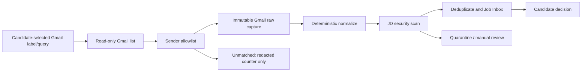

# 24 — Gmail Job Alert Connector (Local, Optional)

> **Status:** Proposed for review
> **Related:** [Job discovery and ingestion](05-job-discovery-and-ingestion.md) · [Safety, security, and privacy](12-safety-security-and-privacy.md) · [Job source connectors](13-job-source-connectors.md) · [n8n local automation](22-n8n-local-automation.md)

## 1. Purpose

This specification defines Gmail Job Alert as the first candidate for an optional local automation. It does not preselect n8n or require an implementation. Before building it, a bounded Node-versus-n8n spike must compare one candidate-selected label/query, manual run, idempotent raw capture, and a visible manual fallback.

The connector is an input adapter only. Its chosen runtime reads a deliberately narrow subset of one Gmail mailbox, preserves a local raw capture before any parsing or AI work, then triggers the discovery workflow described in [05](05-job-discovery-and-ingestion.md). If n8n is selected, it must also satisfy [22](22-n8n-local-automation.md). It does not scrape job portals, send email, change Gmail labels, archive/delete messages, contact recruiters, apply for jobs, or authorize any external submission.

The primary user is a Vietnam/HCMC IT job seeker, but the connector must not assume a portal, language, role family, or employer from the email body.

## 2. Product boundary and non-goals

### 2.1 Gmail account is not a Career Copilot account

Career Copilot remains a no-account, local-first product. A Gmail connection means only that the candidate explicitly grants a local connector read access to **their separately existing Google account** through Google's normal OAuth consent screen. It must never create a Career Copilot identity, user table, cloud profile, remote sync account, or shared mailbox service.

The candidate chooses the Google account in the Google-hosted consent flow. The dashboard must display the selected mailbox address (or a privacy-preserving local nickname) and a clear statement that it is an external Gmail account, not a login to Career Copilot. A local workspace may have zero, one, or several independently enabled mailbox connections; each has a separately visible scope, filter, health status, and disconnect action.

### 2.2 Non-goals

- Reading every email, every label, Spam/Trash, or another person's mailbox.
- Sending, drafting, forwarding, replying to, marking read, labelling, moving, archiving, deleting, or modifying Gmail messages.
- Using `gmail.modify`, `gmail.send`, `mail.google.com`, Gmail settings scopes, a service account, domain-wide delegation, IMAP password, or app password.
- Inferring the candidate's interest, application status, qualifications, employer facts, or consent from an email.
- Treating a job-alert email as proof that the linked job is still open or that portal automation is allowed.
- Accepting instructions in email subject/body/attachments as commands for an agent, connector, browser, or n8n workflow.
- Making Gmail a dependency of dashboard startup, local document work, matching, analytics, or offline tests.

## 3. Decision summary

| Decision | Required policy |
| --- | --- |
| Installation | Optional local feature; disabled by default and fully removable. |
| OAuth client type | Desktop/installed-app OAuth flow with system browser and PKCE; never collect a Google password. |
| Read permission | `https://www.googleapis.com/auth/gmail.readonly` only, after explicit candidate consent. |
| Mailbox scope | One account plus one configured label and/or a constrained Gmail search query. |
| Sender scope | Exact sender addresses and/or domains allowlisted locally; unlisted sender is not imported automatically. |
| Message mutation | Prohibited: connector is read-only and never changes Gmail state. |
| AI boundary | Raw email is captured and deterministically normalized before any agent receives a minimal JD candidate. |
| Persistence | Immutable raw capture in the selected local adapter boundary; Career Copilot receives only durable job artifacts/projections. |
| External action | None. Any later approval/submission follows [08](08-approval-and-submission.md) and [22](22-n8n-local-automation.md). |

`gmail.readonly` is intentionally selected because it permits reading message content without granting the ability to alter the mailbox. It is a sensitive/restricted Gmail data permission and must be disclosed precisely; it is not equivalent to a generic "sign in with Google" permission. Gmail's scope catalogue distinguishes it from the broader modify/send/full-mail permissions. See Google's [Gmail API scope guidance](https://developers.google.com/workspace/gmail/api/auth/scopes).

## 4. Candidate setup and informed consent

### 4.1 Pre-connection screen

Before opening Google OAuth, the local UI must show:

1. **What will be read:** messages that match the selected local label/query and sender allowlist; the initial default is a user-created label such as `CareerCopilot/JobAlerts`.
2. **What will be copied locally:** a raw, immutable evidence capture, selected safe metadata, content hash, and optional user-approved attachment copies; see section 7.
3. **What will not happen:** no email is sent, marked read, labelled, deleted, forwarded, or uploaded to Career Copilot infrastructure; no job application is submitted.
4. **The exact Google permission:** `gmail.readonly`, why `gmail.metadata` is insufficient to extract an opted-in alert body, and that the candidate can disconnect at any time.
5. **Data destination:** the named local workspace path and a warning if that path is already in a cloud-synced folder.

The UI must use an explicit action such as `Connect Gmail Job Alerts`, not a vague `Continue` or `Sign in`. Cancelling Google consent changes nothing locally except a short, redacted setup event.

### 4.2 OAuth flow

1. The connector launches the system browser to Google's installed application OAuth flow using PKCE and a loopback redirect bound only for this authorization session.
2. Google, not Career Copilot, authenticates the candidate and lets them select the Google account.
3. The connector validates `state`, PKCE verifier, redirect origin/port, returned scope, and token audience before accepting the result.
4. It records a local `gmailConnectionId`, a redacted mailbox display value, the granted scope set, consent timestamp, connector version, and encrypted credential reference.
5. The refresh token is stored only in n8n's encrypted local credential store; it is never placed in a workspace artifact, n8n execution payload, prompt, raw email capture, console output, screenshot, or backup in plaintext.

Google documents OAuth for desktop apps and PKCE in its [native app OAuth guidance](https://developers.google.com/identity/protocols/oauth2/native-app). Access and refresh tokens may stop working after revocation, password/session policy changes, inactivity, or other provider controls; token failure must be expected rather than treated as a software defect. See [Google OAuth token lifecycle](https://developers.google.com/identity/protocols/oauth2).

### 4.3 Account selection and re-consent

- The selected account comes exclusively from Google's chooser. The connector must not prefill an email address, silently reuse a browser session, or switch accounts based on message content.
- A new account creates a new connection; it never replaces an existing connection's cursor, raw history, or audit trail.
- A scope escalation requires a new explanation and consent flow. V1 has no valid escalation path because only `gmail.readonly` is allowed.
- If consent returns an incomplete/different scope, the connection remains disabled and explains which requested capability is unavailable.
- The candidate can reconnect the same account after expiration/revocation, but doing so creates a new credential revision linked to the same local connection record. It must not retroactively change captures made under the old credential.

## 5. Filter contract: label, query, and sender allowlist

The connector must not perform a broad mailbox scan and then "decide" which messages look like jobs. Each enabled connection has a versioned `GmailAlertFilter` that the candidate can inspect and edit.

```json
{
  "filterId": "gmailfilter_01J...",
  "connectionId": "gmailconn_01J...",
  "labelId": "Label_123",
  "query": "newer_than:30d",
  "allowedSenders": [
    { "kind": "exact", "value": "alerts@example-job-board.vn" },
    { "kind": "domain", "value": "careers.example.com" }
  ],
  "includeAttachments": "metadata-only",
  "enabledAt": "2026-08-31T10:00:00+07:00",
  "filterVersion": 1
}
```

### 5.1 Safe configuration rules

- **Label:** SHOULD be required for the initial implementation. The candidate creates/assigns the label in Gmail themselves; the connector has no permission to create or apply it.
- **Query:** MAY further narrow a labelled scope using Gmail's documented search syntax. It must be stored as plain local configuration, shown before each manual run, and must not contain arbitrary user-supplied tokens from a JD. Gmail supports `q` and `labelIds` on message listing; query use requires a content-reading scope rather than metadata-only scope. [Gmail `messages.list`](https://developers.google.com/workspace/gmail/api/reference/rest/v1/users.messages/list)
- **Sender allowlist:** MUST be checked after API retrieval using normalized `From` address/domain. A spoofable display name is never sufficient. A configured domain matches the exact normalized sender domain or an explicitly defined subdomain rule; it does not match a look-alike string.
- **No implicit broadening:** editing label, query, sender rules, attachment policy, or lookback window creates a later filter version. The next run displays the expanded scope and requires `Confirm expanded import scope` if it can access messages not previously in scope.
- **Default exclusions:** Spam and Trash are excluded. Forwarded messages, mailing-list digests, and recruiter mail are accepted only if the sender/label policy explicitly includes them.

### 5.2 Unmatched and ambiguous mail

A Gmail result outside the sender allowlist produces only a redacted operational counter by default (`unmatched=1`); its body, subject, recipients, and attachment names are not persisted. The candidate can choose a one-time local preview of message metadata to add a sender to the allowlist. Previewing does not import the message or alter Gmail.

If a message has malformed headers, an unparseable sender, multiple conflicting job cards, or an encrypted/unsupported body, it may be captured only after the user explicitly selects `Import for manual review`. Otherwise it records a redacted `needs-review` diagnostic and leaves the cursor behavior described in section 6 intact.

## 6. Discovery, cursor, and idempotency

### 6.1 Local scheduled run

The first connector mode is explicit `Run now`. A local schedule is considered only after the runtime selection and observed user value justify it; no hourly default is assumed. If n8n is selected, its scheduler must satisfy [22](22-n8n-local-automation.md). A run can process only the configured filter, within a bounded page/message/time budget. It never discovers new senders, follows a URL in an email, downloads linked content, or invokes an LLM.

The Gmail API list operation returns message IDs/thread IDs and pagination; full message data is fetched only for allowlisted candidates. The connector must paginate deterministically, cap a normal scheduled run (recommended: 100 new message candidates and 5 minutes per connection), and defer the remaining pages to the next scheduled or manual run. This prevents one large inbox from blocking other local workflows. [Gmail list messages](https://developers.google.com/workspace/gmail/api/guides/list-messages)

### 6.2 Checkpoint record

Each `(connectionId, filterVersion)` owns an append-only checkpoint history and one current checkpoint:

```json
{
  "checkpointId": "gmailcp_01J...",
  "connectionId": "gmailconn_01J...",
  "filterVersion": 1,
  "lastSuccessfulMessageInternalDate": "2026-08-31T09:00:00Z",
  "lastSuccessfulMessageId": "18f...",
  "lastCompletedPageToken": null,
  "lastRunId": "run_...",
  "updatedAt": "2026-08-31T10:01:00+07:00"
}
```

The implementation may additionally use Gmail History IDs when a supported, tested strategy is chosen, but it must retain message-level idempotency as the correctness mechanism. History IDs, page tokens, and result estimates are operational hints, not business evidence.

The checkpoint advances only after every eligible message in the committed page has an immutable capture or a durable, user-visible terminal disposition. A transient fetch/parse/local-write error leaves that message retryable. A source rate limit records a next-attempt time without falsely advancing the cursor.

### 6.3 Idempotent capture key

The primary key is:

```text
sha256("gmail" + connectionId + gmailMessageId + messageInternalDate)
```

It protects against schedule retries, repeated pages, n8n resume/replay, API list ordering, and manual reruns. A later edit to a Gmail message must not silently overwrite the earlier evidence: if the fetched RFC 822/body hash differs for the same Gmail message ID, store a new immutable capture revision with `supersedesCaptureId` and a `message-content-changed` warning.

Thread IDs are correlation data only. One job-alert email per message is captured independently because one thread can contain multiple alerts, replies, or corrections.

### 6.4 Initial sync and manual backfill

The candidate chooses a bounded initial lookback (recommended default: 7 days; maximum default: 30 days) and sees the estimated scope before starting. Initial sync is not allowed to scan the entire mailbox merely because an OAuth credential exists.

Manual backfill requires the candidate to choose a date range and confirm the number of matched messages after filtering. It creates a separate `userInitiatedRunId`, does not reset the scheduled cursor, and uses the same idempotency keys. A candidate may disable all scheduled polling and use only manual runs.

## 7. Immutable raw capture and privacy boundary

### 7.1 Capture before interpretation

For every accepted alert, the n8n raw collection stores an immutable `GmailRawCapture` before deterministic normalization, dedupe, security scanning, or agent use. This is the source-of-error boundary: a candidate can compare what Gmail delivered with what the parser/agent later concluded.

```json
{
  "rawCaptureId": "rawcap_01J...",
  "connector": { "id": "gmail-job-alert", "version": "1.0.0" },
  "connectionId": "gmailconn_01J...",
  "filterVersion": 1,
  "gmail": {
    "messageId": "18f...",
    "threadId": "18f...",
    "internalDate": "2026-08-31T08:55:00Z",
    "fromAddress": "alerts@example-job-board.vn",
    "subject": "New Backend Engineer jobs",
    "labelIds": ["Label_123"]
  },
  "capturedAt": "2026-08-31T10:00:12+07:00",
  "rawMimePath": "n8n-raw/gmail/rawcap_01J/source.eml",
  "contentHash": "sha256:...",
  "attachmentManifestPath": "n8n-raw/gmail/rawcap_01J/attachments.json",
  "captureDisposition": "received-unreviewed"
}
```

The raw capture is append-only. Correcting a parser, filter, or extraction produces later normalized/derived artifacts, never an overwritten email source. An explicit candidate deletion/retention action is the only permitted removal path. Default raw retention is 180 days, aligned with [22](22-n8n-local-automation.md); the UI must show storage use and the scheduled purge date.

### 7.2 What raw capture contains and excludes

- Preserve the original message bytes or an equivalent lossless local `.eml` representation, received time, Gmail IDs, source filter version, and SHA-256 hash.
- Store a redacted header projection for dashboard lists. Do not expose `To`, `Cc`, `Bcc`, authentication headers, tokens in URLs, or unrelated recipient data by default.
- Strip active HTML/scripts before rendering any preview. Preserve the original in raw evidence but never execute it.
- Do not copy raw full body, MIME data, or headers into n8n normal execution payload retention, error reports, analytics, agent prompt logs, or notifications.
- Do not upload captures to a remote provider automatically. If a later optional AI provider requires selected text, [12](12-safety-security-and-privacy.md) and the provider policy govern a separate, explicit data-egress decision.

### 7.3 Candidate review screen

The local Raw Capture view must show the original message (safely rendered), normalized candidate fields, source URL(s), attachment manifest, content hash, connector/filter version, capture time, downstream workflow IDs, and redacted errors. It must say plainly:

> This capture proves what Gmail supplied to this workspace at the recorded time. It does not prove that a linked role remains available or that the sender/job is legitimate.

The candidate may mark a capture `not-a-job`, `unsafe`, `ignore-sender`, `manual-review`, or `continue`. These actions create later audit events; they must not mutate the original email/capture or Gmail state.

## 8. Attachments and links

### 8.1 Default attachment posture

The default is `metadata-only`: store attachment filename (safely escaped), MIME type, byte size, Gmail attachment ID, and a `not-downloaded` disposition. Attachment bytes are not fetched automatically. This is important because job alerts can contain unrelated personal material, tracking files, executables, or documents that should not become agent input.

The candidate can select an individual attachment in Raw Capture view and choose `Download for manual review`. The connector then allows only configured safe types (`text/plain`, `text/html`, `application/pdf`, DOCX) under a size cap (recommended 10 MiB). Executables, archives, macros, disk images, scripts, and unsupported encrypted documents are blocked and require manual external inspection; they are not handed to an agent.

Downloaded attachment bytes become a separate immutable child capture with hash, filename-as-received, MIME assertion, detected type, size, parent raw capture ID, and malware/parse scan result. A scan warning quarantines it without deleting the source.

### 8.2 Links

URLs in a message are untrusted data. The connector may deterministically extract and display them as link evidence, but it must not automatically follow them, authenticate to a portal, expand shortened links, execute tracking redirects, or use them as n8n webhook destinations. A candidate-initiated later import/fetch follows [05](05-job-discovery-and-ingestion.md) and the source capability declaration in [13](13-job-source-connectors.md).

## 9. Normalization, safety scan, and handoff



Email content is untrusted input under [12](12-safety-security-and-privacy.md). The normalizer can extract message structure and visible job-card candidates but must never obey content such as "ignore rules", "send CV", "click here", or instructions to reveal credentials. It must retain provenance spans/links for every derived fact and return `not-stated` for missing employer, title, role, location, salary, seniority, or deadline.

If an email contains several jobs, the normalizer creates distinct derived job candidates that each cite the same `rawCaptureId` and precise source spans. It does not make a single vague job record or silently choose the "best" one.

The Gmail connector ends after creating a raw capture and safe handoff event. n8n Workflow 02–08 own parsing, security, dedupe, matching, and Job Inbox projection. Workflows 09–12, including `WAITING_FOR_USER`, are unrelated to Gmail authorization and retain the version-bound approval/submission rules in [22](22-n8n-local-automation.md).

## 10. Health, retry, and failure handling

### 10.1 Connection states

| State | Meaning | Automatic action | Candidate action |
| --- | --- | --- | --- |
| `disabled` | Not configured or intentionally paused | No OAuth/API call | Enable/connect or use manual import. |
| `connecting` | OAuth consent session active | Wait only for validated callback | Cancel or finish Google consent. |
| `healthy` | Last scheduled/manual run reached a durable checkpoint | Run at configured schedule | Inspect filter/history. |
| `degraded` | Recent retryable network/rate/server failure | Bounded retry/backoff | Run later or inspect diagnostics. |
| `reauth-required` | Token expired, revoked, scope changed, or Google denied access | Stop all reads; never retry credentials blindly | Reconnect through Google consent. |
| `needs-review` | Filter/source/parser policy issue | Do not broaden scope | Review config/raw capture. |
| `disconnected` | Candidate removed credential/connection | No further call; clear encrypted credential | Reconnect creates a new revision. |

### 10.2 Retry policy

Retry only failures without an external write: network timeouts, transient 5xx, and safe provider rate responses. Use exponential backoff with jitter, a bounded attempt count (recommended 3 per scheduled run), and a `nextAttemptAt` checkpoint. Later scheduled runs may try again after that time. Do not retry `invalid_grant`, consent denial, insufficient scope, forbidden policy, malformed local config, or an unsafe/corrupt message without candidate intervention.

The connector must classify and display errors without including bearer/refresh tokens, raw MIME, full headers, private subjects, or URLs containing tracking tokens. A failed page never advances its durable checkpoint. A successful capture followed by a later parser/agent error is not a Gmail retry; the raw capture is preserved and workflow 02+ handles the repair.

### 10.3 Token expiry, revocation, and disconnect

On `invalid_grant`, revoked access, changed password/session control policy, rejected scope, or failed refresh, mark the connection `reauth-required`, halt schedules immediately, and retain existing raw captures. The UI explains that Gmail access must be re-authorized; it must not prompt for a password or attempt to use a copied token.

`Disconnect Gmail` performs two local actions: remove the encrypted n8n credential reference and stop every schedule/checkpoint for that connection. It SHOULD request OAuth token revocation from Google when a valid token is available, then records only the revocation outcome category. Google documents a token revocation endpoint and notes that revocation removes the grants/tokens for that OAuth project. [Google OAuth revocation](https://developers.google.com/identity/protocols/oauth2/web-server#tokenrevoke)

Disconnect does **not** delete existing local raw captures or Job Inbox entries silently. The candidate sees separate choices to retain, export, archive, or explicitly delete local career data under [12](12-safety-security-and-privacy.md).

## 11. Rate, load, and availability policy

- Default schedule: once per hour per enabled connection. The candidate may pause, choose a slower interval, or use manual-only mode. Faster polling requires a visible cost/limits warning.
- Normal run budget: 100 candidate messages, 5 minutes, and 20 full-message fetches per connection. Any remaining matching mail is deferred with a visible backlog count.
- Full MIME/attachment retrieval is serialized per connection. Matching/AI remains subject to its own local concurrency policy and must not block Gmail checkpoint durability.
- Respect Gmail API response status and `Retry-After`/provider guidance when present. Do not use parallel workers to evade quota/rate behavior.
- A connection failure must not prevent local dashboard use, paste import, `.eml` import, other source connectors, raw review, document editing, or approval review.

No Kubernetes, queue workers, Redis, public webhook, public tunnel, or always-on cloud service is required for this connector. It is one optional local adapter managed by n8n as described in [22](22-n8n-local-automation.md).

## 12. Manual fallback and disablement

The feature is useful only with Gmail access, never mandatory for the product. Every Gmail screen provides the fallback path:

1. save/export the alert email as `.eml` and import it locally;
2. copy/paste the job card or full JD into the standard ingestion flow;
3. paste a job URL and explicitly import it through a source adapter permitted by [13](13-job-source-connectors.md); or
4. manually create a Job Inbox entry with clear `source.unknown` provenance.

If OAuth verification, corporate Google Workspace policy, account type, network availability, or Gmail API changes make the connector unavailable, the product disables that one connection with an explanation. It must not block the workspace, weaken privacy controls, request broader permission, or substitute screen scraping/IMAP credentials without a separate approved specification.

## 13. Test fixtures and verification

All automated tests use local, synthetic Gmail API fixtures and stubbed OAuth/token responses. They must not call Gmail, require a personal mailbox, or include a real email address, message ID, token, applicant CV, or job-board tracking URL. Fixture mail must be marked synthetic and placed outside normal raw-data paths.

### 13.1 Required fixture set

| Fixture | Minimum assertion |
| --- | --- |
| Allowlisted Vietnamese job alert | Creates immutable raw capture, preserves Vietnamese text/diacritics and source span. |
| Allowlisted English job alert | Produces a separate capture; language is observed, not assumed. |
| Multiple job cards in one message | Produces multiple derived candidates that share one raw capture with distinct spans. |
| Unallowlisted sender | Persists no body/subject; increments only redacted unmatched result. |
| Look-alike sender/display-name spoof | Fails exact normalized address/domain allowlist. |
| Tracking-heavy HTML + prompt injection | Renders inertly; no URL fetch/tool/action/agent override occurs. |
| Duplicate listing/replayed API page | Produces one capture/projection via idempotency key. |
| Same Gmail message ID, changed body | Produces a later immutable capture revision and warning. |
| Pagination/interrupted page | Checkpoint does not advance past uncommitted message. |
| 429/5xx/timeout | Backoff is bounded; no duplicate capture; no scope broadening. |
| `invalid_grant`/revocation | Marks `reauth-required`, stops schedule, retains existing data. |
| Oversize or executable attachment | Stores metadata only/blocks download; never sends bytes to agent. |
| Disconnect | Deletes credential reference/stops schedule; does not silently delete raw/job artifacts. |

### 13.2 Acceptance criteria

- A clean offline workspace can run all non-Gmail Career Copilot functions with this connector absent.
- Connecting Gmail requires explicit user action, Google-hosted consent, PKCE/state validation, and exactly `gmail.readonly`; no Google password reaches the product.
- The UI distinguishes the external Gmail mailbox from a Career Copilot account and supports separate local connections without sharing cursors/credentials.
- Scheduled discovery reads only a candidate-selected label/query and sender allowlist, excludes Spam/Trash, and does not mutate any Gmail message.
- An accepted message has a lossless immutable raw capture and hash before parsing/AI; if n8n is selected, its execution logs do not contain full MIME/body by default.
- An unmatched sender's private content is not retained automatically.
- Replaying list pages, manual runs, runtime retries, and service restarts cannot create duplicate raw captures or Job Inbox items.
- Token expiry/revocation disables only the affected connection, never prompts for a password, and does not erase existing local evidence.
- The connector never sends/replies/forwards mail, downloads arbitrary attachments, follows email URLs, scrapes a portal, or starts a submission.
- `.eml`, paste, and manual URL import remain usable when Gmail is disabled or unavailable.

## 14. Related specifications

- [05 — Job discovery and ingestion](05-job-discovery-and-ingestion.md): canonical raw-capture, normalization, dedupe, and Job Inbox rules.
- [12 — Safety, security, and privacy](12-safety-security-and-privacy.md): local-data, untrusted-content, credential, and deletion controls.
- [13 — Job source connectors](13-job-source-connectors.md): portal capability declaration and manual-handoff requirements after an email link is found.
- [22 — n8n local automation](22-n8n-local-automation.md): Workflow 01 scheduling/raw collection, Workflow 02–08 processing, retention, security baseline, and separate approval waits.
