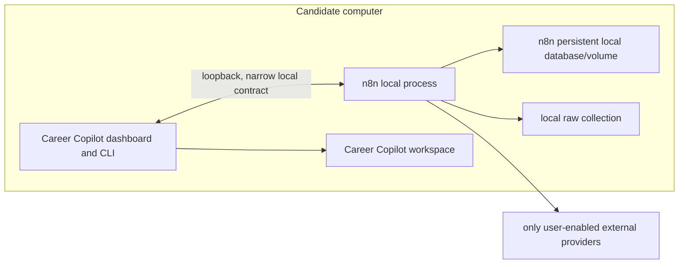

# 26 — n8n Local Setup, Backup, and Recovery Runbook

**Status:** Proposed for review
**Scope:** The supported local operational shape only after n8n has been selected through M3A; it is not a v1 baseline or setup requirement.
**Depends on:** [Local runtime](16-local-runtime-and-observability.md), [Testing and release quality](17-testing-and-release-quality.md), [n8n automation](22-n8n-local-automation.md), and [n8n workflow package](23-n8n-workflow-package-and-versioning.md).

## 1. Purpose and non-goals

This runbook makes optional n8n automation reproducible, private, and recoverable for a person who cloned Career Copilot after an explicit adoption decision. It is intentionally dormant while core work is the priority. It covers installation prerequisites, local topology, encrypted configuration, lifecycle commands, backup, restore, upgrade and failure diagnosis once n8n is actually selected.

It does not create a Career Copilot account, hosted n8n instance, LAN-accessible dashboard, Kubernetes deployment, multi-node queue, Redis, shared workspace or managed backup service. A user must still be able to use core Career Copilot features without n8n enabled.

## 2. Supported local topology



The default is one n8n process/container and one persistent local volume. Docker Compose is the supported distribution shape because it gives an inspectable version-pinned process and volume boundary. A direct local process may be supported for developers only if it produces the same data paths, loopback bind, encryption-key handling, backup set and health results.

No component binds to a LAN interface or public internet by default. The n8n editor, API, ordinary webhooks, raw collection and Career Copilot local API use loopback only. An external Gmail/LLM provider connection is an outbound, user-enabled exception, not evidence that the product is hosted.

## 3. Preconditions and first-run consent

Before n8n can be enabled, the local `doctor` flow verifies:

1. supported operating system, container runtime and free disk space;
2. that required loopback ports are available and no configuration requests a LAN bind;
3. a private workspace root and `.gitignore` protection for data, volumes, exports and configuration;
4. a backup destination selected by the candidate, or an explicit acknowledgement that automation data is not yet backed up;
5. n8n image/package version matching the repository's workflow-package compatibility manifest;
6. the current n8n license notice and non-commercial-use statement;
7. that no connector is enabled until the candidate has completed its own consent/configuration.

First run creates no Career Copilot account. If n8n asks the local operator to create an instance-owner credential, it is confined to that local process and must not be mistaken for a Career Copilot login or remote identity.

## 4. Local configuration and secrets

### 4.1 Configuration classes

| Class | Examples | Storage and handling |
| --- | --- | --- |
| Public package config | n8n image version, workflow template version, loopback ports, feature flags | versioned repository config; contains no secret or private workspace path by default |
| Local runtime config | selected workspace root, enabled connector IDs, retention policy, diagnostics level | ignored local configuration; schema-versioned |
| Secret configuration | `N8N_ENCRYPTION_KEY`, OAuth refresh token, provider API key, local resume secret | encrypted secret store/environment injection; never committed, logged or placed in workflow JSON |
| Recovery material | encrypted backup, encryption-key recovery record, restore manifest | selected local backup destination; candidate-controlled |

The n8n instance encryption key is mandatory before a credential-enabled connector can start. It must be generated locally, persist across restarts, and be protected separately from the database backup. Losing it may make encrypted credential data unrecoverable; exposing it defeats the credential boundary. The runbook never prints a secret in terminal output, diagnostics or screenshots.

### 4.2 Required local files

The implementation chooses exact paths, but the data boundary must remain equivalent to:

```text
.career-copilot/
  n8n/
    runtime-config.json          # ignored; no plaintext secret
    package-state.json           # active package version and hashes
    backups/                     # optional local staging; ignored
  logs/                          # redacted, rotated
data/
  n8n-raw/                       # raw capture collection; ignored
  ... Career Copilot artifacts
```

Container/volume paths are implementation details. The setup/status screen displays actual resolved locations and whether each is excluded from Git.

## 5. Setup lifecycle

### 5.1 Install or enable

1. Candidate starts a local setup command or dashboard wizard.
2. `doctor` validates prerequisites and displays the exact image/package and workflow-template versions that will be used.
3. Candidate accepts local storage locations, chooses whether to configure a backup destination, and explicitly enables n8n.
4. The runtime creates persistent local storage, initializes n8n with loopback-only configuration, and creates/loads the protected instance encryption key.
5. It imports a verified workflow package in disabled mode and validates package hashes, required credentials being absent/present, and local API reachability.
6. The dashboard displays every workflow as `disabled`, `needs-configuration`, or `ready`; no schedule activates automatically.
7. Candidate enables only selected flows, for example the Gmail Job Alert connector after completing its separate consent flow.

Setup failure is non-destructive: remove only newly created empty resources after confirmation, preserve diagnostic status, and leave the Career Copilot workspace usable.

### 5.2 Normal start and shutdown

Normal start checks the n8n process/version, encryption-key availability, database/volume access, workflow-package compatibility, raw-store access, local API health, and amount of free space. It must refuse to start credential-enabled connectors when the encryption key is missing or the package manifest is incompatible.

Normal shutdown stops schedules from claiming a new run, waits for an active safe local write to finish or record a resumable checkpoint, and reports any workflow that remains `waiting-for-user`. It never deletes a wait or marks an external action cancelled merely because the local process stopped.

## 6. Health model and operator actions

| Status | Meaning | Candidate action |
| --- | --- | --- |
| `disabled` | n8n is not installed/enabled | Enable through setup if wanted; core app remains usable. |
| `ready` | process, storage and package are healthy; no active schedules | Enable specific workflows. |
| `degraded` | automation is available but source/provider/retention/space issue needs attention | Review the exact failed component; manual import remains available. |
| `blocked-secrets` | required encryption key or connector credential is unavailable | Restore/reconfigure locally; no automatic credential repair. |
| `needs-restore` | integrity check/database or raw collection cannot be trusted | Stop schedules; run restore or manual repair. |
| `safe-mode` | package/upgrade/connector changed unexpectedly | All external connectors disabled until explicit review. |

The dashboard offers inspectable actions only: run health check, pause schedules, view redacted logs, export a diagnostic bundle, initiate a backup, preview restore, and disable a connector. It cannot show, copy or export secrets.

## 7. Backup contract

### 7.1 Backup set

One named backup snapshot includes the following items and a manifest of their hashes and versions:

| Item | Why it is required |
| --- | --- |
| Career Copilot workspace artifacts and audit records | source of truth for profile, documents, approvals and receipts |
| n8n database/volume | workflow state, waits and encrypted credential references |
| n8n raw collection | source provenance used to investigate an ingestion/agent discrepancy |
| active workflow-package archive and package-state manifest | reproduces the actual 15-workflow logic |
| non-secret local configuration | restores retention, enabled connector IDs and local bindings |
| protected encryption-key recovery material | makes encrypted n8n credentials recoverable without including plaintext in the archive |

The default backup operation does **not** export portal passwords, browser cookie databases, OTP values, raw unredacted browser screenshots, or plaintext provider tokens. If a user elects to back up encrypted connector credentials, the UI explains that both the encrypted data and separately protected key material are required to restore them.

### 7.2 Backup cadence

The candidate chooses a local destination and cadence. The recommended baseline is: before any migration or workflow package upgrade, weekly while automation is active, and on explicit user request. The system warns when the latest successful backup predates the latest raw capture/approval/receipt by more than the configured threshold; it does not upload automatically.

## 8. Restore and disaster recovery

### 8.1 Preview-first restore

Restore always begins with a read-only preview showing source backup time, schema versions, workflow-package version, n8n compatibility, affected local paths, encrypted-credential availability, waiting workflow count and conflicts with current data. The candidate chooses either:

- **Restore to a new workspace:** default; preserves current data and supports comparison.
- **Replace active local automation state:** requires an explicit confirmation after stopping schedules; creates a pre-restore backup.
- **Restore selected artifacts only:** allowed for raw collection or workflow package only when the manifest proves compatible; never used to merge partial approval/receipt records silently.

### 8.2 Restore sequence

1. Stop schedules and block new external actions.
2. Validate archive integrity and manifest hashes before writing anything.
3. Restore to an isolated new location by default.
4. Verify encryption-key recovery material before enabling any credential-backed connector.
5. Restore Career Copilot artifacts, n8n data, raw collection, and workflow package as an atomic logical set.
6. Run health checks and reconcile references between raw captures, workflow executions, approvals and receipts.
7. Leave all imported schedules disabled and every historical submission workflow non-resumable until the candidate reviews status.
8. Candidate explicitly selects which approved safe workflows to enable.

An existing `waiting-for-user` execution may be restored only after its approval is revalidated against the restored Career Copilot record, its expiry is still valid, and its one-time nonce has not been consumed. Otherwise it becomes `stale-after-restore` and cannot submit anything.

### 8.3 Failure modes

| Failure | Safe result |
| --- | --- |
| Encryption key missing | Restore non-secret/raw data where safe; leave credential connectors blocked. |
| n8n version incompatible | Enter safe-mode; do not import/activate package until a documented migration path is chosen. |
| Manifest/hash mismatch | Reject the affected backup item and preserve the original archive for investigation. |
| Workspace exists | Restore to new location by default; no implicit merge. |
| Disk space insufficient | Stop before writing a partial final restore; retain preview report. |
| Approval or document hash mismatch | Mark the wait stale; require a new candidate approval. |

## 9. Upgrade and rollback

An n8n upgrade is a local migration, not a background image refresh. The upgrade flow must:

1. show current and target n8n/workflow-package versions and compatibility result;
2. require a successful backup created after the latest active automation state;
3. export/retain the currently active package and package-state manifest;
4. apply the target in a copied or stopped local environment;
5. execute fixture-based smoke checks: raw ingestion, dedupe idempotency, wait creation/resume rejection, redaction and loopback API call;
6. keep all external schedules disabled until checks pass and the candidate re-enables them;
7. provide rollback to the prior backed-up n8n/package state when the upgrade fails before an external action.

No automatic rollback may replay an external submission or erase a newer receipt. Workflow package migration rules are defined in [23](23-n8n-workflow-package-and-versioning.md).

## 10. Machine support tiers

| Tier | Supported automation posture |
| --- | --- |
| Core-only machine | Career Copilot without n8n; paste/import and manual browser handoff remain available. |
| Automation-capable machine | One local n8n process for an explicitly selected workflow; manual run first, with a schedule only when observed value justifies it. |
| Local-model-capable machine | Same as automation-capable plus user-configured local model; dashboard exposes queue/cost/thermal or memory pressure signals where available. |

The setup wizard measures only what it can inspect reliably and reports uncertainty rather than promising a fixed performance level. When resources are constrained, it lowers schedule frequency/concurrency or disables optional automation; it does not silently drop raw captures or corrupt waits.

## 11. Acceptance criteria

- A candidate can clone and use Career Copilot offline without enabling n8n.
- After n8n adoption, enabling it creates only loopback-bound local services, imports selected workflows disabled, and does not create a Career Copilot account.
- Setup blocks credential-backed connectors without a protected encryption key and never displays the key/token in output.
- Health status identifies the failed component and preserves a manual-import path.
- A backup manifest covers the workspace, n8n state, raw collection, workflow package and recoverable encryption-key material without plaintext secrets.
- Restore defaults to a new workspace, verifies hashes before writes, and does not activate schedules or resume a historical external action automatically.
- Upgrade requires backup, version compatibility, fixture smoke checks and explicit re-enable of affected connectors.
- Low disk space, incompatible versions or missing recovery key produce an honest blocked/safe-mode state without data loss.

## Related specifications

- [22 — n8n local automation](22-n8n-local-automation.md) defines a deferred reference workflow set and raw/wait semantics after adoption.
- [23 — n8n workflow package and versioning](23-n8n-workflow-package-and-versioning.md) defines package import, migration and rollback if a multi-workflow package is selected.
- [24 — Gmail Job Alert connector](24-gmail-job-alert-connector.md) defines the first candidate automation and its runtime-selection gate.
- [25 — AI provider and data egress](25-ai-provider-and-data-egress.md) defines optional model/provider configuration.
- [16 — Local runtime](16-local-runtime-and-observability.md) defines core runtime expectations outside n8n.
